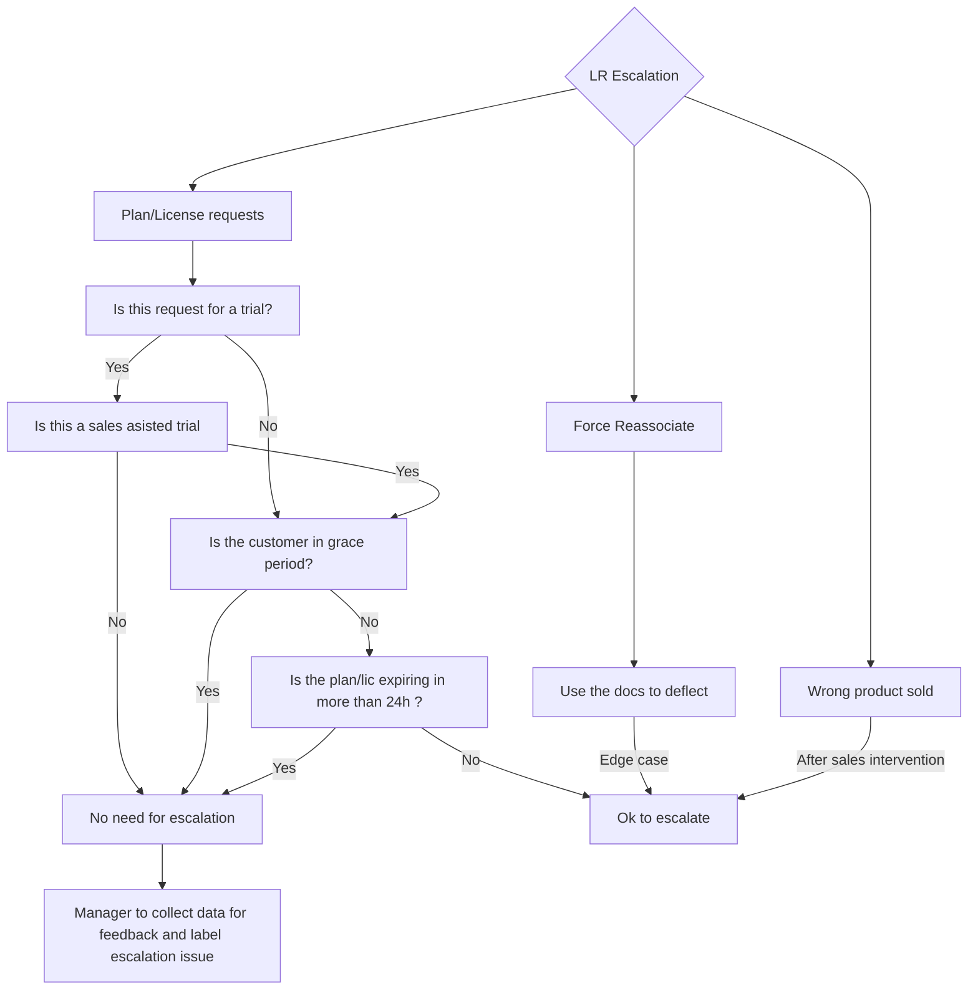

{:.no_toc}

----

### How to manage plan/license related escalations

Any escalation during your [manager on-call shift](https://about.gitlab.com/handbook/support/workflows/support_manager-on-call.html) can be evaluated using the following diagram.

### Edgecases

An edge case can be any situation where the process has been followed and the system will not produce the expeccted results.
Examples:

  - A customer is trying to [link their purchase to their account](https://docs.gitlab.com/ee/subscriptions/), but after following the process, the system produces an error.
  - The webpage or system needed to complete the process is down.
  - The owner is not available.

