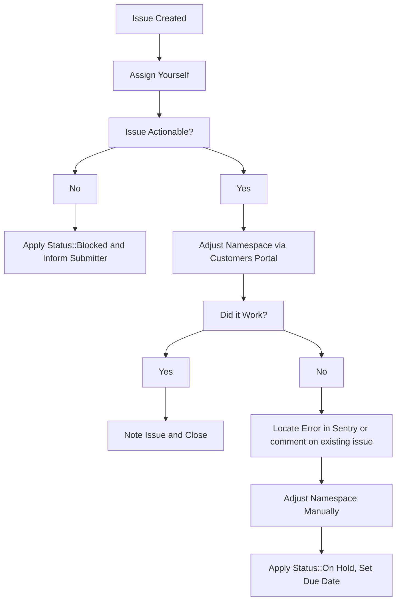

{:.no_toc}

----

If you need to request a trial for a namespace with an existing subscription on
GitLab.com, view the [handling GitLab.com trials workflow page](/handbook/support/license-and-renewals/workflows/saas/trials.html#applying-a-trial-to-a-namespace-with-an-active-subscription).

Otherwise, you're probably here to immediately expire a namespace's trial or
downgrade the namespace to Free.

### Steps

For these issues:

1. Try it in CustomersDot admin first.
   * If you receive an error, follow the usual troubleshooting procedures in
     looking up the error in sentry and/or for an existing CustomersDot issue,
     adding to an existing issue or creating a new one as required.
1. Use the [Update GitLab Subscription](https://gitlab-com.gitlab.io/support/toolbox/forms_processor/LR/update_gitlab_plan.html)
   form processor to directly modify the customer's subscription.
1. If these don't work, as a workaround the plan can be changed manually in one of two ways:
   1. GitLab.com: Add ~"Admin Escalation" label and if needed, ping the dotcom group.
   1. Customers Console: Add ~"Console Escalation::Customers" and if needed, ping the customers-console group.

### Workflow diagram

