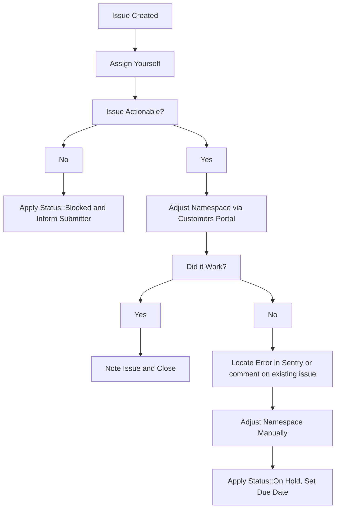

{:.no_toc}

----

Most plan change requests are related to requesting a trial with an existing
subscription on GitLab.com, which is an [open feature request #12186](https://gitlab.com/gitlab-org/gitlab/-/issues/12186).
At times, it is to immediately expire the trial or downgrade the namespace to Free.

### Steps

For these issues:

1. Try it in CustomersDot admin first.
1. If you receive an error, follow the usual troubleshooting procedures in
   looking up the error in sentry and/or for an existing CustomersDot issue,
   adding to an existing issue or creating a new one as required.
1. As a workaround, the plan can be changed manually in one of two ways:
   1. GitLab.com: Add ~"Admin Escalation" label and if needed, ping the dotcom group.
   1. Customers Console: Add ~"Console Escalation::Customers" and if needed, ping the customers-console group.

### Workflow diagram

