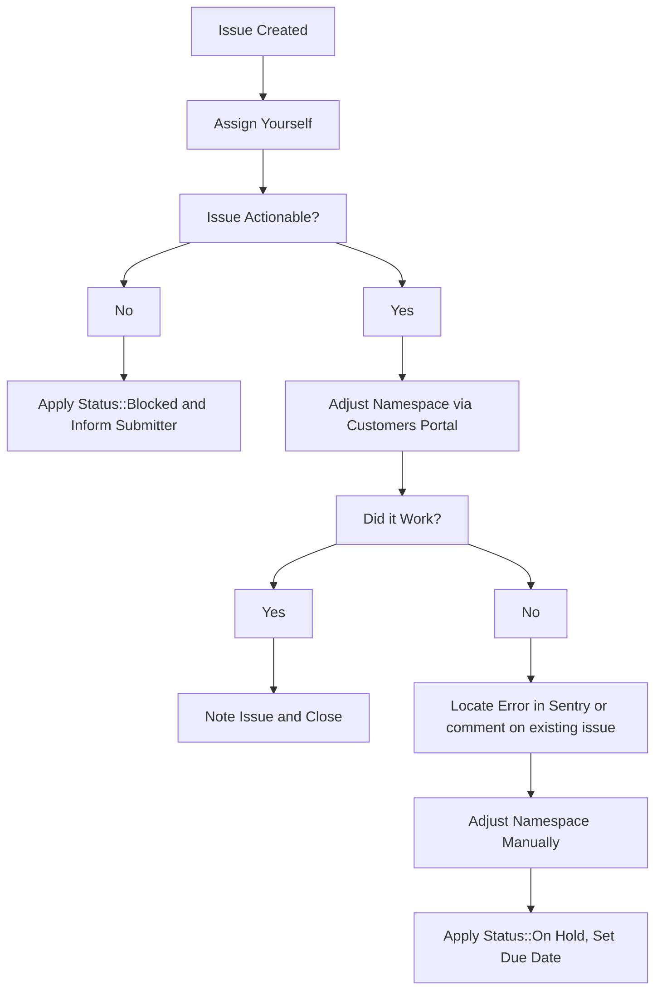

## Bronze and Silver trial subscriptions

GitLab.com [only offers the self-service ability to trial the Gold subscription](https://gitlab.com/gitlab-org/customers-gitlab-com/issues/409).
With manager approval, GitLab.com support can assist with trials of other plans.
Ask the user to create the GitLab.com Gold trial, then change the plan via the
CustomersDot admin `GitLab Groups` page.

## Extending trials

Sales will often request that we extend the duration of GitLab.com trials on behalf of their prospects. These issues will always have the `Trial Extension` label applied to them and the following workflow should be followed to service them.

If any fields in the issue description were filled out incorrectly by the submitter apply the `Status::Blocked` label and mention them in the issue asking them to supply any missing information.

> **NOTE**: Due to [customers #973](https://gitlab.com/gitlab-org/customers-gitlab-com/-/issues/973) and [customers #1643](https://gitlab.com/gitlab-org/customers-gitlab-com/-/issues/1643), these issues are currently marked for those engineers who have access to resolve them through [CustomersDot console](customer_console.html#change_plan). Once those issues are resolved, these requests should be done via CustomersDot admin.

### Steps

1. Assign yourself to the issue.
1. Check over the request and ensure that we've been provided enough information to action the request. To do this check that:
   1. The `GitLab.com Link to Namespace:` field contains a valid GitLab.com link to the namespace that holds the active trial. This should not be a Salesforce link or email address.
   1. The `Extend Until:` field contains a future date.
1. Using the address provided in the `Contact Email:` follow the [customers admin docs](/handbook/internal-docs/customers-admin/index.html) to find the customer and action on the request.
1. If there is an error while taking action, locate the [error in sentry](https://sentry.gitlab.net/gitlab/customersgitlabcom/) (see [Searching Sentry](/handbook/support/workflows/500_errors.html#searching-sentry) if needed) and file an issue, or comment on an existing one.
1. If namespace needs to be adjusted manually, then add the `~Admin Escalation` label, and if you do not have GitLab.com admin access, ping `gitlab-com/support/dotcom`.

### Workflow diagram

