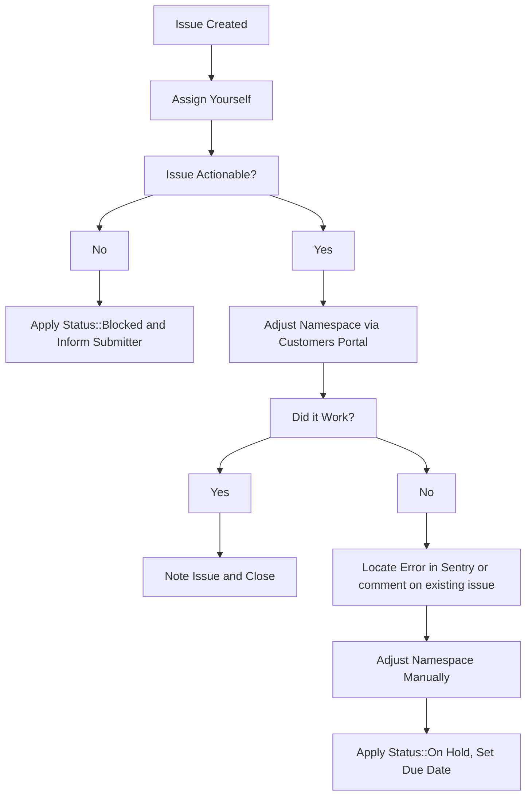

## On this page

{:.no_toc .hidden-md .hidden-lg}

- TOC
{:toc .hidden-md .hidden-lg}

## Request for Premium trial

GitLab.com [only offers the self-service ability to trial the Ultimate subscription](https://gitlab.com/gitlab-org/customers-gitlab-com/issues/409).
With manager approval, GitLab.com support can assist with trials of other plans.
Ask the user to create the GitLab.com Ultimate trial, then change the plan via the CustomersDot admin `GitLab Groups` page.

## Extending trials

Sales will often request that we extend the duration of GitLab.com trials on behalf of their prospects. These issues will always have the `Trial Extension` label applied to them and the following workflow should be followed to service them.

If any fields in the issue description were filled out incorrectly by the submitter apply the `Status::Blocked` label and mention them in the issue asking them to supply any missing information.

> **NOTE**: Due to [customers #973](https://gitlab.com/gitlab-org/customers-gitlab-com/-/issues/973) and [customers #1643](https://gitlab.com/gitlab-org/customers-gitlab-com/-/issues/1643), these issues are currently marked for those engineers who have access to resolve them through [CustomersDot console](../customersdot/customer_console.html). Once those issues are resolved, these requests should be done via CustomersDot admin.

1. Assign yourself to the issue.
2. Check over the request and ensure that we've been provided enough information to action the request. To do this check that:
   1. The `GitLab.com Link to Namespace:` field contains a valid GitLab.com link to the namespace that holds the active trial. This should not be a Salesforce link or email address.
   2. The `Extend Until:` field contains a future date.
3. Use the [Update GitLab Subscription form](https://about.gitlab.com/handbook/support/license-and-renewals/workflows/customersdot/mechanizer.html#update-gitlab-subscription) to process the request.
   1. If successful, this should create a new internal request issue documenting the change action. Link this new issue to the one where the extension was requested.
   2. If there is an error while taking action, locate the [error in sentry](https://sentry.gitlab.net/gitlab/customersgitlabcom/) (see [Searching Sentry](/handbook/support/workflows/500_errors.html#searching-sentry) if needed) and file an issue, or comment on an existing one.
4. If namespace needs to be adjusted manually, then add the `~Admin Escalation` label, and if you do not have GitLab.com admin access, ping `gitlab-com/support/dotcom`.

## Applying a trial to a namespace with an active subscription

At present, a namespace cannot have a trial and an active subscription run
concurrently. A customer may request this if they wish to give a higher-tier
subscription a trial.

There is an [open feature request #12186](https://gitlab.com/gitlab-org/gitlab/-/issues/12186)
requesting to implement this functionality in GitLab. In the meanwhile, use the
[Update GitLab Subscription](https://gitlab-com.gitlab.io/support/toolbox/forms_processor/LR/update_gitlab_plan.html)
form processor to directly modify the customer's subscription:

1. Submit the form processor with the appropriate information filled out. This
   will create an internal request issue if the change is successfully applied.
1. Set a reminder for yourself at the end of the trial period to submit the form
   processor again to downgrade the namespace back to its original plan.
   * You can use the issue due date functionality for this.

## Workflow diagram

# Plan change requests

A requested change has been proposed to depreciate the offering and support for this request type. Please consult the [issue](https://gitlab.com/gitlab-com/support/support-team-meta/-/issues/3887) to ensure the request should be serviced. If proposal is passed, please update this section to reflect changes.

## Important

- Before using this workflow verify if the namespace recently purchase a plan and if that is the case, associate that purchase instead of using this method.

- If this workflow is used always verify the number of seats with the requestor before closing the request.

## Summary

A plan change is when an existing GitLab SaaS plan will be modified on its plan level or subscription end date.

### Which are the plan levels?

1. Ultmate
1. Premium
1. Free

## Steps

### Using Mechanizer

1. Use the [Update GitLab Subscription](https://gitlab-com.gitlab.io/support/toolbox/forms_processor/LR/update_gitlab_plan.html)
   to modify the customer's plan as neeed.

  > If you don't enter a date, the existing subscription date will be used.

### Using customerDot

**Important**

From CustomerDot you can only change the plan type not the subscription end date.

1. From the left side menu click on `customers` and search for the customer.
1. In the search results click on the GitLab groups icon for the customer you want to update.
1. You'll see a list of groups owned by the customer and you can perform your change here.
> If you receive an error, follow the usual troubleshooting procedures in
> looking up the error in sentry and/or for an existing CustomersDot issue,
> adding to an existing issue or creating a new one as required.

### What if I got an error?

If these don't work, as a workaround the plan can be changed manually in one of two ways:

   1. GitLab.com: Add ~"Admin Escalation" label and if needed, ping the dotcom group.
   1. Customers Console: Add ~"Console Escalation::Customers" and if needed, ping the customers-console group
