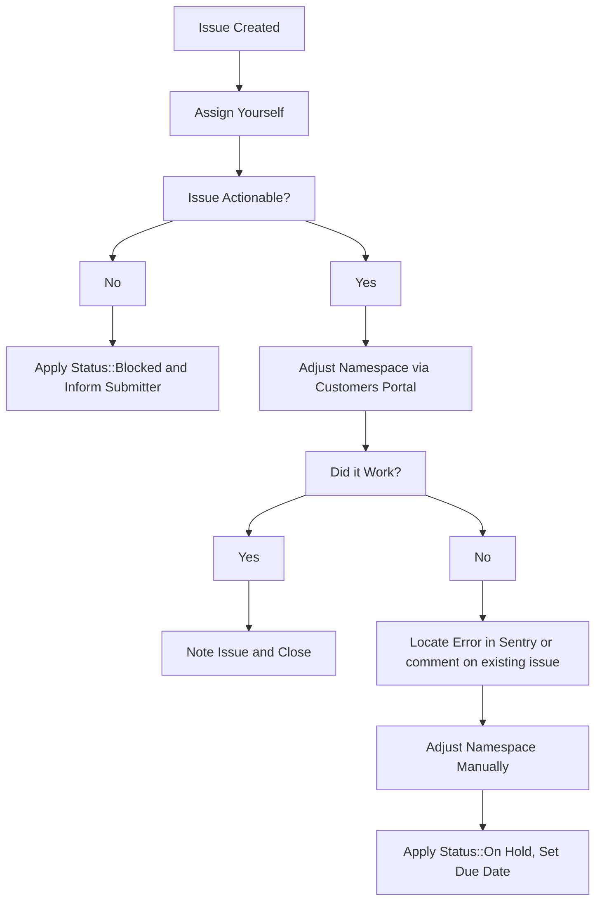

## On this page

{:.no_toc .hidden-md .hidden-lg}

- TOC
{:toc .hidden-md .hidden-lg}

## Request for Premium trial

GitLab.com [only offers the self-service ability to trial the Ultimate subscription](https://gitlab.com/gitlab-org/customers-gitlab-com/issues/409).
GitLab.com support can assist with trials of other plans. Ask the user to create the GitLab.com Ultimate trial, then change the plan via the CustomersDot admin `GitLab Groups` page.

## Extending trials

Sales will often request that we extend the duration of GitLab.com trials on behalf of their prospects. These issues will always have the `Trial Extension` label applied to them and the following workflow should be followed to service them.

If any fields in the issue description were filled out incorrectly by the submitter apply the `Status::Blocked` label and mention them in the issue asking them to supply any missing information.

> **NOTE**: Due to [customers #973](https://gitlab.com/gitlab-org/customers-gitlab-com/-/issues/973) and [customers #1643](https://gitlab.com/gitlab-org/customers-gitlab-com/-/issues/1643), these must be done via [mechanizer](../customersdot/mechanizer.html) or [CustomersDot console](../customersdot/customer_console.html). Once those issues are resolved, these requests should be done via CustomersDot admin.

1. Assign yourself to the issue.
2. Check over the request and ensure that we've been provided enough information to action the request. To do this check that:
   1. The `GitLab.com Link to Namespace:` field contains a valid GitLab.com link to the namespace that holds the active trial. This should not be a Salesforce link or email address.
   2. The `Extend Until:` field contains a future date.
3. Use the [Update GitLab Subscription form](../customersdot/mechanizer.html#update-gitlab-subscription) to process the request.
   1. This should create a new internal request issue documenting the change action. Link this new issue to the one where the extension was requested.
   2. If there is an error while taking action, check the internal issue to see what went wrong. Please also locate the [error in sentry](https://sentry.gitlab.net/gitlab/customersgitlabcom/) (see [Searching Sentry](/handbook/support/workflows/500_errors.html#searching-sentry) if needed) and file an issue, or comment on an existing one.
4. If namespace needs to be adjusted manually, then add the `~Console Escalation::Customers` label.

## Applying a trial to a namespace with an active subscription

At present, a namespace cannot have a trial and an active subscription run
concurrently. A customer may request this if they wish to give a higher-tier
subscription a trial.

There is an [open feature request #12186](https://gitlab.com/gitlab-org/gitlab/-/issues/12186)
requesting to implement this functionality in GitLab.

In the meantime, if you receive one of these requests, ask the requester that they and their customer understand the risks involved.

  
Confirmation of risks - Example wording

  
Due to various bug issues it has caused, we are `[working on deprecating trials on an existing SaaS subscription](https://gitlab.com/gitlab-com/support/support-team-meta/-/issues/3887)`. As we recognize this is a sudden change and communication is still in progress, we can go ahead. However, we want to ensure that you and your customer are aware of the risks.

   
By manually updating the plan, the namespace's plan will no longer match our subscription records. If the system does a validation check, it will `**immediately**` downgrade the namespace to Free. If this happens, customers can submit a high priority ticket, but are asked `*not*` to submit an emergency ticket as this is a known risk for the change requested.

   
If the customer does not want to take the risk, we recommend they start a 30-day trial on a separate group, and fork (or create) a project to test the features in the trial group.

   
If you have communicated the above with your customer and you still want to go ahead, then please confirm that for us and we will make the requested change.

If the requester still wants to go ahead:

1. Follow the [plan change requests using GitLab.com instructions](#using-gitlabcom-admin).
1. Add a comment on the issue that the change has been made with a link to the namespace admin page.
1. Set yourself as assignee.
1. Set an appropriate due date.
1. Once the due date has been reached, change the plan back to the original, and remove the admin note instead of adding another one.

If the namespace accidentally gets downgraded to Free and the customer no longer wants to be on the Ultimate trial, use the [force associate](../workflows/customersdot/mechanizer.html#force-associate). Otherwise, manually changed them back to the Ultimate plan.

## Workflow diagram

## Plan change requests

Except for downgrading to Free, plan changes on a paid non-trial namespace should be done through a subscription purchase.

If a plan must be modified manually, ensure you have approval from product, development, or a support manager, as manually changing a plan causes data discrepencies and can cause bug issues. Use an internal request issue to track approval, the change made, how the change was made, set yourself as assignee, and a due date to remind yourself to change it back.

In the case of an emergency, please make the change, and pass the ticket with an internal note to, or create an internal request for, the L&R team to investigate.

### Using customerDot

**Important**

From CustomerDot you can only change the plan type not the subscription end date.

1. From the left side menu click on `customers` and search for the customer.
1. In the search results click on the GitLab groups icon for the customer you want to update.
1. You'll see a list of groups owned by the customer and you can perform your change here.
> If you receive an error, follow the usual troubleshooting procedures in
> looking up the error in sentry and/or for an existing CustomersDot issue,
> adding to an existing issue or creating a new one as required.

If you get an error, use admin following the instructions in the next section.

### Using GitLab.com Admin

1. Go to the namespace admin page (`/admin/users/username` or `/admin/groups/group_path`).
1. Click `Edit`.
1. Change the `Plan` to the appropriate plan (Ultimate or Premium).
1. Add [an admin note](../../../workflows/admin_note.html).
1. Click `Save`.
