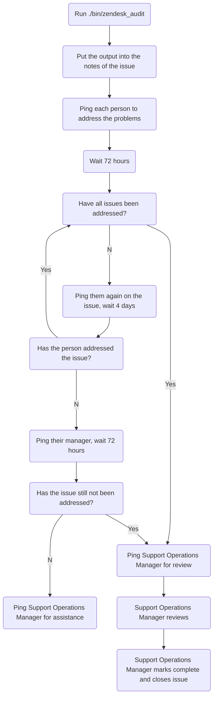
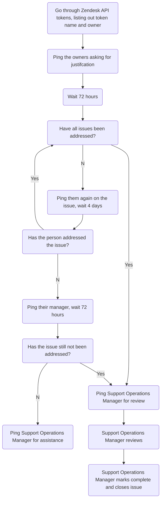
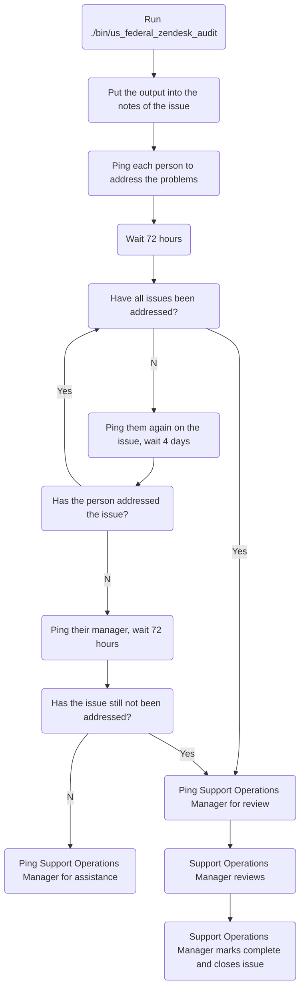
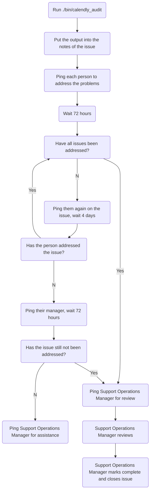
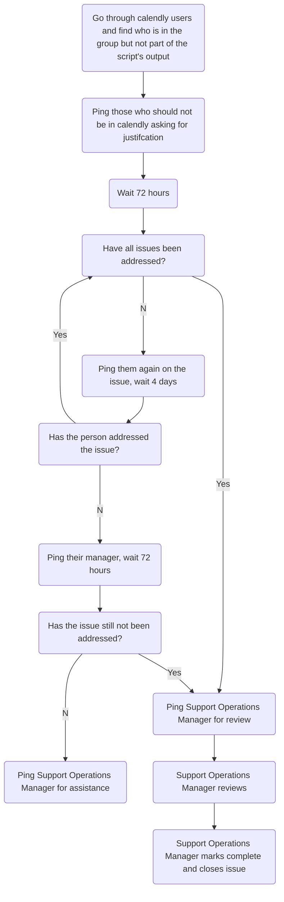
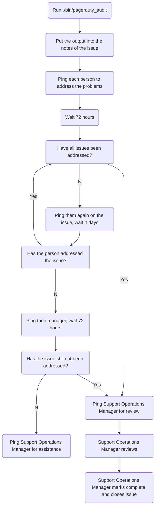

# Audits Processes

## On this page
{:.no_toc .hidden-md .hidden-lg}

- TOC
{:toc .hidden-md .hidden-lg}

Once a quarter, Support Operations is to conduct audits on all the tech stacks
we manage. These currently include:

* Zendesk
* Calendly
* Pagerduty

All of these are conducted via issues in the
[support-ops/audits](https://gitlab.com/gitlab-com/support/support-ops/audits)
project.

## Main Zendesk

These are done and tracked via the
[Zendesk Issue Template](https://gitlab.com/gitlab-com/support/support-ops/audits/-/issues/new?issuable_template=Zendesk).

This is a more complex audit, requiring a lot of checking and following up. To
start, run 
[this script](https://gitlab.com/gitlab-com/support/support-ops/audits/-/blob/master/bin/zendesk_audit).
It will take a considerable amount of time, but reduce a good portion of the
work required on your part. Use the output to fill out the notes section of the
issue you generated.

From there, you need to go through the items reported and ping the person
in the issue to ask for the issue to be fixed (or clarify if this is
intentional). This can take time, so wait about 72 hours after pinging someone
before following back up. If the issue is not addressed within a week, ping
that person's manager.

After that, you need to review the
[API tokens](https://gitlab.zendesk.com/agent/admin/api/settings) currently in
use. The script above will output the basic details of what to put into the
issue. You will need to fill it out and seek out the maintainer/requester of the
API token to enter the justification/use case. This can take time, so wait about
72 hours after pinging someone before following back up. If the issue is not
addressed within a week, ping that person's manager.

### Based on script output

### API token review

## US Federal Zendesk

These are done and tracked via the
[Zendesk Issue Template](https://gitlab.com/gitlab-com/support/support-ops/audits/-/issues/new?issuable_template=US%20Federal%20Zendesk).

This is a more complex audit, requiring a lot of checking and following up. To
start, run 
[this script](https://gitlab.com/gitlab-com/support/support-ops/audits/-/blob/master/bin/us_federal_audit).
It will take a considerable amount of time, but reduce a good portion of the
work required on your part. Use the output to fill out the notes section of the
issue you generated.

From there, you need to go through the items reported and ping the person
in the issue to ask for the issue to be fixed (or clarify if this is
intentional). This can take time, so wait about 72 hours after pinging someone
before following back up. If the issue is not addressed within a week, ping
that person's manager.

After that, you need to review the
[API tokens](https://gitlab-federal-support.zendesk.com/agent/admin/api/settings)
currently in use. The script above will output the basic details of what to put
into the issue. You will need to fill it out and seek out the
maintainer/requester of the API token to enter the justification/use case. This
can take time, so wait about 72 hours after pinging someone before following
back up. If the issue is not addressed within a week, ping that person's
manager.

### Based on script output

### API token review

## Calendly

These are done and tracked via the
[Calendly Issue Template](https://gitlab.com/gitlab-com/support/support-ops/audits/-/issues/new?issuable_template=Calendly).

As the API is not yet able to handle this, this process will be a bit more of a
manual process. To starter, you will need will first make an audit issue via the
[Calendly Issue Template](https://gitlab.com/gitlab-com/support/support-ops/audits/-/issues/new?issuable_template=Calendly).

After doing so, you will want to run
[this script](https://gitlab.com/gitlab-com/support/support-ops/audits/-/blob/master/bin/calendly_audit).
Use the output to fill out the notes section of the issue you generated.

From there, you need to go through the items reported and ping the person
in the issue to ask for the issue to be fixed (or clarify if this is
intentional). This can take time, so wait about 72 hours after pinging someone
before following back up. If the issue is not addressed within a week, ping
that person's manager.

After that, you need to go into calendly and confirm who is and isn't there. It
helps to make a list of who all is in the
[Calendly group](https://calendly.com/app/organization/users) and then correlate
it to what the script outputed. Any users in Calendly but not outputted from the
script need to be noted and we will need confirmation of why they are in there. 
If no justifcation can be made, they will need to be removed.

### Based on Script output

### Based on Calendly review

## Pagerduty

These are done and tracked via the
[Pagerduty Issue Template](https://gitlab.com/gitlab-com/support/support-ops/audits/-/issues/new?issuable_template=Pagerduty).

This is a simpler audit, since it is mostly just checking for valid IDs and
schedules. As this doesn't require much human interaction, it is largely
scripted.

To do these, first make an audit issue via the 
[Pagerduty Issue Template](https://gitlab.com/gitlab-com/support/support-ops/audits/-/issues/new?issuable_template=Pagerduty).
Then run
[this script](https://gitlab.com/gitlab-com/support/support-ops/audits/-/blob/master/bin/pagerduty_audit).
Use the output to fill out the notes section of the issue you generated.

From there, you need to go through the items reported and ping the person
in the issue to ask for the issue to be fixed (or clarify if this is
intentional). This can take time, so wait about 72 hours after pinging someone
before following back up. If the issue is not addressed within a week, ping
that person's manager.

Once all that has been done, ping the Support Operations Manager for review.

