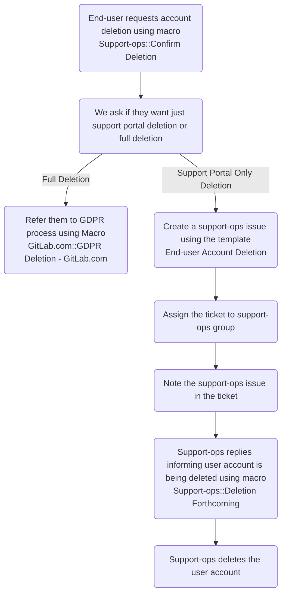
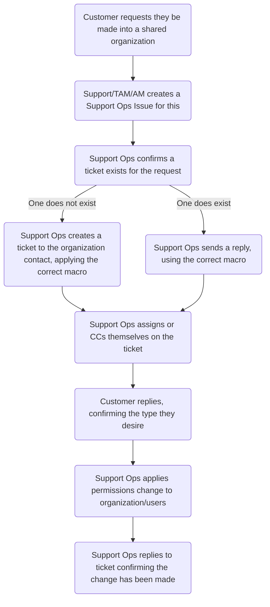

# Zendesk Processes

## On this page
{:.no_toc .hidden-md .hidden-lg}

- TOC
{:toc .hidden-md .hidden-lg}

## Users

### Provisioning Agents

You should not need to ever provision an agent in Zendesk, as this is handled
via Okta. Everyone at GitLab can have Light Agent access. What you may need
to do is upgrade someone's role or group within Zendesk. You should ensure
there is a valid AR for this before proceeding. Once you have verified this,
find the user in Zendesk, select the Role dropdown, and change it to the
correct role (from the AR details).

### Deprovisioning Agents

You will, from time to time, get a request to deprovision an agent (these will
mostly stem from Offboarding tasks). To deprovision a user, go to
that user's page in Zendesk and do the following:

* Unassign any active tickets (less than Closed) from that user
* Remove user's tags from Tags section
* Demote the user's role to that of end-user
* Suspend the user

After doing so, take a screenshot of the user page (the screenshot should show
that the user is now an end-user and suspended). Post this screenshot in the
offboarding issue to verify they have been deprovisioned. 

### Deleting end-users

In these cases, the end-user wants their support portal account removed, but
not everything GitLab-related removed. To be sure, we should first ask if that
is the case or if they are wanting a full deletion.

If the user wants full account deletion, we need to refer them to the
[Support GDPR Process](https://about.gitlab.com/handbook/support/workflows/gdpr_account_deletion.html).

If the user wants only the support account deleted, an issue should be made to
support-ops via the
[End-user Account Deletion template](https://gitlab.com/gitlab-com/support/support-ops/support-ops-project/-/issues/new?issuable_template=End-user%20Account%20Deletion)
After doing so, note the issue in the original ticket.

From there, Support-ops will do the following:

* Reply to the ticket using macro `Support-ops::Deletion Forthcoming`
* Delete the support account of the end-user

Please refer to the below flowchart to help illustrate this.

## Organizations

### Domain Matching

Domain matching is the concept of identifying a person's organization based on
the domain name in their email address.

While Zendesk does have the functionality to do domain matching, we have
determined that the security risks inherent in this feature outweigh the
benefits that would be received from its use. So we do not use domain matching,
and we do not add domains to organizations.

### Shared Organization Process

A shared organization is one in which the end-users in said organization have
heightened permissions in regards to tickets created in the organization. The
options available to this are:

* All users can view all tickets but not add comments
* All users can view all tickets and add comments to all tickets

#### Process in Action

The process is as follows:

* The customer requested their organization be made into a shared organization.
  This can stem from:
  * The customer requested it in an existing ticket
  * The customer reached out to Sales/TAM/AM requesting it
* Whether it be Sales, Support, the TAM, etc., that group/person will need to
  make an issue to Support-Ops. This is done via the
  [Shared Organization Issue Template](https://gitlab.com/gitlab-com/support/support-ops/support-ops-project/-/issues/new?issuable_template=Shared%20Organization%20Request)
* From here, Support-Ops needs to confirm if a ticket exists.
  * If it does, Support-Ops needs to reply to the ticket using the
    `SupportOps::Confirm Request for Shared Organization` macro
  * If it does not, Support-Ops needs to create the ticket, using the
    `SupportOps::Confirm Request for Shared Organization` macro
* Support-Ops needs to assign or CC themselves on the ticket, so they can be
  updated when the ticket is updated. It might be a good idea to add the rest of
  the Support-Ops team as CCs to ensure it can be handled as soon as is
  possible.
* Once the customer replies confirming the setup, Support-Ops then needs to
  apply this (see below).
* Once applied, Support Ops should reply to the ticket confirming the changes
  have been made.

For the actual changes, it depends on the exact settings the customer wants.
Generally speaking, the process is to navigate to the organization page within
Zendesk, click the dropdown next to the `Users` entry (towards the top of the
left-hand side) and select the option the customer desired. If you are allowing
all users to view tickets, a second dropdown will appear asking if they can also
comment on them. Select the ones that have been requested by the customer to
apply them to the organization.

If they are only wanting to have specific users have heightened abilities, you
would need to do this via the user page instead. The steps are the same, with
the exception that the dropdown(s) will be under the `Access` entry instead of
the `Users` entry.

#### Process Flowchart

The below mermaid chart shows the general process for this.

## Suspended and Deleted Tickets

Once a shift, Support Ops should go through the Suspended and Deleted tickets in
Zendesk. The objective is to clear these views out. For references, the views
are:

* [Suspended tickets](https://gitlab.zendesk.com/agent/filters/suspended)
* [Deleted tickets](https://gitlab.zendesk.com/agent/filters/deleted)

### Suspended Tickets

For the suspended tickets, you will need to review the contents of said ticket 
(done by clicking the subject) to determine if the ticket is legitimate or not.
As this can sometimes be tricky, Support Ops should feel free to request the
assistance of a Support Manager in determining those that are not clear.

If the ticket is legitimate, you should click the Recover Automatically button.
Once it has been recovered, you should let the Support Team know, as the ticket
has likely faced a delay and might be close to (if not) breaching SLA.

If the ticket is not legitimate, you should click the arrow on the right hand
side of the button and select `Delete`. 

### Deleted Tickets

For deleted tickets, you should look over the tickets present and make sure they
should be deleted. This will require looking at the reason and the subject. If
you are unsure, feel free to request the assistance of a Support Manager in
determining those that are not clear.

For tickets to delete, you should simply select all of them (via the
checkboxes), click the arrow next to the black button at the top right, and
select `Delete x ticket forever`.
