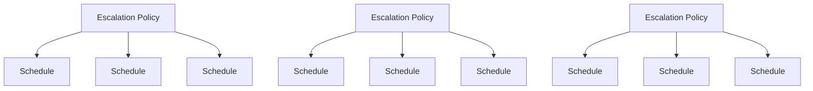
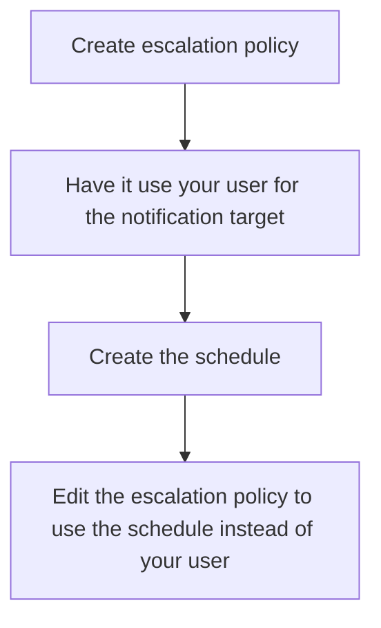

## On this page
{:.no_toc .hidden-md .hidden-lg}

- TOC
{:toc .hidden-md .hidden-lg}

## What this covers

This training material will cover the following topics:

* Pagerduty user management
* Pagerduty rotations (adding/editing)
* adding and removing users from a rotation

## Pagerduty user management

To manage users in Pagerduty, you will first need to go to the
[Users page](https://gitlab.pagerduty.com/users). You can get there by clicking
on `People` at the top of the page and then selecting `Users` in the sub-menu
that appears.

### Creating users in Pagerduty

From the [Users page](https://gitlab.pagerduty.com/users), click the blue
`Add Users` button in the top-right of the page. You will then enter the new
user's full name, email address, and select a role (User for most, Admin for
Support Operations team members). After doing so, click the blue `Add` button to
have an invite sent out to that person.

### Editing users in Pagerduty

From the [Users page](https://gitlab.pagerduty.com/users), locate the user you
wish to edit and click on their name (far left column). After doing so, locate
the settings you wish to change (role is the most common, which is under
`User Settings`). Click the box with a pencil in it icon, make the changes, and
click the blue `Save` button.

### Deleting users in Pagerduty

From the [Users page](https://gitlab.pagerduty.com/users), locate the user you
wish to edit and click the `Delete` link on their row (far right column). Doing
so will have a Javascript confirmation box appear asking you to confirm the
deletion. Click the OK button to confirm the deletion.

## Pagerduty schedules

When working with pagerduty schedules, keep the following diagram in mind:

One to many relationship:

This helps illustrate that for a schedule to work properly, it must be within a
escalation policy. A bit of a catch-22 is the escalation policy normally needs
a schedule or list of users to use in the targets, so you normally have to
either use an existing escalation policy or create the schedule first and then
create the escalation policy.

This can be tedious, so the general workflow we recommend is:

## Creating an escalation policy

To create an escalation policy, you will first need to go to the
[Escalation Policies page](https://gitlab.pagerduty.com/escalation_policies).
You can locate this by clicking `People` at the top of the page and then
clicking `Escalation Policies` on the sub-menu that appears.

From there, click the blue `+ New Escalation Policiy` button. You will then give
the escalation policy a name and description.

In the `Notify the following users or schedules` section, click the textbox and
select your user for the time being. You will later replace this with the
schedule or set of users you wish to utilize.

After doing so, click the blue `Save` button to finish creating the escalation
policy.

## Editing an escalation policy

To create an escalation policy, you will first need to go to the
[Escalation Policies page](https://gitlab.pagerduty.com/escalation_policies).
You can locate this by clicking `People` at the top of the page and then
clicking `Escalation Policies` on the sub-menu that appears.

From there, locate the escalation policy you wish to edit and click on the name.
You will then click the white button on the top-right that reads
`Edit Escalation Policy`.

From here, you can change the name, description, and escalation rules. After you
have done so, click the blue `Save` button.

### Creating a schedule

To create a schedule, you will first need to go to the
[Schedules page](https://gitlab.pagerduty.com/schedules). You can locate this by
clicking `People` at the top of the page and then clicking `On-Call Schedules` on the sub-menu that appears.

From there, click the blue `+ New On-Call Schedule` button at the top-right of
the page. On this page, you will give your schedule a name, description,
timezone to use, and layers to use (this contains the list of users and times to
use). Once you are done, review the preview of the schedule at the bottom of the
page. If it looks accurate, click the blue `Create Schedule` button at the
top-right of the page.

**Note**: Step 3 of a layer let's you specify _when_ a layer applies. This is
important when creating or making schedules that should be applied at a future
point and not right now. Changes to this will reflect in the schedule preview,
so make sure to review it carefully.

### Editing a schedule

To create a schedule, you will first need to go to the
[Schedules page](https://gitlab.pagerduty.com/schedules). You can locate this by
clicking `People` at the top of the page and then clicking `On-Call Schedules` on the sub-menu that appears.

From there, locate thr schedule you wish to edit and click on the name of the
schedule. After doing so, click the white `Edit this Schedule` button at the
top-right of the page.

On this page, can edit the schedule a name, description, timezone to use, and
layers to use (this contains the list of users and times to use). Once you are
done, review the preview of the schedule at the bottom of the page. If it looks
accurate, click the blue `Save Changes` button at the top-right of the page.

**Note**: Step 3 of a layer let's you specify _when_ a layer applies. This is
important when creating or making schedules that should be applied at a future
point and not right now. Changes to this will reflect in the schedule preview,
so make sure to review it carefully.

## Useful links

* [GitLab Pagerduty](https://gitlab.pagerduty.com/)]
* [Pagerduty Users page](https://gitlab.pagerduty.com/users)
* [Pagerduty Escalation Policies page](https://gitlab.pagerduty.com/escalation_policies)
* [Pagerduty Schedules page](https://gitlab.pagerduty.com/schedules)
