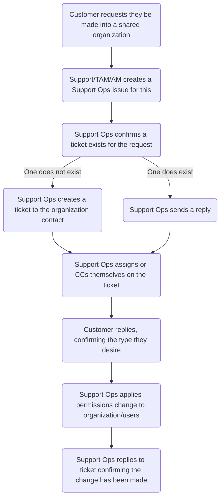

## On this page
{:.no_toc .hidden-md .hidden-lg}

- TOC
{:toc .hidden-md .hidden-lg}

## Overview

A shared organization is one in which the end-users in said organization have
heightened permissions in regards to tickets created in the organization. The
options available to this are:

* All users can view all tickets but not add comments
* All users can view all tickets and add comments to all tickets

In addition, end-users can also have a heightened permission set that allows
them to view all tickets in their organization. For more information on that,
see [editing_end_users.html](Editing end-users).

## Process

1. An end-user requests heightened permissions for their organization. This can
   be either via a ticket or by communicating with their technical account
   manager (TAM) or account manager (AM).
1. Depedning on the source of the request, someone creates a support-ops-project
   issue using the
   [Shared Organization Request template](https://gitlab.com/gitlab-com/support/support-ops/support-ops-project/-/issues/new?issuable_template=Shared%20Organization%20Request)
   * If via a ticket, Support will create the request
   * If via TAM/AM communication, the TAM/AM will create the request
1. Support-ops will then confirm if the ticket exists.
   * If it does, Support-ops will note the ticket with the issue link in the
     [`GitLab Issues` ticket field](https://gitlab.com/gitlab-com/support/support-ops/zendesk-ticket-forms-and-fields/-/blob/master/ticket_fields/active/GitLab%20Issues.yaml).
     After doing so, Support-ops will reply to the ticket using the
     [`Support::Support-Ops::Confirm Request for Shared Organization"`](https://gitlab.com/gitlab-com/support/support-ops/zendesk-macros/-/blob/master/macros/active/Support/Support-Ops/Confirm%20Request%20for%20Shared%20Organization.yaml)
     macro.
   * If it does not, Support-ops will create the ticket using the
     [`Support::Support-Ops::Confirm Request for Shared Organization"`](https://gitlab.com/gitlab-com/support/support-ops/zendesk-macros/-/blob/master/macros/active/Support/Support-Ops/Confirm%20Request%20for%20Shared%20Organization.yaml)
     macro. They will then note the ticket on the issue and the issue in the
     ticket.
* Once the end-user replies back to the ticket, Support-ops will then apply the
  changes to the organization or the users, depending on the type of shared
  organization the end-user desires.
* If after a week and there's still no response from the end-user accepting the security risk and choosing the type of shared organization they desire, Suppport-ops will close out the issue in the support-ops-project. In the event the end-user replies after closing out the issue, Support-ops will need to create a new issue and process the request from there. 

## Flowchart

## Changing the organization permissions

To change the organization permissions, you will first go to the organization
page. From there, click the text next to the `User` field. This will produce a
dropdown. You can then select the option you want.

When selecting "Can view all org tickets", a new line will appear with another
dropdown option. You can use this to further modifiy the permissions.

## Security risks

Heightend permissions always increase security risks. This is why GitLab
follows the
[principle of least privilege](../../engineering/security/access-management-policy.html#principle-of-least-privilege)
in everything we do. While the risk is normally minimized by our current
processes and procedures, shared organizations do have a slighly higher risk
than normal. This is why Support-ops always confirms the end-user understands
and accepts this added risk.
