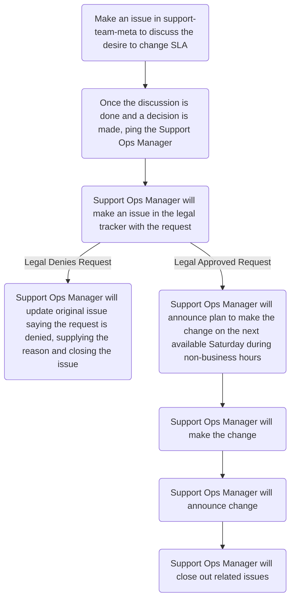

# Zendesk SLA Policies

From Zendesk:

> A Service Level Agreement, or SLA, is an agreed upon measure of the response
> and resolution times that your support team delivers to your customers.
> Providing support based on service levels ensures that you're delivering
> measured and predictable service. It also provides greater visibility when
> problems arise.

Keep in mind only 1 SLA policy can be in place for a ticket. As such, it will
use the top most SLA based on the list of our SLAs (see below).

## On this page
{:.no_toc .hidden-md .hidden-lg}

- TOC
{:toc .hidden-md .hidden-lg}

## SLA Change Process

1. An issue should be created in
   [support-team-meta](https://gitlab.com/gitlab-com/support/support-team-meta/)
   using the
   [Requested Change Template](https://gitlab.com/gitlab-com/support/support-team-meta/-/issues/new?issuable_template=Requested%20Change).
1. The support team discusses the desire to change, citing reason and potential
   impact.
1. The Support Ops Manager, @jcolyer, is pinged in the issue once the
   discussion is over and a decision has been reached, with approval from at
   least ONE Senior Support Manager.
1. The Support Ops Manager will make an issue in the
   [legal tracker](https://gitlab.com/gitlab-com/legal-and-compliance/-/issues)
   requesting the change.
1. Once legal has approved, the Support Ops Manager will announce the plan to
   make the SLA change to the support team via both slack (#support_team-chat)
   and the SWIR. It should be scheduled for the next Saturday, during
   non-business hours.
   * If legal does not approve, the Support Ops Manager will update the
     original issue and close it out.
1. The Support Ops Manager will implement the change. Following the
   implementation, the Support Ops Manager will announce the change has been
   made via both slack (#support_team-chat) and the SWIR.
1. The Support Ops Manager will update relevant documentation with the change.
1. The Support Ops Manager will update the original issue and close it out.

## Current SLA Policies

### Emergency SLA

* Conditions:
  * Matches ALL of:
    * `Received at` is `<redacted>`
* Targets:

| Target | Urgent | High | Normal | Low |
|--------|:------:|:----:|:------:|:---:|
| First reply time | 30m | 30m | 30m| 30m |
| Next reply time | 4h | 4h | 4h | 4h |
| Hours of operation | Calendar hours | Calendar hours | Calendar hours | Calendar hours |

### Silver & gold SLA

* Conditions:
  * Matches ALL of:
    * `Tags` contains at least one of `gold silver`
    * `Tags` contain none of `ar_form lnr_form proserv_form security_form prospect`
* Targets:

| Target | Urgent | High | Normal | Low |
|--------|:------:|:----:|:------:|:---:|
| First reply time | 30m | 4h | 8h| 24h |
| Next reply time | 4h | 4h | 8h | 24h |
| Hours of operation | Business hours | Business hours | Business hours | Business hours |

### Premium & Ultimate SLA

* Conditions:
  * Matches ALL of:
    * `Tags` contains at least one of `premium ultimate`
    * `Tags` contain none of `ar_form lnr_form proserv_form security_form prospect`
* Targets:

| Target | Urgent | High | Normal | Low |
|--------|:------:|:----:|:------:|:---:|
| First reply time | 30m | 4h | 8h| 24h |
| Next reply time | 4h | 4h | 8h | 24h |
| Hours of operation | Business hours | Business hours | Business hours | Business hours |

### Bronze SLA

* Conditions:
  * Matches ALL of:
    * `Tags` contains at least one of `bronze`
    * `Tags` contain none of `upgrades_and_renewals security accounts_receivable`
* Targets:

| Target | Urgent | High | Normal | Low |
|--------|:------:|:----:|:------:|:---:|
| First reply time | 24h | 24h | 24h| 24h |
| Next reply time | 24h | 24h | 24h | 24h |
| Hours of operation | Business hours | Business hours | Business hours | Business hours |

### Accounts Receivable SLA

* Conditions:
  * Matches ALL of:
    * `Form` is `Accounts Receivable / Refunds`
* Targets:

| Target | Urgent | High | Normal | Low |
|--------|:------:|:----:|:------:|:---:|
| First reply time | 4h | 16h | 24h| 36h |
| Next reply time | 4h | 16h | 24h | 36h |
| Hours of operation | Business hours | Business hours | Business hours | Business hours |

### Starter SLA

* Conditions:
  * Matches ALL of:
    * `Tags` contains at least one of `basic starter`
    * `Tags` contain none of `upgrades_and_renewals security accounts_receivable`
* Targets:

| Target | Urgent | High | Normal | Low |
|--------|:------:|:----:|:------:|:---:|
| First reply time | 24h | 24h | 24h| 24h |
| Next reply time | 24h | 24h | 24h | 24h |
| Hours of operation | Business hours | Business hours | Business hours | Business hours |

### Upgrades & Renewals SLA

* Conditions:
  * Matches ALL of:
    * `Form` is `License Renewals and Upgrades`
* Targets:

| Target | Urgent | High | Normal | Low |
|--------|:------:|:----:|:------:|:---:|
| First reply time | 8h | 8h | 8h| 8h |
| Next reply time | 24h | 24h | 24h | 24h |
| Hours of operation | Business hours | Business hours | Business hours | Business hours |

### Prospects SLA

* Conditions:
  * Matches ALL of:
    * `Tags` contains at least one of `priority_prospect`
    * `Tags` contains none of `ar_form lnr_form security_form proserv_form prospect`
* Targets:

| Target | Urgent | High | Normal | Low |
|--------|:------:|:----:|:------:|:---:|
| First reply time | 24h | 24h | 24h| 24h |
| Next reply time | 24h | 24h | 24h | 24h |
| Hours of operation | Business hours | Business hours | Business hours | Business hours |

### Security SLA

* Conditions:
  * Matches ALL of:
    * `Form` is `Security Issue`
* Targets:

| Target | Urgent | High | Normal | Low |
|--------|:------:|:----:|:------:|:---:|
| First reply time | 24h | 24h | 24h| 24h |
| Next reply time | 24h | 24h | 24h | 24h |
| Hours of operation | Business hours | Business hours | Business hours | Business hours |

### Professional Services SLA

* Conditions:
  * Matches ALL of:
    * `Form` is `Support for GitLab Professional Services`
* Targets:

| Target | Urgent | High | Normal | Low |
|--------|:------:|:----:|:------:|:---:|
| First reply time | 72h | 72h | 72h| 72h |
| Next reply time | 72h | 72h | 72h | 72h |
| Hours of operation | Business hours | Business hours | Business hours | Business hours |

### Missing SLA

* Conditions:
  * Matches ALL of:
    * `Tags` contains at least one of `missing_sla_tag`
* Targets:

| Target | Urgent | High | Normal | Low |
|--------|:------:|:----:|:------:|:---:|
| First reply time | 24h | 24h | 24h| 24h |
| Next reply time | 24h | 24h | 24h | 24h |
| Hours of operation | Business hours | Business hours | Business hours | Business hours |
