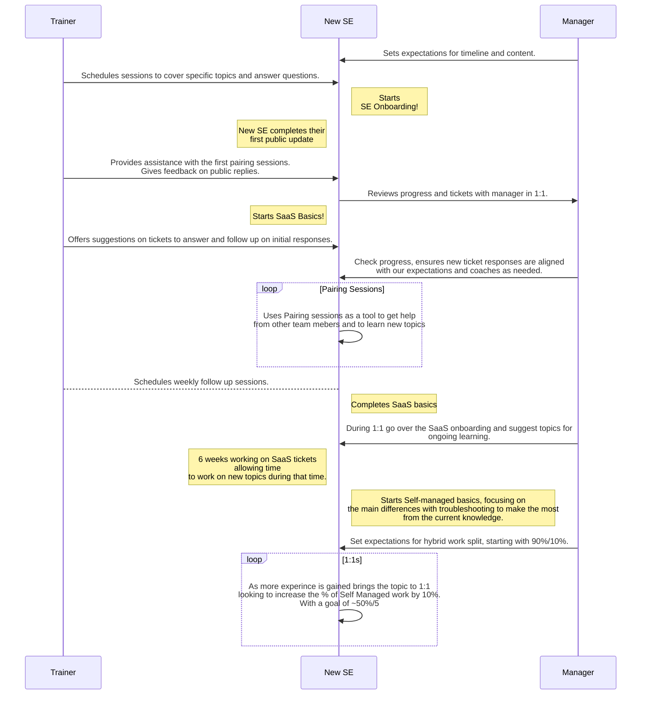

## On this page
{:.no_toc .hidden-md .hidden-lg}

- TOC
{:toc .hidden-md .hidden-lg}

## Support Learning Pathways

All the learning pathways we have in Support are listed [here](https://gitlab-com.gitlab.io/support/team/skills-by-subject.html). Each pathway contains a set of modules, and a module may reside in multiple pathways.

To create an issue for yourself with one of the module templates:

- Click on the module you want to pursue from the [Skills by Subject](https://gitlab-com.gitlab.io/support/team/skills-by-subject.html) page
- Title it as **_Your Name_: _Module Name_**
- Assign it to yourself
- Now you're all set to follow the instructions in the module!

**NOTE:** Contact your [Onboarding Buddy](https://about.gitlab.com/handbook/support/training/onboarding_buddy.html) if you have any questions about these pathways. Buddies are always happy to help!

### Support hybrid model

The hybrid model presents a structured training plan that will prepare the support engineer to work in different areas focusing the grow in the differences in how to approach problems in the new areas and get most our of the knowledge acquired up to that point.

### Support Onboarding Pathway

When you first join the team everything will be new to you. Don't worry! In order to get you started with GitLab quickly, apart from the company wide onboarding issue that will be assigned to you on Day 1 by PeopleOps, we also have an onboarding program in Support. There are two pathways:

1. [Support Engineer Onboarding Pathway](#support-engineer-onboarding-pathway)
1. [Support Manager Onboarding Pathway](#support-manager-onboarding-pathway)

**NOTE:** You can start the PeopleOps onboarding and the Support Onboarding at the same time, or you can complete PeopleOps and then switch to Support. Determine the best path with your manager.

### Onboarded

A new support engineer will be considered onboarded when they are able to perform the core tasks for their new role:

1. Answer tickets.
1. Understand the basics of GitLab.

### Support Engineer Onboarding Pathway

Your primary Support Engineer Onboarding Issue is created from the [New Support Team Member Start Here template](https://gitlab.com/gitlab-com/support/support-training/-/blob/master/.gitlab/issue_templates/New%20Support%20Team%20Member%20Start%20Here.md). This issue keeps track of your completion of the onboarding modules shown in the table below.

It is recommended that you complete the modules in the order listed, unless an issue mentions that you can start something else simultaneously. Typically, for a new team member in Support, completion of the below onboarding modules (including those in the Area of Focus Pathway) should take **~ 3 weeks**.

| Module | Duration | Description |
| ------ | ------ | ------ |
| [Git & GitLab Basics](https://gitlab.com/gitlab-com/support/support-training/issues/new?issuable_template=Git%20and%20GitLab%20Basics) | 2 days | Understand our products and services |
| [GitLab Support Basics](https://gitlab.com/gitlab-com/support/support-training/issues/new?issuable_template=GitLab%20Support%20Basics) | 1 Day | Understand how GitLab Support operates and the most common workflows |
| [Customer Service Skills](https://gitlab.com/gitlab-com/support/support-training/issues/new?issuable_template=Customer%20Service%20Skills) | 2 Days | Understand how we interact with customers, and how to utilize your customer service skills to ensure customer success |
| [Zendesk Basics](https://gitlab.com/gitlab-com/support/support-training/issues/new?issuable_template=Zendesk%20Basics) | 1 Day | Utilize ZenDesk to perform ticket management |
| [Triaging Tickets](https://gitlab.com/gitlab-com/support/support-training/issues/new?issuable_template=Triaging%20Tickets) | 2 Weeks | Understand how to triage tickets including the Needs Org and Triage view in Zendesk |
| [Working on Tickets](https://gitlab.com/gitlab-com/support/support-training/issues/new?issuable_template=Working%20On%20Tickets) | 2 Weeks | Help customers by pairing with Support Engineers and replying to tickets |
| [Documentation](https://gitlab.com/gitlab-com/support/support-training/-/issues/new?issuable_template=Documentation) | 1 Day | Become proficient in making documentation and merge requests |

## GitLab.com Administration access

Whenever GitLab.com administration access is required to complete any of the modules listed on this page, the training will direct you to this module [GitLab.com Administration Access](https://gitlab.com/gitlab-com/support/support-training/issues/tba) 

## Support Engineer Area of Focus Pathway

When you have completed the basic modules, work with your manager to decide your initial [Area of Focus](/handbook/support/support-engineer-responsibilities.html#support-engineer-areas-of-focus).

1. For GitLab.com, move on to the [Gitlab.com SAAS Support Basics pathway](#gitlabcom-saas-support-learning-pathway).
1. For Self-Managed, move on to the [Self Managed Support Basics pathway](#self-managed-support-learning-pathway).
1. For License & Renewals, move on to the [License and Renewals Learning Pathway](#license-and-renewals-learning-pathway).

#### GitLab.com SaaS Support Learning Pathway

| Module | Duration | Description |
| ------ | ------ | ------ |
| [GitLab.com Basics](https://gitlab.com/gitlab-com/support/support-training/-/issues/new?issuable_template=GitLab-com%20SaaS%20Basics) | 2 Weeks | Understand the basics to answer GitLab.com (SaaS) product related tickets |

When this Area of Focus module is complete, let your manager know that you are ready to [proceed to the appropriate On-Call rotations](#on-call-rotations).

#### Self-managed Support Learning Pathway

| Module | Duration | Description |
| ------ | ------ | ------ |
| [GitLab Installation & Administration Basics](https://gitlab.com/gitlab-com/support/support-training/issues/new?issuable_template=GitLab%20Installation%20and%20Administration%20Basics) | 1 Week | Understand the different ways in which GitLab can be installed and managed |
| [Self-Managed Support Basics](https://gitlab.com/gitlab-com/support/support-training/issues/new?issuable_template=Self-Managed%20Basics) | 2 Weeks | Understand the basics to answer Self Managed product related tickets |

When this Area of Focus module is complete, let your manager know that you are ready to [proceed to the appropriate On-Call rotations](#on-call-rotations).

#### License and Renewals Learning Pathway

| Module | Duration | Description |
| ------ | ------ | ------ |
| [License and Renewals](https://gitlab.com/gitlab-com/support/support-training/-/blob/master/.gitlab/issue_templates/Subscriptions%20License%20and%20Renewals.md) | 2 Weeks | Understand the basics to answer our product's License and Renewals related tickets |

## On-call rotations

After you've completed a focus area, you should talk to your manager about joining an on-call rotation. They'll have guidance for where Support need
and your skills overlap. Usually, you'll only complete one of these modules.

| Module | Duration | Description |
| ------ | ------ | ------ |
| [GitLab.com CMOC](https://gitlab.com/gitlab-com/support/support-training/-/issues/new?issuable_template=GitLab-com%20CMOC) | 1 Day | Understand the responsibilities of being the [Communications Manager On Call (CMOC)](/handbook/engineering/infrastructure/incident-management/#roles-and-responsibilities) for an active GitLab.com incident |
| [Customer Emergencies](https://gitlab.com/gitlab-com/support/support-training/issues/new?issuable_template=Customer%20Emergencies) | 1 Week | Understand the responsibilities of being on-call for Customer Emergencies |

## Ongoing learning

The modules in this section should eventually be taken regardless of your focus area. The topics listed here can be completed in any order. Please discuss with your manager to determine which areas will be relevant to your work and the timing for completion.

| Module | Description |
| ------ | ------ |
| [GitLab Intermediate Topics](https://gitlab.com/gitlab-com/support/support-training/issues/new?issuable_template=GitLab%20Intermediate%20Topics) | Intermediate topics for both areas of focus |

---

## Support Manager Onboarding Pathway

Your primary Support Manager Onboarding Issue is based on the [New Support Team Member Start Here template](https://gitlab.com/gitlab-com/support/support-training/-/blob/master/.gitlab/issue_templates/New-Support-Team-Member-Start-Here.md). This Issue keeps track of and completes the onboarding modules shown in the following table.

It is recommended that you complete the modules in the order listed, unless an issue mentions that you can start something else simultaneously. Typically, for a new manager in Support, completion of the below onboarding modules should take **3 weeks**.

| Module | Duration | Description |
| ------ | ------ | ------ |
| [Support Manager Basics](https://gitlab.com/gitlab-com/support/support-training/-/blob/master/.gitlab/issue_templates/Support-Manager-Basics.md) | 2 Weeks | Understand support management processes and workflows, including on-call rotations |
| [Git & GitLab Basics](https://gitlab.com/gitlab-com/support/support-training/-/blob/master/.gitlab/issue_templates/Git-GitLab-Basics.md) | 1 Week | Understand our products and services |
| [Gitlab Support Basics](https://gitlab.com/gitlab-com/support/support-training/-/blob/master/.gitlab/issue_templates/GitLab-Support-Basics.md) | 1 Day | Understand how GitLab Support operates and the most common workflows |
| [ZenDesk Basics](https://gitlab.com/gitlab-com/support/support-training/-/blob/master/.gitlab/issue_templates/Zendesk-Basics.md) | 1 Day | Utilize ZenDesk to perform ticket management |
| [Triaging Tickets](https://gitlab.com/gitlab-com/support/support-training/issues/new?issuable_template=Triaging%20Tickets) | 2 Weeks | Understand how to triage tickets including the Needs Org and Triage view in Zendesk |
| [Customer Emergencies](https://gitlab.com/gitlab-com/support/support-training/-/blob/master/.gitlab/issue_templates/Customer-Emergencies.md) | 1 Week | Understand the responsibilities of being on-call for Customer Emergencies |
| [SSAT Reviewing Manager](https://gitlab.com/gitlab-com/support/support-training/-/blob/master/.gitlab/issue_templates/SSAT-Reviewing-Manager.md) | 1 day | Understand how to handle Support Satisfaction feedback results |

When this pathway is complete, let your manager know that you are ready to join the appropriate On-Call rotations. (Your Support Manager Onboarding Issue contains the instructions for this step.)

## Support Training Project

We are continuously working on adding more modules and building out more learning pathways: you can find a list of all our current training modules and Modules in the [Support Training project](https://gitlab.com/gitlab-com/support/support-training/-/tree/master/.gitlab/issue_templates).

## Support Engineer Achievable Progress - First 6 Months

Our onboarding pathway gives new Support Engineers an opportunity to learn at their own pace and explore. We strongly believe in learning by doing ([70/20/10 learning model](https://trainingindustry.com/wiki/content-development/the-702010-model-for-learning-and-development/)), and encourage Support Engineers to start contributing on tickets (with public or internal comments) from as early as your 3rd week.

**NOTE:** The 6 months starts after your initial [Support Learning Pathways](#support-learning-pathways) are complete.

The following reference table can be used as a guideline on achieving comfort with ticket management in your first 6 months in GitLab Support. Managers can also use this table to gauge the progress of new hires in their first 6 months after onboarding.

**NOTE:** Table data is shown by month - for instance, in my 4th month as a Dotcom support engineer, I can aim to make about 60+ comments on tickets.

| Month | Public Comments Reference Range - Self-managed | Public Comments Reference Range - Dotcom |
| ------ |  ------ | ------ |
| 1 | 0-10 | 0-20 |
| 2 | 10-30 | 20-40 |
| 3 | 30-50 | 40-60 |
| 4 | 50+ | 60+ |
| 5 | 60+ | 80+ |
| 6 | 70+ | 100+ |

*As always, please submit an Issue or MR if you have suggestions on how this page could be better!*
