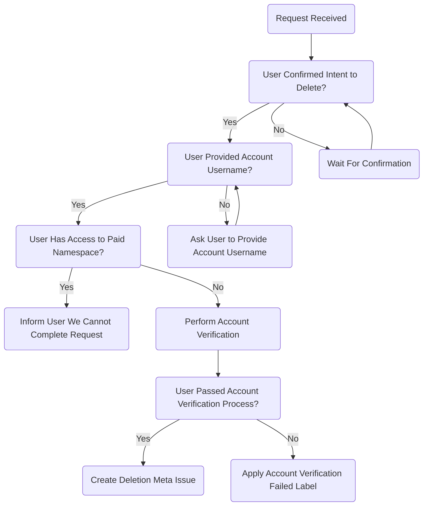

## On this page
{:.no_toc .hidden-md .hidden-lg}

- TOC
{:toc .hidden-md .hidden-lg}

## Overview

Use the appropriate workflow on this page when a user requests the deletion of their GitLab.com account either through a Zendesk ticket or via an email to our [Account Deletion and Other Requests](https://gitlab.com/gitlab-com/gdpr-request/issues/service_desk) project. **These requests must be filled within 30 days.**

## Before You Begin

Account deletion requests must go through a few stages before they can be closed and it can be difficult to keep track of what stage in the process each request is in at any given time. To help, consider creating an issue board within the account deletion project and use the `Awaiting::Confirmation`, `Awaiting::Challenge Answers`, `Awaiting::Deletion`, and `meta-issue` labels to track the progress of each request. See [this board](https://gitlab.com/gitlab-com/gdpr-request/-/boards/2316580?assignee_username=tristan&) for an example.

## Workflows

### Zendesk

>**NOTE:** As there is a [known bug with Group Managed Accounts](https://gitlab.com/gitlab-org/gitlab/-/issues/209081), see the [Group Managed Accounts section](#group-managed-accounts) for the process.

When a request is received through Zendesk as a ticket, do the following:

1. Apply the [**Support::SaaS::Account Deletion Instructions - GitLab.com**](https://gitlab.zendesk.com/agent/admin/macros/360027176693) macro and mark the ticket as solved.

This will simply advise the user to email `personal-data-request@gitlab.com` in order to have their request processed. The request will then be serviced when received in the [Personal Account Requests Service Desk](https://gitlab.com/gitlab-com/gdpr-request/issues/service_desk).

### Personal Account Requests Service Desk

When a user emails `personal-data-request@gitlab.com` or `gdpr-request@gitlab.com` an issue is automatically created in the [Personal Account Requests Service Desk](https://gitlab.com/gitlab-com/gdpr-request/-/issues/service_desk), meaning comments made on it will be emailed to the submitter.

Upon submission, the submitter will receive an [autoresponder](https://gitlab.com/gitlab-com/gdpr-request/-/blob/master/.gitlab/service_desk_templates/thank_you.md) thanking them for their request and informing them that they must reply back for confirmation before we can proceed. Servicing these requests is a two stage process. When a request is received, complete all of the following tasks in each stage in order.

#### **Stage 1: Verification**

>**NOTE:** Users have a total of 14 days to reply to our [autoresponder](https://gitlab.com/gitlab-com/gdpr-request/-/blob/master/.gitlab/service_desk_templates/thank_you.md) with confirmation that they wish to proceed before we close their request due to a lack of verification.

>**NOTE:** In order to keep track of which requests still require confirmation or answers to the challenge questions, you can optionally apply the `Awaiting Confirmation` or `Awaiting Challenge Answers` labels.

1. **Deletion Confirmation:** Before proceeding further you need to ensure that the user has responded confirming that they wish for us to delete their account, this will appear as a comment on the issue. If the user has not provided this confirmation within **7** days, remind them to with the `Confirmation Reminder` snippet below.

   

     
Confirmation Reminder

     
Greetings,

     
Recently we received and responded to a request to delete your account. As mentioned in our first response, we require positive confirmation of the request in the form of a reply to this message stating that you do want your account deleted. 

     
We have not yet received that confirmation from you. Please reply to this email to verify that you want your account deleted. If we do not receive a confirmation within the next 7 days, we will close your request.

     
This email contains a unique key that helps us verify that the owner of this email address made the request. Sending a new email to personal-data-request@gitlab.com will re-initiate this process. You must reply to this email in order to delete your account. 

     
Regards,

   

   If the user chooses to provide this confirmation by sending us an entirely new request, resulting in a new issue, reply to the original issue with the following `Request Re-Confirmation` snippet and **close** the new issue.

   

     
Request Re-Confirmation

     
Greetings,

     
Recently we received and responded to a request to delete your account. As mentioned in our first response, we require positive confirmation of the request in the form of a reply to this message stating that you do want your account deleted. We have not yet received that confirmation from you.

     
Please reply to this email to verify that you want your account deleted. This email contains a unique key that helps us verify that the owner of this email address made the request.

     
Sending a new email to personal-data-request@gitlab.com will re-initiate this process. You must reply to this email in order to delete your account.

     
Regards,

   

   If **7** more days have passed since the reminder was sent without confirmation from the user, send the following `Request Closed - No Confirmation` snippet and close the issue.

   

     
Request Closed - No Confirmation

     
Greetings,

     
Due to lack of identity verification, your request for account deletion is denied. This issue will be closed.

     
Regards,

   

1. **Username Confirmation:** Verify that the user has provided the username of the GitLab.com account associated with the originating email address of the request. If they have not, ask for them to provide it by replying with the `Verify Username` snippet below.

   

     
Verify Username

     
Greetings,

     
We appreciate you confirming your intent to delete your GitLab.com account. However, before we can proceed we will also need you to confirm the username of the GitLab.com account associated with this email address. Once we've confirmed the username, we'll issue some additional identity verification challenges.

     
Please provide this username at your earliest convenience so that we can begin the account deletion process.

     
Regards,

   

   If the username provided **does not** match the GitLab.com account associated with the originating email address, they may still be able to delete the account. You may proceed to verify they aren't part of a paid namespace and verify account ownership. If the user, even after sending the `Verify Username` snippet, did not provide the username, send the `Request Closed - No Confirmation` snippet (see above) and close the request.

1. **Paid Namespace Confirmation:** Verify that the user is not associated with a paid namespace on GitLab.com. If they are, do the following:
   1. Send the following `Paid Namespace Found` snippet:

      

        
Paid Namespace Found

        
Greetings,

        
As your account is associate with [Customer Name], we are unable to complete your request. Please contact your organization's system administrator to remove you from their projects if you would like to delete your account. After removal from [Customer Name]'s projects, you will need to begin a new Privacy Request.

        
This ticket will be marked as 'Solved'.

        
Regards,

      

   1. Close the issue.
   1. [Create a new Zendesk ticket](https://support.zendesk.com/hc/en-us/articles/203690946-Creating-a-ticket-on-behalf-of-the-requester) using the [`Support::SaaS::Account Deletion - Customer Contact Inform`](https://gitlab.com/search?utf8=%E2%9C%93&group_id=2573624&project_id=17008590&scope=&search_code=true&snippets=false&repository_ref=master&nav_source=navbar&search=id%3A+360056264079) macro on behalf of the customer using the contact information for them associated with the subscription in the [Customer Portal](https://customers.gitlab.com).

1. **Account Ownership Verification:**
   Verify that the requestor is the owner of the account in question by sending the [Verification Challenges](https://gitlab.com/gitlab-com/support/internal-requests/-/wikis/Account-Verification-Challenges) snippet.

   Once the user replies back with their answers to the challenges, follow the [Account Verification](https://about.gitlab.com/handbook/support/workflows/account_verification.html#if-the-user-responds-with-the-need-for-further-verification-by-answering-the-challenges) workflow using a data classification of `RED` as all user data is [classified as red](https://docs.google.com/spreadsheets/d/1eNuSLuBcZWQe13SV1TfEjtNdCOZw7G7ofY9A42Y0sPA/edit#gid=797822036). If verification fails or is otherwise not possible, apply the `Account Verification Failed` label and respond with the following:

   

     
Request Closed - Verification Failed

     
Greetings,

     
Unfortunately, your answers to our verification challenges have failed, so your request for account deletion is denied. This issue will be closed.

     
Regards,

   

#### **Stage 2: Deletion**

1. [Create a new confidential issue](https://gitlab.com/gitlab-com/gdpr-request/issues/new?issuable_template=deletion_meta_issue) in the Personal Account Requests issue tracker and follow the instructions at the top of the template, then complete each step in the issue template that begins with `Support Engineer:` in order.

#### Flow Chart

An overview of this process is outlined in the chart below.

## Group Managed Accounts

If a group is using [group managed accounts](https://docs.gitlab.com/ee/user/group/saml_sso/group_managed_accounts.html), user accounts may be orphaned until [gitlab#209081](https://gitlab.com/gitlab-org/gitlab/-/issues/209081) is fixed. You can use chatops to check whether a group has the relevant feature flags enabled.

When checking the user account in admin, the user will be badged as a "Group Managed Account". Double check that the user is no longer a member of any group.

In these cases, we can delete the account so that a new user account can be created.

1. Use the [`Support::SaaS::Group Managed Account Deletion` macro](https://gitlab.com/search?utf8=%E2%9C%93&group_id=2573624&project_id=17008590&scope=&search_code=true&snippets=false&repository_ref=master&nav_source=navbar&search=id%3A+360073474899), which outlines the criteria and deletion.
1. Once Support receives permission from *both* the account holder and a group owner:
1. Create an [internal request issue](https://gitlab.com/gitlab-com/support/internal-requests/-/issues/new) titled "Account Deletion" with the username, email, ticket number, and the reason in brief in the description.
1. Email both the accound holder and group owner infoming that you are going to delete the account asking them to confirm for a final time.
1. Once confirmation has been received go to the user's admin page and click on "Delete user and all contributions".
1. Close the internal issue, and respond to the customer that the account has been deleted.
