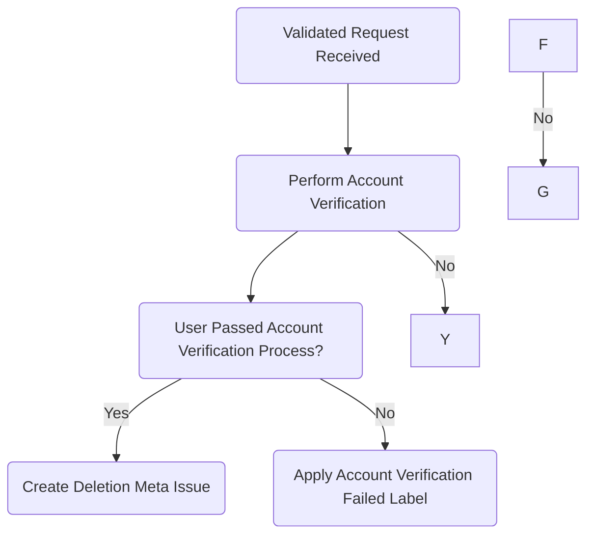

## On this page
{:.no_toc .hidden-md .hidden-lg}

- TOC
{:toc .hidden-md .hidden-lg}

## Overview

Use the appropriate workflow on this page when a user requests the deletion of their GitLab.com account either through a Zendesk ticket or via form submission to our [Account Deletion and Other Requests](https://gitlab.com/gitlab-com/gdpr-request/issues/service_desk) project. **These requests must be filled within 30 days.**

## Before You Begin

Account deletion requests go through a few stages before they can be closed and it can be difficult to keep track of what stage in the process each request is in at any given time. To help, consider creating an issue board within the account deletion project and use the `Awaiting::Challenge Answers`, `Awaiting::Deletion`, and `meta-issue` labels to track the progress of each request. See [this board](https://gitlab.com/gitlab-com/gdpr-request/-/boards/2316580?assignee_username=tristan&) for an example.

The label `Awaiting::Confirmation` is no longer needed as the user must confirm their intent to delete when they submit the request form. Any invalid requests will still create an issue in our [Account Deletion and Other Requests](https://gitlab.com/gitlab-com/gdpr-request/issues/service_desk) project, however they will close automatically with no further action needed from Support.

## Workflows

### Zendesk

>**NOTE:** As there is a [known bug with Group Managed Accounts](https://gitlab.com/gitlab-org/gitlab/-/issues/209081), see the [Group Managed Accounts section](#group-managed-accounts) for the process.

When a request is received through Zendesk as a ticket, do the following:

1. Apply the [**Support::SaaS::Account Deletion Instructions - GitLab.com**](https://gitlab.zendesk.com/agent/admin/macros/360027176693) macro and mark the ticket as solved.

This will direct the user to the [Personal Data Request form](https://gitlab-com.gitlab.io/support/support-ops/account-deletion-form-temp/), in order to have their request processed. The request will then be serviced when received in the [Personal Account Requests Service Desk](https://gitlab.com/gitlab-com/gdpr-request/issues/service_desk). 

The only requests we need to take action on are:

- validated account deletion requests (user is automatically sent challenge questions)
- validated data access requests (user is automatically sent challenge questions)
- general questions

All invalid requests will have `Invalid request received` in the title of the issue, and will be scheduled to automatically close. Validated requests mean that the username and email address submitted through the form have been verified (they exist in GitLab.com and the account is not part of a paid namespace).

### Personal Account Requests Service Desk

When a user submits a personal request using the [Personal Data Request form](https://gitlab-com.gitlab.io/support/support-ops/account-deletion-form-temp/),  an issue is automatically created in the [Personal Account Requests Service Desk](https://gitlab.com/gitlab-com/gdpr-request/-/issues/service_desk), meaning comments made on it will be emailed to the submitter.

Upon submission, the submitter will receive an autoresponder depending on the request and outcome of the initial validation. The autoresponse they receive will be in the initial description of the issue, along with a copy of the form entries that were submitted.

#### **Stage 1: Ownership Verification**

>**NOTE:** Users have a total of 14 days to respond to the challenge questions.

>**NOTE:** In order to keep track of the requests that are pending a response to the challenge questions, you can apply the `Awaiting::Challenge Answers` label if it does not already exist.

1. **Account Ownership Verification:**
   The user will receive a set of [Verification Challenges](https://gitlab.com/gitlab-com/support/internal-requests/-/wikis/Account-Verification-Challenges) after form submission, as long as the following form entries have been validated:
   - username is found / exists
   - email is found / exists
   - username and email match for the same account
   - the user checked the box confirming their request to delete their account
   
   Once the user replies back with their answers to the challenges, follow the [Account Verification](https://about.gitlab.com/handbook/support/workflows/account_verification.html#if-the-user-responds-with-the-need-for-further-verification-by-answering-the-challenges) workflow using a data classification of `RED` as all user data is [classified as red](https://docs.google.com/spreadsheets/d/1eNuSLuBcZWQe13SV1TfEjtNdCOZw7G7ofY9A42Y0sPA/edit#gid=797822036). If verification fails or is otherwise not possible, apply the `Account Verification Failed` label and respond with the following:

   

     
Request Closed - Verification Failed

     
Greetings,

     
Unfortunately, your answers to our verification challenges have failed, so your request for account deletion is denied. This issue will be closed.

     
Regards,

   

#### **Stage 2: Deletion**

1. [Create a new confidential issue](https://gitlab.com/gitlab-com/gdpr-request/issues/new?issuable_template=deletion_meta_issue) in the Personal Account Requests issue tracker and follow the instructions at the top of the template, then complete each step in the issue template that begins with `Support Engineer:` in order.

#### Flow Chart

An overview of this process is outlined in the chart below.

## Group Managed Accounts

If a group is using [group managed accounts](https://docs.gitlab.com/ee/user/group/saml_sso/group_managed_accounts.html), user accounts may be orphaned until [gitlab#209081](https://gitlab.com/gitlab-org/gitlab/-/issues/209081) is fixed. You can use chatops to check whether a group has the relevant feature flags enabled.

When checking the user account in admin, the user will be badged as a "Group Managed Account". Double check that the user is no longer a member of any group.

In these cases, we can delete the account so that a new user account can be created.

1. Use the [`Support::SaaS::Group Managed Account Deletion` macro](https://gitlab.com/search?utf8=%E2%9C%93&group_id=2573624&project_id=17008590&scope=&search_code=true&snippets=false&repository_ref=master&nav_source=navbar&search=id%3A+360073474899), which outlines the criteria and deletion.
1. Once Support receives permission from *both* the account holder and a group owner:
1. Create an [internal request issue](https://gitlab.com/gitlab-com/support/internal-requests/-/issues/new) titled "Account Deletion" with the username, email, ticket number, and the reason in brief in the description.
1. Email both the accound holder and group owner infoming that you are going to delete the account asking them to confirm for a final time.
1. Once confirmation has been received go to the user's admin page and click on "Delete user and all contributions".
1. Close the internal issue, and respond to the customer that the account has been deleted.
