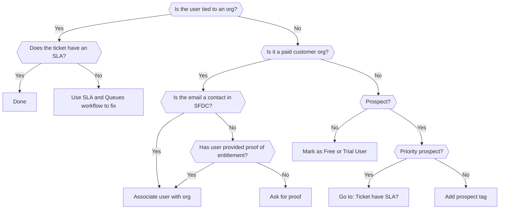

## On this page

{:.no_toc .hidden-md .hidden-lg}

- TOC
{:toc .hidden-md .hidden-lg}

## Use case

Tickets often come in without an associated organization, which means that no SLA is applied.

Potential reasons this might occur:

1. It's the first time user has submitted a ticket.
1. The user is writing from a domain name that doesn't match what we have in ZD
  (for example, using a personal email address for a work-related issue).
1. The user or organization has a no subscription or a trial subscription.

### Determining if this workflow applies

This workflow applies if ZD is prompting you to create an organization.

> **Note**: Please do not manually create organizations. This can break the ZD<>SFDC
> integration and cause users to receive incorrect SLAs. If you notice an
> organization needs to be created, please notify support-ops to rectify this.

## Overall Flow

See also the

- [triage page](ticket_triage.html) on assigning the correct form, and
- [SLA and Zendesk views page](sla_and_views.html) for after an org is associated.

## Identifying customers and users

Tickets can be created by different types of users.
Check whether a requester matches a type in the following order:

1. **[Customer](#identifying-customers)** - Has a paid current subscription for GitLab SaaS and/or self managed.
  - Customers receive SLA on their tickets as described in the [Standard and Priority Support](/support/#standard-support) section.
1. **[Prospect](#identifying-and-marking-prospects)** - Organization trialing GitLab that is sales assisted, also often referred to as a POC (proof of concept).
  - Prospects do not receive SLA unless sales has [manually marked them as a priority prospect](/handbook/support/internal-support/#trials-and-prospect-support).
1. **[Trial](#identifying-and-marking-trials)** - User or organization that has taken out a trial, typically using the free trial form.
  - Often, users identify themselves as `Gold` or `Ultimate` based on their trial plan, but **Trial** users do not get support as mentioned on the [Free trial page](/free-trial/).
1. **[Free User](#identifying-free-users)** - User of GitLab (SaaS or self managed) who has not purchased any type of paid subscription plan, and is not a Prospect.

### Identifying customers

If a requester has identified themselves as a paid customer,
you can tie the ZenDesk organization to the user if the user meets one of the following:

1. In Salesforce (SFDC), the email is listed as a contact for an organization.
1. Meets [proof of entitlement](/support/#proving-your-support-entitlement), meaning:
  - For self-managed, the user has provided the required license information.
  - For GitLab.com, user is a member of paid group. Use the `GitLab User Lookup` app in the Zendesk sidebar to check the user's membership details.
1. Possibly, ask the TAM (Technical Account Manager) or Account Owner (also known as AM / Account Manager)
listed in SalesForce, in the `#account-management` slack channel,
to add the user under the contacts for that Salesforce Account.
While that's happening, please let the customer know you are reaching out to their TAM/AM to get them properly associated with the organization.

*Look up resource*: You can use the [customer account look up workflow](looking_up_customer_account_details.html)
to find the relevant subscription and organization name.

If the user has not met the above criteria:

- If it's unclear, you may need to ask the customer [to prove their entitlement](/support/#proving-your-support-entitlement) (for self-managed, macro: `Support::Self-Managed::Locating GitLab subscription`).
- If the customer has a subscription, but *not* for the product they're inquiring about,
let the customer know and consider them [a prospect](#identifying-and-marking-prospects).
- If after reviewing the "proof", they do not appear to be a customer, check the following sections on identifying and marking trials, prospects, and free users.

### Identifying and marking prospects

The user is a prospect:

- if SFDC Account Type is "Prospect".
- typically self-identified in ZD as "Sales Assisted Trial".

#### Priority prospect with SLA

When [sales has marked a prospect organization](/handbook/support/internal-support/#trials-and-prospect-support)
with `Manual Support Upgrade`:

- [Associate the org](#adding-a-customer-to-an-organization) synced from SFDC.
- SLA will be automatically applied based on the `priority_prospect` tag.

Note: Further tags need to be [manually added to show in a single view](sla_and_views.html#priority-prospects-showing-in-multiple-views).

#### Other prospects

For all other prospects:

- add the `prospect` tag.

**Note:** It will be moved to the `Free/Self-Provisioned Trial Support` view without SLA,
so you should also respond with the appropriate `Free User` macro.

#### Organization incorrectly marked as a Prospect in SFDC

In SFDC, you may notice an organization has the Type set to `Prospect` but associated with a non Expired support level,
and the account in the CustomersDot shows that the org has a valid self-managed license or a GitLab.com subscription.
In this case, you may need to update the org in SFDC:

- Check if `Subscriptions` section in SFDC contains information about a valid subscription.
- Check if account in the CustomersDot contains information about the purchased subscription.
- Double click `Prospect` type, change it to `Customer` and click `Save`.
- After that, notify `@Sales-Support` by following the steps similar to the ones in [this section](sla_and_views.html#handling-customers-with-expired-licenses-and-updating-info-on-sfdc-side) to tag them.
- **IMPORTANT**: if you are not sure about the changes, ask `Sales-Support` to do it.
- As soon as the org has a valid `Customer` type, it will propagate to Zendesk.

### Identifying and marking trials

If you cannot find an account (organization) in SFDC, when searching by email, you should find:

- a *Lead*, where `Initial Source` mentions `Trial`,
- date is within the last 30 days.

Alternate ways to check:

- GitLab.com: [CustomersDot](https://customers.gitlab.com/admin) > `GitLab Groups` Tab >
an expiration date under the **Trials** column.
If needed, also check the
[internal-requests project](https://gitlab.com/gitlab-com/support/internal-requests/issues)
for manual plan changes.
- Self-managed: [LicenseDot](http://license.gitlab.com) portal as per [customer info license lookup](looking_up_customer_account_details.html#within-licensegitlabcom).

If you identify a ticket as from a trial user,

- add the `trial` tag to it.
- subscription type field does not need to be updated.

**Note:**  It will be moved to the `Free/Self-Provisioned Trial Support` view without SLA,
so you should also respond with the appropriate `Free User` macro.

### Identifying free users

If you cannot identify a user as a customer, prospect, or trial, [mark them as a free user](#marking-free-users).

## Associating an organization

### Finding the appropriate organization name

While often they match, the organization name a customer provides will not always match what's in ZD.

Since [the ZD organization information is synced from the SFDC Account](/handbook/support/support-ops/responsibilities.html#account---organization-sync-from-salesforce),
if you're unsure, [looking up the account in Salesforce](looking_up_customer_account_details.html#within-salesforce) for the org name.

You can search for organizations using the ZD search (see screenshow below).

### Adding a customer to an organization

Follow these steps after [identifying the user as a customer](#identifying-customers).

To associate a user with an organization:

1. Click on the user's name in ZD ticket.
1. In the "Org" field type the organization name.
1. Select the appropriate organization.

## Marking free users

After [identifying a free user ticket](#identifying-free-users):

- Self-managed:
  1. Change the ticket to use the `GitLab CE` form if applicable.
  1. Reply using the `Free user` macro to explain they do not receive support.
- GitLab.com:
  1. Ensure the correct form (accounts or general).
  1. `Tell us about your GitLab subscription` change to `Free user`.
  1. Select the appropriate `Problem Type`.
    - If you cannot choose an appropriate problem type, then check [if the user qualifies](/support/statement-of-support.html#support-for-free-plan-users).
  1. If the user does not qualify for support, use the appropriate `Free user` macro.

The ticket will be moved to the `Free/Self-Provisioned Trial Support` view.

For example:

- a user `username@domain.tld` submits a ticket to GitLab Support.
- you search by the requester's e-mail i.e. `username@domain.tld`, the e-mail
  specified in the field `Email associated with your subscription`, or using the
  customer's domain and you cannot find any related accounts in SFDC.
- you search for the same data in the CustomersDot and cannot find any accounts there.
- you view any groups the user is a member of and confirm that no subscriptions exist in the CustomersDot
- you view `GitLab User Lookup` app in the Zendesk sidebar and none of the groups are on a paid plan
- if an account exists in the CustomersDot, no subscriptions are shown and you see
  `Choose a plan that suits your needs` when using `Impersonate` functionality.
