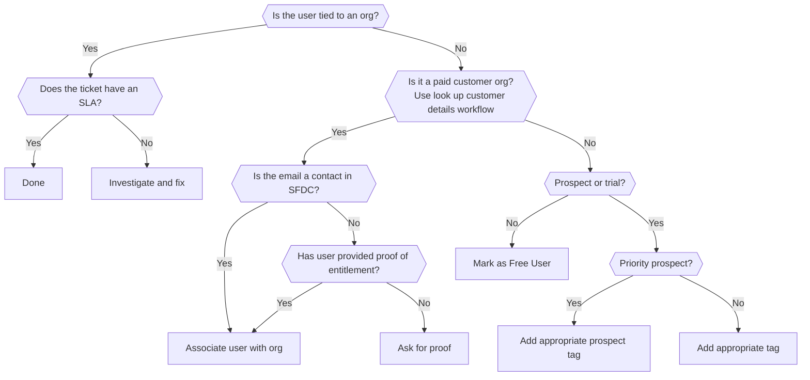

## On this page

{:.no_toc .hidden-md .hidden-lg}

- TOC
{:toc .hidden-md .hidden-lg}

## Associating tickets with the `needs-org` tag with appropriate organizations

Occasionally tickets come in without an associated organization, which means
that no SLA is applied.

Potential reasons this might occur:

* we've never seen anyone from the organization in ZD before (i.e. this is an
  organization's first ticket)
* the user is using a generic domain name that we cannot assign to a ZD
  organization (e.g. `@gmail.com`)
* the company has more than one division with a support level, but only a single
  email domain
* the user is writing from a domain name that doesn't match what we have in ZD
  (e.g. they're using a personal email address for a work-related issue)
* the user or organization has a trial license

It could equally be the case that a ZD organization was manually created and the
SLA type is out of date / incorrect. Many of the same principles apply here.

> Please do not manually create organizations. This can break the ZD<>SFDC
> integration and cause users to receive incorrect SLAs. If you notice an
> organization needs to be created, please notify support-ops to rectify this.

### Overall Flow



### Determining if this workflow applies

This workflow applies if:

* ZD is prompting you to create an organization
* The Tag `needs-org` is applied (implied by above)
* You have reason to believe that this ticket belongs to a customer
* The domain TLD is *not* a generic domain (e.g. `gmail.com`)


### Trials and Prospects

There are two types of users/organizations that have not yet purchased a GitLab subscription/license:

* **Trial** = user or organization that has taken out a trial, typically using
  the free trial form.
* **Prospect** = organization trialing GitLab that is sales assisted, also often
  referred to as a POC (proof of concept).

How to define if a ticket is from a prospect or a trial? A long term solution is still in progress. 
At the moment, the process is mostly manual: check the form content,
check the ticket content, it can refer to POC or prospect, check if there were any sales representantives' posts in one 
of the Support Slack channels. In the last case, please add an internal note on the ticket. Hints mentioned below should help
you to identify prospects or trials correctly.

#### Identifying trials

While SFDC syncs organizations nightly to Zendesk, it does not include trial licenses
because no organization account is created in SFDC for trials, only a lead. So
organizations on a trial will not be shown in Zendesk.

To check if a customer is on a trial: in SFDC (see search instructions below),
the `Initial Source` will likely say `Trial` (check that initial date is within
the standard trial period).

For GitLab.com, in the [CustomersDot](https://customers.gitlab.com/admin),
trials are marked with an expiration date under the **Trials** column in the `GitLab Groups` Tab next to a namespace.
If needed, also check the
[internal-requests project](https://gitlab.com/gitlab-com/support/internal-requests/issues)
for manual plan changes.

For self-managed, you can double-check for a license in the [LicenseDot](http://license.gitlab.com) portal
as described in [Finding the existing license in LicenseDot](#finding-the-existing-license-in-licensedot).

**Trial** users do not get support as mentioned at [Free trial page](https://about.gitlab.com/free-trial/).
If you find a ticket from the organization using trial, add `trial` tag to it.
Once tagged, the ticket from trial 
will move to the view `Free/Self-Provisioned Trial Support` and will not get SLA.

**Note:** due to the type of subscription/license they receive, trial users often identify themselves as
Ultimate or Gold customers. This form field does not need to be updated as SLA is tied to the Zendesk org.

#### Identifying prospects

**Prospects** will get SLA if the conditions listed in [Trials and Prospect Support](https://about.gitlab.com/handbook/support/internal-support/#trials-and-prospect-support) are met: if an organization in SFDC has `Manual Support Upgrade` checked. In this case, an org with 
the type `Prospect` or `Prospect - CE User` will be synced to Zendesk, it will be possible to associate a user with this org,
and their ticket will then get SLA.

Such organization will get SLA because it will have `priority_prospect` tag.
By default, such tickets will be shown both in SM and GitLab.com views. To make it visible
only in the appropriate view, add either `prospect_saas` or `prospect_sm` tag to a ticket.

If the steps described in [Trials and Prospect Support](https://about.gitlab.com/handbook/support/internal-support/#trials-and-prospect-support)
were not done, a prospect organization will not be propagated from SFDC to Zendesk, and the prospect will not get SLA. 
In this case, assign `prospect` tag to this ticket. It will be moved to the view `Free/Self-Provisioned Trial Support` without SLA.

**Note:** there can be duplicate orgs or orgs incorrectly marked as prospects. If you see that the org is a prospect but other evidence shows that this is a valid customer, follow the workflow [Organization is incorrectly marked as a Prospect in SFDC](#organization-is-incorrectly-marked-as-a-prospect-in-sfdc).

##### Organization is incorrectly marked as a Prospect in SFDC

In SFDC, you may notice an organization has the Type set to `Prospect` but associated with a non Expired support level,
and the account in the CustomersDot shows that the org has a valid self-managed license or a GitLab.com subscription. 
In this case, it you may need to update the org in SFDC:

- Check if `Subscriptions` section in SFDC contains information about a valid subscription and is not empty.
- Check if account in the CustomersDot contains information about the purchased subscription.
- Double click `Prospect` type, change it to `Customer` and click `Save`.
- After that, notify `@Sales-Support` by following the steps similar to the ones in [this section](#handling-customers-with-expired-licenses-and-updating-info-on-sfdc-side) to tag them.
- **IMPORTANT**: if you are not sure about the changes, ask `Sales-Support` to do it.
- As soon as the org has a valid `Customer` type, it will be propagated to Zendesk.

### Marking Free Users for GitLab.com

For GitLab.com, if a user cannot be identified as a customer, nor a
[trial or prospect](#trials-and-prospects), it should be marked as `Free user`. See example below:

* a user `username@domain.tld` submits a ticket to GitLab Support.
* you search by the requester's e-mail i.e. `username@domain.tld`, the e-mail
  specified in the field `Email associated with your subscription`, or using the 
  customer's domain and you cannot find any related accounts in SFDC.
* you search for the same data in the CustomersDot and cannot find any accounts there.
* you view any groups the user is a member of and confirm that no subscriptions for their groups
  exist in the CustomersDot
* if an account exists in the CustomersDot, no subscriptions are shown and you see 
  `Choose a plan that suits your needs` when using `Impersonate` functionality.

In such case, select `Free user` in `Tell us about your GitLab subscription` dropdown and
submit the ticket to apply the changes. This ticket will now disappear from the `Needs Org & Triage` view
and will be visible in `Free/Self-Provisioned Trial Support` view.

If you are unsure if a user is really free, ask for someone with admin access on GitLab.com
to check the user via the `#support_gitlab-com` Slack channel.

**Note:** be extra careful when searching using the customer's domain: there can be generic domains
that you are not aware of, and there can be large customers with multiple organizations using the same
domain. Therefore, search by e-mail is more reliable.

**Note:** in some cases you will need to search by e-mail and by domain. For example, 
if the e-mail has previously been associated with a trial account it will still be visible 
in SFDC but this might not be the same account that is used by the organization.

### Finding the existing organization in Zendesk

You may attempt to find the organization within Zendesk using the search
functionality. Do note that TLDs don't necessarily correspond to company names,
so you may need to search in SFDC to find the appropriate organization.

Also, note that users may be using generic mail providers you might not be familiar with, so the TLD on their email address may not correspond with their company at all.

> When in doubt, check SFDC


### Finding the existing organization in SFDC (aka Salesforce)

See: [Looking up customer account details in Salesforce](/handbook/support/workflows/looking_up_customer_account_details.html#within-salesforce)

#### Organization exists in SFDC but service level does not match Zendesk

At times, the organization exists in Zendesk but has the wrong service level.
This would indicate a potential problem with the SFDC -> ZD sync, so you should
open an issue to the
[support-ops-project](https://gitlab.com/gitlab-com/support/support-ops/support-ops-project/issues/new)

### Finding the existing organization in [customers.gitlab.com](https://customers.gitlab.com)

See: [Looking up customer account details in customer.gitlab.com](/handbook/support/workflows/looking_up_customer_account_details.html#within-customersgitlabcom)

### Finding the existing license in LicenseDot

All self-managed licenses including trial ones should be available in [LicenseDot](http://license.gitlab.com) portal.
You should be able to access it with your dev.gitlab.org account. If a customer provides you with their license ID,
you can verify it in the portal by appending the ID to the link https://license.gitlab.com/licenses/, so the final link
to the license will look like https://license.gitlab.com/licenses/LICENSE_ID

### Finding the existing license when a customer includes the full license file

Sometimes a customer may include the full license file to prove their support entitlement. You can determine the license ID (and thus organization) by
extracting the ID.

First, trim the carriage returns and/or new lines:

```
tr -d '\r\n' < file_name.gitlab-license
```

Then, from the Rails console on your own self-managed instance:

```
license = ::License.new(data: "<paste entire license key without the carriage returns>")
"https://license.gitlab.com/licenses/".concat(license.license_id.to_s)
```

This will return nice URL that will take you the relevant license in LicenseDot.

```
=> "https://license.gitlab.com/licenses/<license_id>"
```


### Adding the domain (Zendesk Admins only)

> **Important**: Be extra careful here. If a large company has multiple
  subscriptions it may not be appropriate to add the domain. You'll need to add
  individual customers to the appropriate organization (see below)

Once you've determined the appropriate domain to add and identified the correct
ZD Organization, you can click the `Domains` field to add it.


### Adding a customer to an organization (All Zendesk Users)

If you don't have admin access on ZD, you can still make sure the proper SLA is
applied by adding the user to the appropriate organization.

Before doing this, you first need to ensure the user is supposed to be
associated with the organizations. The current process for this is as follows:

1. Locate the organization in Salesforce
1. Check the contacts for the Account in Salesforce
1. If the user's email address is listed there, you may safely associate the
   user to the organization.
1. If the users email is not listed then the following workflow applies and reflects how
   [customers prove their entitlement](https://about.gitlab.com/support/#proving-your-support-entitlement).

**For GitLab.com users:**

   1. The user (matched by ticket requester's email) is in the paid group for which they are asking for support (or it's an account related issue)


**For Self-managed users:**

   1. Ask the user to provide their license details and verify the license/e-mail is valid (e.g. in [Licenses portal](https://license.gitlab.com/)). If valid, it is OK to associate this particular user to the org that owns the license.
      * There is a field in the ticket titled **Email associated with your GitLab instance**. It is possible that it is already populated and that user already provided the e-mail that is owning the license, in which case we don't need to explicitly ask for it (or the screenshot).
      * You can also ask the user to provide a screenshot of the `/admin/license` endpoint from their instance or to tell you the e-mail to which the license their organisation is using is associated to. To do this quickly, you can use the macro called **Self-Managed::Locating GitLab subscription**. 
   1. Reach out to the TAM (Technical Account Manager) or Account Owner (sometimes referred to as AM / Account Manager) to confirm they should be added.  Do this in the `#account-management` slack channel and mention the TAM or AM if they are known.
         1. Ask the TAM / Account Owner to add the user under the contacts for that Salesforce Account. (You can find the TAM / Account Owner name in Zendesk on the Organization's screen - this is synced from SalesForce.)
   1. If the organization does not have a Technical Account Manager or Account Owner and we can't verify them via another method, then we need to ask the subscription owner if the user is eligible for support.
         1. Identify the subscription owner (customer) by looking at the existing contacts for the Salesforce account
         1. Create a new ticket in Zendesk to the subscription owner, advising them that an unknown user is requesting support via their subscription and that we require their consent before we can help them. If possible, avoid disclosing the email address of the unknown user to the subscription owner and use name and GitLab.com handles to relay identification.
         1. Link that verification ticket back to the original ticket request via an internal comment in both tickets so others can keep track of it
         1. Once the subscription owner confirms that the unknown user is authorized for support under their subscription, you can then ask for the unknown user to be associated with the organization in Salesforce via the `#account-management` Slack channel.
1. Once the user is added as a contact in Salesforce, you may safely associate the user to the organization.

**Note**: While you are working with the TAM/AM to get the user added as a
Salesforce contact, please let the customer know you are reaching out to their
TAM/AM to get them properly associated with the organization.

The process to associate a user with an organization is:

1. Click on the users's name in ZD
1. In the "Org" field type the organization name


### Customer reply from email address not associated with ticket
When a customer responds to a ticket from an email address that is not included in CC or is not the original requestor, the customer's response is recorded as internal. The current workaround is to add that email of the customer to CC and reply. After that, their next replies will not be marked as internal anymore.

Be sure to notify the customer that a CC has been added to the ticket. For example:

> We got a note from John with email address john@domain.org. From the context it looks like they should be included in the ticket, so for convenience I added them to the CC list. If they shouldn't be included, please let us know so we can remove them.`

### Verifying that the ticket now has the proper SLA applied

Now that you've added the appropriate domain, head back to your original ticket
and verify that it is associated with the appropriate organization and SLA.


### Handling tickets without SLA

Sometimes you may notice that a ticket still has no SLA even when a user is associated with an organization.
There are two classes of reasons:

**By-default Zendesk behavior:**

- This can happen if a support person was the last one who replied to this ticket or
this ticket was put to **On-hold** status and reopened automatically. There is nothing to fix in this case.
- This ticket was updated by a person on the customer's side from an e-mail that is not
included in CC or is not the original requestor of the ticket. In this case, we need to add this e-mail to CC
before replying to such a ticket. There is a [trigger](https://gitlab.zendesk.com/agent/admin/triggers/360019008340/revisions/3)
which sends an internal note to remind people to do it, see [this issue](https://gitlab.com/gitlab-com/support/support-team-meta/-/issues/1581) for more details.

**Org's status on SFDC side:**

Statuses of organizations are propagated to Zendesk from SFDC during the regular sync. SLA will not be shown for organizations
with some special statuses. To check the status of an organization in Zendesk, click the organization name and check the field `GitLab Plan`,
see the GIF below. The following values of `GitLab Plan` may cause the absence of SLA:


- `Community`. It means that the organization is an educational institution that obtained a license according to
[GitLab for Education](https://about.gitlab.com/solutions/education/), and this license does not have support included
unless it was purchased additionally. Their tickets **will have no SLA**, and it is expected behavior. You may explore their
status on the SFDC side according to [Finding the existing organization in SFDC](#finding-the-existing-organization-in-sfdc-aka-salesforce).

- `Expired`. In general, it means that their self-managed license or GitLab.com subscription is expired
but often it can be caused by some incorrect information on the SFDC side. Follow the section [Handling customers with expired licenses and updating info on SFDC side](#handling-customers-with-expired-licenses-and-updating-info-on-sfdc-side) to fix it,
and then follow the [Fixing tags for tickets with `Expired` organization](#fixing-tags-for-tickets-with-expired-organization) section.
Note that we have [an ongoing issue](https://gitlab.com/gitlab-com/sales-team/field-operations/systems/-/issues/634)
that causes a lot of accounts to be incorrectly shown as `Expired` in SFDC. Follow the same workflow to deal with them.

- `Hold`. Such status can be shown if customer delays payment or there is some other issue with the sales process. You may contact an Account Manager or
other person involved in the sales process to clarify the customer's status in such case.

- If `GitLab Plan` shows a valid value like `Silver`, `Starter`, etc but there is still no SLA then likely there is an issue with tags in the specific ticket. You may explore it on your own or ask support-ops or other support team members for help.

> **Important**: always leave internal comments when doing something on the SFDC side or modifying some tags in Zendesk. It will help next engineer
to understand what was done in the ticket.

### Handling customers with expired licenses and updating info on SFDC side

If `GitLab Plan` in Zendesk shows `Expired`, it means that the organization is marked as
`Former Customer` in SFDC, and support level is set to `Expired` there. In such case, it is
better to check with Sales if the status is valid or not:

* Open [Salesforce](/handbook/support/workflows/looking_up_customer_account_details.html#within-salesforce) and find the customer in question.
* Click `Show feed` button at the upper part of the page.

  

* Send a message there asking to clarify the customer's status and mention
  `@Sales-Support` username in SFDC, they should be able to help with such cases.
  Make sure that `@Sales-Support` is converted into clickable username, otherwise
  Sales Support team will not get your message (see the GIF below):

  

  Example of the message:

  ```
  John Doe (Support Engineer): @Sales-Support, this organization has
  Support Level set to Expired, and they opened a new ticket. Can you clarify if
  the support is really expired and if we should decline support for this customer, or
  this is some kind of error and Support Level should be updated? Customer also
  provided screenshot of their license and it seems valid.
  ```

  Prepending your message with your name and role (e.g. `John Doe (Support Engineer):`
  helps as everyone in Support is using a shared account so it is not possible to
  deduce who sent which message.

* Once you follow the above procedure, mention that in the internal note of the
ticket (e.g. with SFDC link) so that others can pick up from where you
left off.

**Note:** the same workflow applies if you notice that customer-related
information is not up-to-date on SFDC side and you are not able to update it
using our generic `Support Admin` account.

### Fixing tags for tickets with `Expired` organization

If data in the [LicenseDot](http://license.gitlab.com) and
the [CustomersDot](#finding-the-existing-organization-in-customersgitlabcom) shows
that the customer has a valid license, you should update the ticket in Zendesk side.
This part does not overlap with the steps from [Handling customers with expired licenses and updating info on SFDC side](#handling-customers-with-expired-licenses-and-updating-info-on-sfdc-side),
it should be done in combination: first [update information on the SFDC side](#handling-customers-with-expired-licenses-and-updating-info-on-sfdc-side)
to fix future tickets, then follow this section to fix existing tickets:

- Open the ticket in question and find `Tags` field where all the tags are listed.
- Click `x` next to `former_customer` and `expired` tags.
- Start typing the appropriate tag name. E.g. if it is a customer with Bronze subscription, type `bronze` in `Tags` field.
When you see the required tag in the dropdown list, select it.
- After making sure that tags are updated correctly, Submit the ticket to apply the changes.


**Important notes**:
- When you assign a tag, there is a chance that the ticket will breach immediately.
  It is not strictly necessary but, if possible, send a public reply before
  you assign tags to prevent breach. Or, write your public reply and apply the tags,
  then Submit the ticket with both changes at the same time.

### Example: full sequence of actions that should be done to fix incorrectly expired organization

- A ticket comes to Zendesk and you spot that `GitLab Plan` is shown as [Expired](#handling-tickets-without-sla).
- First, search for any info about this organization in [SFDC](#finding-the-existing-organization-in-sfdc-aka-salesforce), [LicenseDot](http://license.gitlab.com/) and [CustomersDot](#finding-the-existing-organization-in-customersgitlabcom).
- If you found that they have a valid license or subscription i.e. it is not expired, you are likely facing [this issue](https://gitlab.com/gitlab-com/sales-team/field-operations/systems/-/issues/634).
- Fix SFDC side first by following [the steps above](#handling-customers-with-expired-licenses-and-updating-info-on-sfdc-side).
  Sales Support will usually reply to your message in SFDC, and you will be able to see it in the feed at the organization's page there.
  `GitLab Plan` value on Zendesk side will change from `Expired` to the valid one after the sync is done.
  After that new tickets from this orgination will be shown correctly. 
- Fix the tags in the ticket you are working using [these steps](#fixing-tags-for-tickets-with-expired-organization). Note that
  you do not need to wait for fix on SFDC side, you may fix the tags right away. SLA will appear in the ticket after doing it.
- Update the ticket with the internal comment describing what was done.

### Associated Triggers:
- [Add need-org tag](https://gitlab.zendesk.com/agent/admin/triggers/360001567348)
- [Remove need-org tag](https://gitlab.zendesk.com/agent/admin/triggers/360017109414)

### GitLab.com ticket is in `SM with SLA` queue

If you're sure that the ticket is related to **GitLab.com**, but you see it in 
**SM with SLA queue**, do the following:

1. Change the **Form** to **GitLab.com** (if it's not like that already)
1. Remove the tag that is related to self-managed plans (e.g. **basic** or
**premium**)
    1. **NOTE:** Do not remove a plan tag without ensuring a [SLA](https://about.gitlab.com/handbook/support/support-ops/zendesk/tags.html) tag is applied. A ticket
      without a plan tag will receive no SLA and not be visible in a view! If you
      are unsure of how to proceed, please reach out to @support-operations in
      slack.
1. Check to see if there is already a .com plan related tag.
    - If yes, you can submit with just the removal.
    - If not, add the `prospect` tag and the following note:
> This ticket was in SM with SLA queue, but it's obviously related to GitLab.com.
> I did not go into details whether this is a paying or free GitLab.com user, I
> only changed the tags so that it is not listed in the wrong queue, please verify
> if the customer is paying GitLab.com user and add the necessary tags so that
> correct SLA policy is applied to the ticket.

### SM ticket is in `.com with SLA` queue

If you're sure that the ticket is related to **Self-managed**, but you see it in 
**.com with SLA queue**, do the following:

1. Change the **Form** to **Self-managed** (if it's not like that already)
1. Remove the tag that is related to GitLab.com plans (**bronze**, **silver**, or
**gold**)
    1. **NOTE:** Do not remove a plan tag without ensuring a SLA tag is applied. A ticket
      without a plan tag will receive no SLA and not be visible in a view! If you
      are unsure of how to proceed, please reach out to @support-operations in
      slack.
1. Check to see if there is already a SM plan related tag.
    - If yes, you can submit with just the removal.
    - If not, add the `prospect` tag and the following note:
> This ticket was in the `.com with SLA` queue, but I believe it to be related to a Self-managed instance.
> I have not checked whether this is a paying or free user. I
> only changed the tags so that it is not listed in the wrong queue. Please verify
> if the user is a paying Self-managed customer and add the necessary tags so that the
> correct SLA policy is applied to the ticket.
