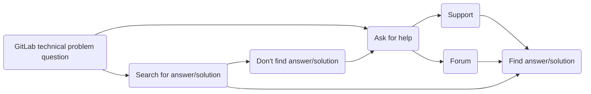
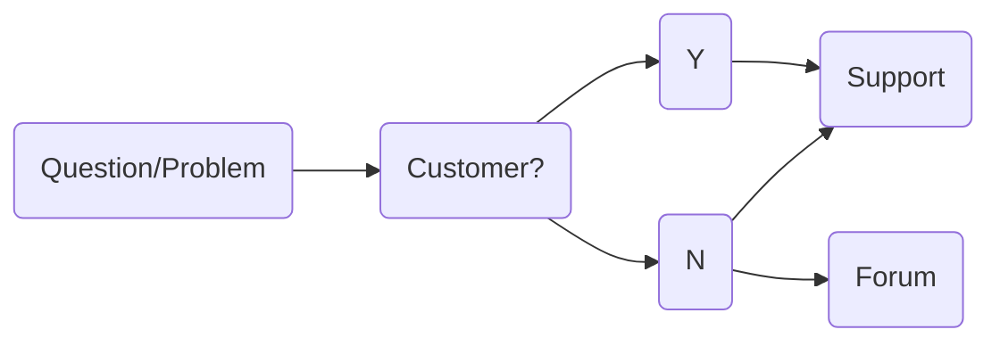
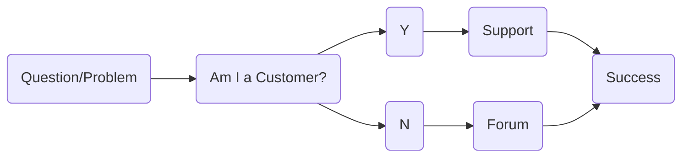
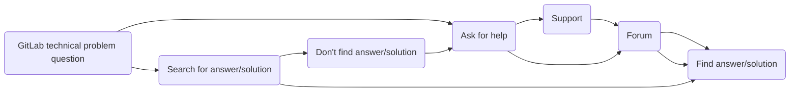
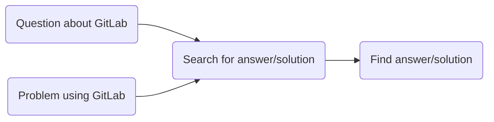

# Community Support

All GitLab team members, customers, contributors, and users are important members of the GitLab Community.

Problems encountered and questions asked by our wider community are often identical to problems solved and questions answered by Support Engineers when assisting customers.

Community Support is sharing knowledge, answers, and solutions in a way that makes them available and discoverable to *everyone* in the GitLab Community.

## Docs-first Community Support

GitLab Documentation's library is vast, and users sometimes need assistance in finding the answers they need.

GitLab employs a [Docs-first methodology](https://docs.gitlab.com/ee/development/documentation/styleguide.html#docs-first-methodology) to ensure our documentation is a SSoT resource where users can find answers, solutions, and information on using GitLab.

GitLab Support Engineers should default to using a **Docs-first approach to Community Support**.

The critical points of the Docs-first approach for Community Support are:

- Always (try to) respond with a link to the docs.
- If you find helpful content missing from our documentation, create a merge request or issue to add it. Then link the MR or issue in your reply.
- If a Community member says the documentation is incorrect, confusing, or deficient - encourage them to create an issue explaining the problem or contribute an MR to fix it.

### Special types

In our documentation styleguide we define ["special types"]((https://docs.gitlab.com/ee/development/documentation/styleguide.html#no-special-types)) of content that are not well-suited for our documentation - specifically Tutorials, How-to guides, and Explanations.

In a troubleshooting context, a docs-first approach to Support in the Community Forum can fill the "special type" gaps in our documentation.

Examples of Community forum threads where answers and solutions are "special types" that don't "fit" into the docs:

- Explanation - (eg. "I read the docs, but I don't understand.")
- Situation-specific Tutorials/How-tos - (eg. "I'm running GitLab CE 11.0 as a Docker container, and I want to upgrade to GitLab 13.2 EE Omnibus with minimal downtime, how can I safely do this?")
- Problem-specific Troubleshooting steps (eg. "I upgraded GitLab from 12.9 to 13.1 and now it's not working, I get 404 error on every page - please help!")

## GitLab Community Forum

Opening a thread in the GitLab Community Forum is the official and most efficient way for users of our free products to receive Technical Support.

### GitLab Support Modes of Work in Community Forum

- **[First Responder](#first-responder)** - early detection of customer-facing problems, bugs, and regressions
- **[Silo-breaker](#silo-breaker)** - publicly share solutions/answers relevant to free users
- **[Fruit picker](#fruit-picker)** - pick low-hanging fruit for quick, easy wins
- **[Fishing Instructor](#fishing-instructor)** - teaching Self-service and Community-first GitLab Support

#### First Responder

For detecting bugs, improving documentation, and identifying problems in our product that will affect paying customers, the GitLab community is an excellent resource.

The Community Forum is an early detection and early alert system for customer-facing problems.

GitLab FOSS makes up over 80% of the GitLab codebase. Any technical problems with this 80% of the codebase impact *all* GitLab users, including customers.

Free users often surface up bugs, regressions, and problems with our product or docs in the Community forum before we start getting support tickets from customers about them.

#### Silo breaker

Silo-breakers take common answers/solutions in Support ZenDesk and ensure they're available and discoverable to all GitLab users.

Support team members may notice patterns or trends in incoming Support tickets - new FAQs, increasingly common problems, confusion regarding a new feature, unclear documentation, or bugs affecting customers.

We communicate internally, usually via Slack and Support Week in Review, to raise awareness in Support and help anyone who encounters tickets on the subject.

If these same patterns or trends are present in the Community forum, providing answers and solutions in forum threads helps ensure answers/solutions are discoverable via a search engine.

#### Fruit-picker

Specializes in picking "low-hanging fruit" by publicly sharing known answers and solutions.

- Quick, easy wins. ("*I know the problem/question and can easily explain the solution/answer*")
- The answer is in our documentation. (polite link to docs is sufficient)
- Single-touch Solutions. (no follow-up required)

#### Fishing Instructor

It is more worthwhile to teach someone to do something (for themselves) than to do it for them (on an ongoing basis).

The forum is like fishing, "Toss in a Q, get out an A".

Fishing is "the activity of catching fish". To catch a fish, one must know how to fish, and where to find fish to catch. Some people hire fishing instructors or guides to help with this.

"Fishing instruction" in this context is an opportunity to showcase the resources are available and how to find them. (docs, issues, MRs, codebase, forum threads).

Currently we have a lot of folks reach out to Support without first looking for easy answers/solutions.

We also have folks who contact Support although they are not a customer. By showing free users where to fish, we can reduce any delay and friction in Community support options.

The most efficient and effective way to connect users with appropriate support option is to act in a way that encourages and increases the following support-seeking user flow.

The forum is a pond with fish, and the goal of this role is to:

- make sure free users know how to fish
- direct free users to the best fishing spots
- keep our pond well stocked

"Fishing instructors" enable and empower GitLab users to catch their own fish - find solutions and answer questions without Support intervention.

By directing incoming Free user tickets to the Community forum, where fishing instructors are available, users get in the habit of finding answers/solutions without relying on GitLab Support.

### Accepted Answers

Mark a response as an "accepted solution" in situation where a single response effectively answers or resolves a forum thread.

### Flagging Posts

If you see a form post that is clearly abuse or spam, flag the post by clicking the flag icon. This marks the post as abuse, which gets processed by GitLab Forum moderators.

### Working alongside the wider community

In the GitLab Community Forum, most tech support and troubleshooting assistance comes from community members volunteering their time and knowledge to help others.

If you see a community member volunteering their time to help another community member, give their reply a :heart: to show appreciation for their contribution.

### Documentation updates and deficiencies

Similar to GitLab Support ZenDesk tickets, unsolved GitLab technical support threads in the forum are often an opportunity to:

- link to the relevant documentation
- improve docs based on user interaction/feedback

### Community Support Experience

We aim to optimize the self-serve Support experience for all GitLab users.

#### Average Free User Support Experience

#### Optimal Free User Support Experience

Win-win-win - benefits GitLab community, customers, and team members.

- [x] self-serve support
- [x] docs-first
- [x] ticket deflection

