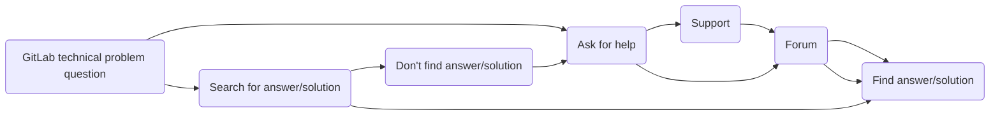
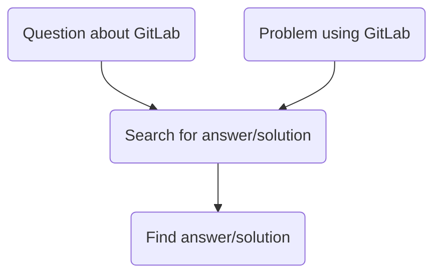
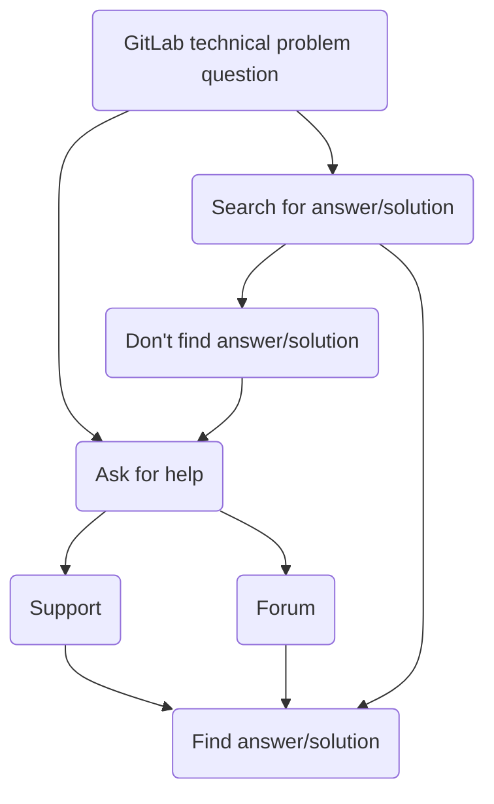
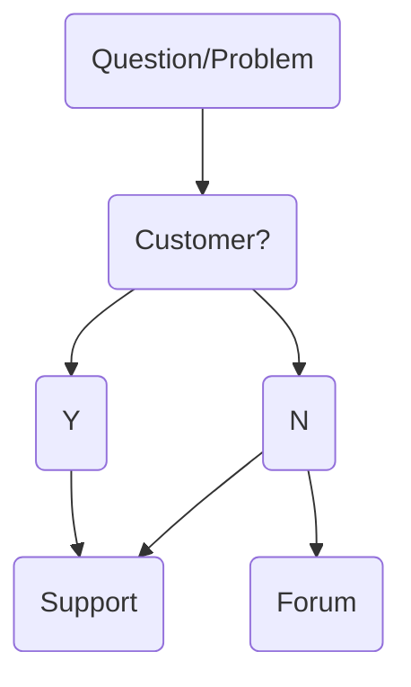
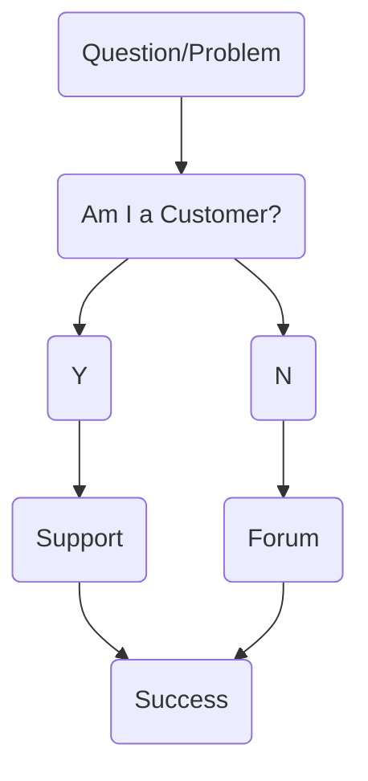

# Community Support

All GitLab team members, customers, contributors, and users are important members of the GitLab Community.

Problems encountered and questions asked by our wider community are often identical to problems solved and questions answered by Support Engineers when assisting customers.

Community Support is sharing knowledge, answers, and solutions in a way that makes them available and discoverable to *everyone* in the GitLab Community.

## Docs-first Community Support

GitLab employs a [Docs-first methodology](https://docs.gitlab.com/ee/development/documentation/styleguide.html#docs-first-methodology) to ensure our documentation is a SSoT resource where users can find answers, solutions, and information on using GitLab.

The GitLab Support team takes a docs-first approach to Support using the [Ticket deflection through documentation](https://about.gitlab.com/handbook/support/#ticket-deflection-through-documentation) workflow.

When we **encounter new questions/problems with answers/solutions not available in GitLab’s documentation**,
our first step should be to **create a merge request (MR) or issue to add this information to the docs**.
Once the MR or issue is created, we can then **share the MR/issue to communicate this information**.

If the answer to a question exists in documentation, **share the link to the docs instead of rephrasing the information**.

GitLab Support Engineers should default to using a **Docs-first approach to Community Support** when providing Support in the GitLab Community Forum or elsewhere.

Docs-first is a methodology that GitLab Support can share knowledge, answers, and solutions to ensure they're
available to everyone in our Community.

The library of GitLab Documentation is vast, some users may need assistance finding what they need.

With [docs-first](https://docs.gitlab.com/ee/development/documentation/styleguide.html#docs-first-methodology) approach to providing Community Support, we can ensure that the documentation remains a highly useful [single source of truth](https://docs.gitlab.com/ee/development/documentation/styleguide.html#documentation-is-the-single-source-of-truth-ssot) that GitLab users can use to locate answers/solutions on their own.

The key points of the Docs-first approach for Community Support are:

- Always (try to) respond with a link to the docs.
- If you find helpful content missing from our documentation, create a MR or issue to add it. Then link the MR or issue in your reply.
- If a Community member says the documentation is incorrect, confusing, or deficient, encourage them to create an issue explaining the problem or contribute an MR to fix it.

Beyond docs-first, there are several GitLab Support workflows helpful in getting answers and solutions available to all GitLab users.

## GitLab Community Forum

Opening a thread in the GitLab Community Forum is the official and most efficient way for users of our free products to receive Technical Support.

### Community Support user journey

### Optimal Community Support Experience

Win-win-win - benefits GitLab community, customers, and team members.

- [x] self-serve support
- [x] docs-first
- [x] ticket deflection

## GitLab Support Engineer Modes of Work in Community Forum

- **[First Responder](#first-responder)** - Early detection/alert system - of problems, bugs, regressions that will affect customers
- **[Silo-breaker](#silo-breaker)** - publicly share solutions/answers common in free user support
- **[Fruit picker](#fruit-picker)** - low-hanging fruit = quick, easy wins
- **[Fishing Instructor](#fishing-instructor)** - Self-serve Support
- **[Community Expert](#community-expert)** - [involving experts workflow](https://about.gitlab.com/handbook/marketing/community-relations/community-advocacy/workflows/involving-experts/)

### First Responder

The Community Forum is an early detection and early alert system for problems that will inevitably affect customers.

GitLab FOSS makes up over 80% of the GitLab codebase. Any technical problems with this 80% of the codebase will affect all GitLab users, including customers. GitLab has above 10:1 ratio for free users:customers.

In terms of detecting bugs, improving documentation, and identifying problems in our product that will affect paying customers, our community of free users is an excellent resource.

Free users can notice and bring up bugs, regressions, and problems with our product or docs in the Community forum before we get Support tickets from customers about them.

### Silo breaker

Silo-breakers take common answers/solutions in Support ZenDesk and ensure they're available and discoverable to all GitLab users.

Support team members may notice patterns or trends in incoming Support tickets - new FAQs, increasingly common problems, confusion regarding a new feature, unclear documentation, or bugs affecting customers. We communicate internally, usually via Slack and Support Week in Review, to raise awareness in Support and help anyone who encounters tickets on that.

If these same patterns or trends are present in the Community forum, providing this type of answers and solutions to forum threads could help get answers/solutions available and discoverable via search.

### Fruit-picker

Specializes in "picking" low-hanging fruit, or providing known answers/solutions to common GitLab user questions/problems with minimal effort.

- Quick, easy wins. ("*I know the problem/question and can easily explain the solution/answer*")
- The answer is in our documentation. (polite link to docs is sufficient)
- Single-touch Solutions. (no follow-up required)

### Fishing Instructor

> "give a [hu]man a fish, and you feed them for a day; teach a [hu]man to fish, and you feed them for a lifetime." - proverb

TL;DR: It is more worthwhile to teach someone to do something (for themselves) than to do it for them (on an ongoing basis).

The forum is like fishing, "Toss in a Q, get out an A".

Fishing is "the activity of catching fish". To catch a fish, one must know how to fish, and where to find fish to catch.
Some people hire fishing instructors or guides to help with this.

"Fishing instruction" in the forum is an opportunity to showcase the resources are available and how to find them. (docs, issues, MRs, codebase, forum threads). The forum is a pond with fish, and the goal of this role is to:

- make sure free users know how to fish
- direct free users to the best fishing spots
- keep our pond well stocked

"Fishing instructors" enable and empower GitLab users to catch their own fish - find solutions and answer questions without Support intervention.

By directing incoming Free user tickets to the Community forum, where fishing instructors are available, users get in the habit of finding answers/solutions outside of GitLab Support.

Self-serve support is the ability to find answers or solutions to technical problems by oneself. GitLab Support would consider self-serve support part of "ticket deflection".

Currently we have a lot of folks reach out to Support without first looking for easy answers/solutions.

We also have folks who contact Support although they are not a customer. By showing free users where to fish, we can reduce any delay and friction in Community support options.

The most efficient and effective way to connect users with appropriate support option is to act in a way that encourages and increases the following support-seeking user flow.

### Accepted Answer

If you see that a topic or thread in the forum was resolved by a forum member sharing the requested answer/solution, mark the reply solving the problem as an accepted solution.

### Working alongside the wider community

In the GitLab Community Forum, most of the tech support and troubleshooting assistance comes from community members volunteering their time and knowledge to help others.

If you see a community member volunteering their time to help another community member, give their reply a :heart: to show appreciation for their contribution.

### Documentation updates and deficiencies

Similar to GitLab Support ZenDesk tickets, unsolved GitLab technical support threads in the forum are often an opportunity to:

- link to relevant documentation
- improve docs based on user interaction/feedback

<!--TODO: Add link to training module>
