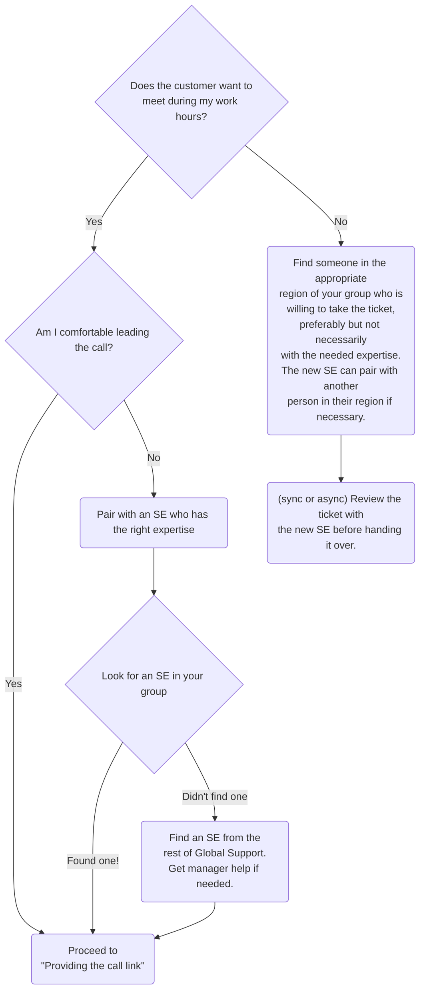

## On this page
{:.no_toc .hidden-md .hidden-lg}

- TOC
{:toc .hidden-md .hidden-lg}

## Introduction

This page presents the workflows to be used in Support Engineering to schedule,
prepare for, manage and follow-up on customer calls.

## Emotional Headwinds

We [hire smart humans to provide smart support](/handbook/support/workflows/how-to-respond-to-tickets.html#smart-humans-provide-smart-support). Humans have _feelings_. It is important to recognize that there are emotional headwinds that can make it harder to schedule or be in calls. During a call you're putting yourself into a situation where you have to manage:
 - your own feelings
 - the customer's experience
 - the customer's feelings
 - technical troubleshooting
 - time, efficiency and your own energy

Calls can be a vulnerable experience that hit on core human fears:
 - **Being wrong** - providing incorrect information or poor guidance
 - **Being in conflict / tension** - having to work with customers in heightened emotional states 
 - **Being rejected** - having a customer judge you as insufficient, incompetent or inadequate to meet the challenge 
 - **Being drained** - spending so much energy on preparing, running and following-up on a call you don't have energy to contribute elsewhere
 - **Being alone** - having no support or guidance as you work through a challenging situation
 - **Being trapped** - not being able to escape a tense or challenging situation
 - **Missing out** - operating from an area of weakness when there are opportunities to contribute your strengths 

If you're feeling one of the results of one of these headwinds it can be easy to rationalize why you shouldn't move the ticket to a call. The feelings you're feeling though shouldn't be ignored. Before judging whether or not to move to a call: 

1. **Stop** and experience what you're feeling without judgement.
1. **Be curious about your feelings**: is any of your resistance related to a core fear?
1. **Try and separate out the facts of the case**: form ["steel man" arguments](/handbook/values/#assume-positive-intent) for resolution time, SSAT or customer experience to round things out.
1. **Empathize** with the customer and try and see the case from their perspective.
1. **Talk with a peer or manager** to give yourself a second / more objective opinion.

## When should a ticket go to a call?

Under development in MR: [www-gitlab-com!117168](https://gitlab.com/gitlab-com/www-gitlab-com/-/merge_requests/117168/diffs)

## Types of calls

Under development in MR: [www-gitlab-com!117223](https://gitlab.com/gitlab-com/www-gitlab-com/-/merge_requests/117223/diffs)

### Discovery calls

Sometimes a one hour call doesn't seem like the best step to take forward, and
may not be the best use of our time. This is where the Discovery Call comes in.

A Discovery call is a short 15 minute call with the sole purpose of learning
enough to start troubleshooting asynchronously again. These calls are also
great at helping ease a customer who is getting frustrated not being able to
_show_ us the problem.

If you feel that you're close to a resolution or need more time to collect info,
then it's at your discretion to continue the call or not.

Create a Calendly event in your account labeled `Support - Discovery Call with <your name>`
and send a one-time link to this event when you find that a Discovery call
would be useful.

### Upgrade Assistance

Premium Support customers may request a call as a part of upgrade assistance. Read more about this in the dedicated [Upgrade Assistance workflow](/handbook/support/workflows/upgrade-assistance.html).


### Unscheduled calls

While working with customers you should always be prepared to host a quick call
with them. It's easier to get all the information you might need on a short (5 -
20 minutes) call than in a long series of back-and-forth emails. If anything
similar to the following situations is true, suggest a Zoom call:

*  the initial problem statement is very unclear
*  you aren't getting what you need from the customer after one or two email
   requests
*  you aren't making good progress toward resolution
*  you sense the customer is getting frustrated or upset

If you feel too inexperienced to handle a call, ask someone more experienced to
lead it while you shadow. After shadowing, it is still your responsibility
to handle the ticket as long as it is assigned to you.

If the problem is urgent you can simply send the customer a Zoom link and jump on immediately. For less urgent
calls, you may send the customer a Calendly link so that they can schedule a convenient time in their time zone.
The link you send may be a link to your personal calendar or to the Team Calendly event, depending on the circumstances,
but in every case you should send a
[single-use Calendly link](/handbook/support/workflows/calendly.html#generating-a-single-use-calendly-link),
to ensure proper processes are followed for scheduling calls.

## Taking Calls

### Scheduling the call

When you know a ticket is ready for a call, start by determining who will lead
the call:



### Providing the call link

Start by using the
[`General::Invite customer call`](https://gitlab.com/search?utf8=%E2%9C%93&group_id=2573624&project_id=17008590&scope=&search_code=true&snippets=false&repository_ref=master&nav_source=navbar&search=id%3A+360013199280)
macro in Zendesk. Be sure to change `PERSONAL_CALENDLY_LINK` to be your own personal
Calendly link.

When sending a customer a call link:

* Always use [single-use Calendly link](/handbook/support/workflows/calendly.html#generating-a-single-use-calendly-link)
  to invite customers to a call so that we can avoid ghost calls.
* Ensure the [event title](https://calendly.com/event_types)
  [includes the word `Support`](/handbook/support/workflows/calendly.html#support-calls-in-the-team-calendar)
  (case insensitive). This is necessary for the event to appear in the
  `GitLab Support` Calendar.
* Make sure your calendly event includes a required Invitee Question asking
  for the Zendesk ticket number.
* If you know your availability is limited, or you need additional backup,
  check with another SE to see if they might also be available to take the call.

### Removing the need for a call before it even starts

It's important to remember that customers also don't want to waste time on calls. The primary reason most customers _want_ a call is because they believe it's the best use of time for them in making progress towards the resolution of their issue. In the interval between offering a call and hosting the call you have an opportunity to deflect the need for the call completely. **It's prudent to shift into a more rapid response mode as you center in towards a call.**

Having a customer engaged in forming the agenda for the call will help you do research and be well prepared. Ask the customer for (or prepare your own set of) questions that will need to be answered during the call. Once you have a list, (to the extent that time allows) answer them prior to the call within the ticket or provide instructions for how the customer can answer them for you.

For each item on your call agenda, seek to find a way to shift towards an async workflow to complete it prior to the call. For example, if the customer wants a call to demonstrate an issue: ask them to record their screen while reproducing the issue and tailing logs, then and attaching the recording and relevant logs.

This will (potentially):
- let you more deeply engage the customer in troubleshooting asynchronously
- allow you to cancel the call completely
- give you breathing room in the call to point to previously documented answers within the ticket

Remember: you don't have to solve everything while you're on the call. It is okay to schedule a follow-up if you hit time or knoledge constraints. Here are some phrases that could be helpful in moving _back_ to async:

1. _I'll need to do some additional research on that and follow-up with you in the ticket._
1. _To the best of my knowledge, the answer is X - but let me confer with a subject matter expert and get back to you._
1. _At this juncture we've made some good progress, but there are some outstanding questions that need follow-up. Let's move back to the ticket, and once I've got a bit more information I'll send that along._
1. _Homework on my side is: X, on your side: Y. Let's move async for now and schedule a follow-up for later this week._

### Pre-call email

Please consider sending a pre-call email. This helps set expectations to the call regarding goals, duration, and
the people required to be on the call for effective troubleshooting. You can use the [`Support::Self-Managed::Pre customer call`](https://gitlab.com/search?utf8=%E2%9C%93&group_id=2573624&project_id=17008590&scope=&search_code=true&snippets=false&repository_ref=master&nav_source=navbar&search=id%3A+360086318253) macro in Zendesk
for that, please modify it as you see fit.

### Tips to keep calls within the scheduled time:

* Set expectations (again) at the start of the call:
   1. Call duration will be X
   1. 5-15 minutes before the end time, call wrap up will happen (below)
   1. Will need access to applicable systems
* At wrap-up time: 
   1. Start to wind down the call
* Stop the call and review progress and status (solved, not solved more info needed)
   1. Solvable in the next few minutes
   1. Need to research/schedule additional call
* Review
   1. Summary of what was learned
   1. Next steps for GitLab Support Engineer
   1. Next steps for user
   1. Next call recommendations (timing/goals/expectations)

Example:

> Today we're going to be looking at the configuration of your object storage for attachements. In the ticket you were able to provide the `values.yaml` for the deployment and we were able to capture some errors for viewing attachments. We were also able to verify that attachments were correctly being stored in S3. We haven't been able to verify if the IAM roles you're using have appropriate permissions to retrieve objects. We're going to spend 30 min. today running through a few scenarios that I've detailed in the ticket.


## Tips for making calls successful

1. **Come prepared**: do your research, have a plan for how the call should go
1. **Be curious**: Sometimes things don't go according to plan and you'll have to adapt your plan, or end the call early and come up with a new plan.
1. **Treat customers as a technical peer**: Be courteous and professional, but be human and try and connect with the other humans on the call.
1. **If you don't know, say you don't know (and what you'll do to find the answer)**: customers don't expect you to know the intimate details of every configuration of GitLab live. If you don't know, that's okay - it's better to be transparent and explain what the path forward is. You can:
   - look things up in the docs live on the call
   - move async to [request help from development](/handbook/support/workflows/how-to-get-help.html#how-to-use-gitlabcom-to-formally-request-help-from-the-gitlab-development-team) or a peer
   - try something in your own environment or (if it's safe) in the customer's environment
1. **Adapt your tactics to the situation**: Large calls with many teams represented require a different level of formality and precision than a single engineer on a lower priority case. 

### Ending calls gracefully

Setting context and expectations before you start the call is the best way to a graceful exit. Review [tips to keep calls within the scheduled time](#tips-to-keep-calls-within-the-scheduled-time) for some tips on handling the overall call flow.

Some calls _can_ be difficult to exit though:

- The customer has an unrelated topic to discuss
- A delay on the customer side has resulted in the call time not being long enough
- Progress through the issue being discussed was slower than anticipated
- No further progress can be made because of reasons outside of anyone's control

Depending on the specifics of the situation you may need to [get manager help](#getting-manager-help), but often careful handling can be enough to reassure the customer of your commitment to seeing a timely resolution to their problem. It can be helpful to remember: you are responsible for coordinating the ticket and finding subject matter expertise to guide it to resolution. You are not responsible for directly reproducing and solving everything.

1. **Establish context**: what impact is the issue having? Have you found any workarounds to reduce the severity of the issue? Does this issue need to be escalated or handed over with urgency? Does another ticket need to be opened?
1. **Explain your constraints**: are you at the edge of your knowledge and need time to find a subject matter expert? Do you have another call coming up? Do you need additional time to research?
1. **Provide a path forward**: what's the next step? What homework do you have? What homework does the customer have?
1. **Agree on conditions to rejoin**: Will you meet once you've finished reproduction in your own environment? Will you set a time tomorrow or later in the week to continue the work?

Overall: communicate that the customer can trust that you and that you are proactively managing the situation.

A customer who has an understanding of what work will happen next and has secured commitments from you (that you will fulfill) for how you'll engage in the future will feel taken care of.

### Getting manager help 

Managers can be called in by [paging the on-call manager](/handbook/support/on-call/#paging-the-on-call-manager) or tagging them in Slack if:
- a call can't be ended gracefully 
- the customer is being abusive / bullying
- there is another situation that requires urgent manager involvement

### Customer No Shows

There are many reasons that a customer may not be able to join a call. If a customer doesn't join the call and you've waited for over *10 minutes*, end the call, update the ticket and resend your Calendly link to schedule a new call. Your response on the ticket should just state that you're sorry you didn't get a chance to meet and would they please use the link to schedule a new call.

## Post-call

Congratulations! You made it through the call. Unfortunately, your work is not yet over (even if the issue was solved).

### Call summary

**Immediately** following your call you should construct the call summary in
the Zendesk ticket using the macro
[`Support::Self-Managed::Post Customer Call`](https://gitlab.com/search?utf8=%E2%9C%93&group_id=2573624&project_id=17008590&scope=&search_code=true&snippets=false&repository_ref=master&nav_source=navbar&search=id%3A+360028010274).
The call summary is important for confirming with the customer what was said
and done during the call, and documenting for them and for us the agreed-upon
action plan. And as with all ticket documentation, it is a source of
valuable information for support engineers looking for resolution guidance from
tickets similar to their own.

Why should the summary be written immediately? First, your ability to remember
the details of the call will fade quickly, especially if the call was at the end
of your day. Second, follow-up action may be required from others, and they
will only be able to act appropriately if they have the call summary available.

## Special Handling

### WebEx

For some customers, only Cisco systems are allowed and in those cases, WebEx will be the best tool for calls. To start a call/session, use the `GitLab Support` WebEx account. Go to our [WebEx Portal](https://gitlabmeetings.webex.com), click on the login button on the top right and use the credentials found in the Support Vault on 1Password.


Once logged in, click the `Enter Room` button to start the WebEx meeting and send the following link to the customer and ask them to join the call.

```
https://gitlabmeetings.webex.com/meet/gitlabsupport
```


> Note: Make sure you lock the meeting so that you (as the presenter) have to allow people in. Otherwise others may attempt to use the room.

WebEx allows you to see the customer's desktop and to control it on request. It also gives the customer the possibility to join via phone and us the possibility to use our computer audio connection.

### If a customer wants to record a support call

Frequently during screenshare sessions plaintext secrets or other sensitive information can be displayed. To ensure sure that any recordings that inadvertantly contain this information stay within customer's security boundary, you should ask that customers initiate and store any recordings.

If a customer wishes to record the session, then transfer the ownership of the call to the customer or ask the customer to invite you to a new call to make sure recording is done by the customer.

If you're not comfortable having the call recorded, please involve your manager in the discussion with the customer.

## Audio and Video Guidelines for Support Engineers on Customer Calls

### Video

You're not required to turn your camera, and some clients may elect not to. At GitLab we [try to have our video on at all times because it's much more engaging for participants](/handbook/communication/#video-calls).

See more tips about video, environment and dress on our [communication page](/handbook/communication/#video-calls) and our [all-remote meetings page](/company/culture/all-remote/meetings/#8-meetings-are-about-the-work-not-the-background).

### Audio

[You're strongly encouraged to use a headset with a microphone](/handbook/communication/#headphones), but [avoid AirPods because of audio quality and battery life issues](/handbook/finance/procurement/office-equipment-supplies/#price-guide-for-common-home-office-items).

See more tips on our [All Remote Workspace page](/company/culture/all-remote/workspace/)
- [About Headphones](/company/culture/all-remote/workspace/#headphones)
- [About Microphones](/company/culture/all-remote/workspace/#microphone)

#### Krisp.ai License for GitLab Support Team

[Krisp.ai](https://krisp.ai/) will mute background noise when you're in a noisy environment so you can hear and be heard more easily on calls. You may consider installing this app for your calls. GitLab Support team has a [Teams Pro license](https://krisp.ai/pricing/). If you are interested in getting one, kindly leave a comment at [this issue](https://gitlab.com/gitlab-com/support/support-team-meta/-/issues/3773). Currently, it is unavailable for Linux.
