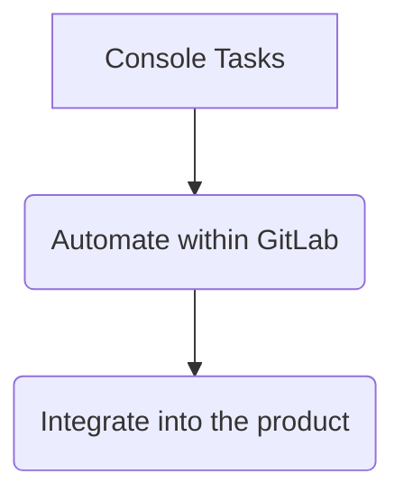
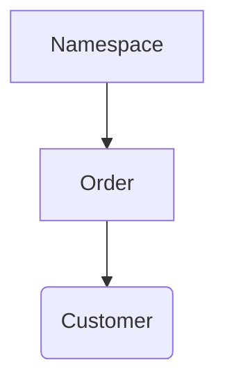

## On this page
{:.no_toc .hidden-md .hidden-lg}

- TOC
{:toc .hidden-md .hidden-lg}

## Overview

Using the customer console for internal requests is only for specials cases where the existing tools won't allow us to complete the task at hand.

Console access requires a completed [Access Request](https://gitlab.com/gitlab-com/access-requests/issues/new?issuable_template=Single%20Person%20Access%20Request) as outlined in the [Console Bootcamp](https://gitlab.com/gitlab-com/support/support-training/-/issues/new?issuable_template=Bootcamp%20-%20GitLab.com%20Console) and its completion.

The scope of what's outlined in this workflow is for frequently used functions which are pre-loaded via [console training wheels project](https://gitlab.com/gitlab-com/support/toolbox/console-training-wheels). Please [check the internal dotcom wiki](https://gitlab.com/gitlab-com/support/internal-requests/-/wikis/Console-related) for functions not included here.

## Using the support console

After logging into the customer portal server, enter the command:

```
$ support_console
```
This will open the console and automatically load the functions available to use.

Most functions rely on the namespace (i.e. GitLab.com Group name or username), always make sure to have it handy before starting any work from the console.

Consider creating a [Shell alias](https://about.gitlab.com/handbook/tools-and-tips/#shell-aliases) such as the below:

```
alias gcp-console="ssh -t <YOUR_USERNAME>@customers.gitlab.com 'support_console'"
```

## Scope

The console will be for tasks which cannot be completed from the tools we have available.

We need to see the console as a `transition` stage:


The more we use a function the more we should ask ourselves why we haven't automated that process or even better integrated that missing function into our product.

## Search methods

### view_namespace

Provides a unified view for the namespace including orders and customer account linked to the orders.

Function to see namespace information and linked orders/customer profile.
The function will find orders linked to the provided namespace and then customer profile linked to the orders:



#### Parameters

| Name | Required | Details |
| ------ | ------ | ------ |
| `:namespace` | *Yes* | The namespace to find information about |

#### Sample

```ruby
irb(main):002:0> view_namespace('example')

[+]Namespace information
id                                7744884
name                              example
path                              example
members_count_with_descendants    15
shared_runners_minutes_limit      50000
billable_members_count            14
plan                              gold
trial_ends_on                     2020-06-22
trial                             true

[+] There are 1 orders for this namespace
 id                                00000
 customer_id                       111111
 subscription_id
 subscription_name
 start_date                        2020-04-22
 end_date                          2020-06-22
 gl_namespace_id                   2222222
 gl_namespace_name                 example

[+] Customer linked to orders
 https://customers.gitlab.com/admin/customer/111111
 id                                111111
 company                           example Ltd
 first_name                        Jane
 last_name                         Doe
 email                             jdoe@examplecorp.net
 uid                               666666
 zuora_account_id
```

### find_namespace

Find namespaces similar to the given string 

#### Parameters

| Name | Required | Details |
| ------ | ------ | ------ |
| `:namespace` | *Yes* | The namespace to search for, it can be complete or partial|

#### Sample

```ruby
irb(main):421:0> find_namespace('test')
[!] Possible matches:
	[+] Name Test Example         | Full Path test
	[+] Name Other Example        | Full Path test1
	[+] Name My Test              | Full Path test2
=> " "
```

## Plan Methods

### **change_plan**

This function will change the plan for a customer with an active trial and output the namespace information after completing the change.

A third optional parameter `date` can be added with format 'YYYY-MM-DD' (using the quotes), if this parameters exists the trial will be extended up to that date, otherwise no changes will be done to it.

#### Parameters

| Name | Required | Details |
| ------ | ------ | ------ |
| `:namespace` | *Yes* | The namespace to update |
| `:newplan` | *Yes* | The plan to assign to the namespace (free, bronze, silver, gold) |
| `:date` | **No** | Date to extend the plan. If not provided, the end date won't be modified |

#### Sample

```ruby
irb(main):001:0> change_plan('example','silver','2020-05-25')
{"id"=>0000000,
 "name"=>"example",
 "path"=>"example",
 "kind"=>"group",
 "full_path"=>"example",
 "parent_id"=>nil,
 "avatar_url"=>
  "https://gitlab.com/uploads/-/system/group/avatar/0000000/icon.png",
 "web_url"=>"https://gitlab.com/groups/example",
 "members_count_with_descendants"=>43,
 "shared_runners_minutes_limit"=>10000,
 "extra_shared_runners_minutes_limit"=>2000,
 "billable_members_count"=>44,
 "plan"=>"silver",
 "trial_ends_on"=>"2020-05-25",
 "trial"=>true}
```
### update_group

Update a groups shared runner minutes

#### Parameters

| Name | Required | Details |
| ------ | ------ | ------ |
| `:id` | *Yes* | The namespace ID to update |
| `:newplan` | *Yes* | The plan to assign to the namespace (free, bronze, silver, gold) |
| `:mins` | *Yes* | CI Minutes to update |

### force_attr

Force Order to sync with what's in Zuora

**Warning:** This only works if the plan is the product listed first. If there are multiple products, you may need to use the original function with `.last` or something else.

#### Parameters

| Name | Required | Details |
| ------ | ------ | ------ |
| `:subscription_name` | *Yes* | Subscription name in the order to update |

### fix_expired_subscription

Fix expired subscription ID

#### Parameters

| Name | Required | Details |
| ------ | ------ | ------ |
| `:subscription_name` | *Yes* | Subscription name in the order to update |

## Group methods

### showGroups2FAStatus

Outputs the group id and name, which the user provided is a member of also the group setting related to 2FA Enforce as `true` or `false`.

#### Parameters

| Name | Required | Details |
| ------ | ------ | ------ |
| `:username` | *Yes* | The Gitlab username to query|

#### Sample

```ruby
irb(main):180:0>  showGroups2FAStatus 'some_user'
1111111 - One Group : 2FA Enforce [false]
2222222 - Other group : 2FA Enforce [false]
3333333 - Technology Group : 2FA Enforce [false]
4444444 - All Groups : 2FA Enforce [false]
5555555 - Design Group : 2FA Enforce [false]
6666666 - External Technology : 2FA Enforce [false]
7777777 - All-Reporter : 2FA Enforce [false]
```

### fix_dotcom_seats

In any situation similar to [this](https://gitlab.com/gitlab-org/gitlab/-/issues/220010) you can use this function to update the number of seats to the current value.

#### Parameters

| Name | Required | Details |
| ------ | ------ | ------ |
| `:namespace` | *Yes* | The Gitlab Namespace to fix|

#### Sample

```ruby
irb(main):180:0>  fix_dotcom_seats 'some_namespace'
=> {:success=>true}
```
### force_reassociation

Force a group to be re-associated with a Subscription

#### Parameters

| Name | Required | Details |
| ------ | ------ | ------ |
| `:subscription_name` | *Yes* | The subscription name to be re-associated|
| `:group_id` | *Yes* | The Gitlab namespace ID|
| `:group_name` | *Yes* | The Gitlab namespace _`name`_ (not to be confused with its `path`)|

### unlink_customer

Completely unlink a GitLab.com account from a customers account

#### Parameters

| Name | Required | Details |
| ------ | ------ | ------ |
| `:customer_id` | *Yes* |Customer ID to be unliked from it's GitLab account.|

### associate_full_user_count_with_group

Associate full user count with group

#### Parameters

This function requires an order object

| Name | Required | Details |
| ------ | ------ | ------ |
| `:order` | *Yes* | Order `object`]` to associate  the user count|

## EULA Methods

### send_eula

Generating a EULA for a Subscription:

#### Parameters

| Name | Required | Details |
| ------ | ------ | ------ |
| `:subscription_name` | *Yes* |Subscription name to generate the EULA|

## FAQ

1. How can I add a function?
  - Create a MR for `support_team.rb` in the [console-training-wheels](https://gitlab.com/gitlab-com/support/toolbox/console-training-wheels) project.
1. Can I use other code not available in `support_team.rb`?
  - Yes, when you're comfortable with ruby code and IRB, just make sure to merge the code in the library for everyone to use it.

### Manually changing attributes

When changing attributes on a specific order manually, please keep in mind that most attributes are tied to the purchase of a subscription.

For a purchase, these are the only attributes you should be editing:

- `gl_namespace_id`
- `gl_namespace_name`

For a trial (`trial` is set to `true`), because it's not tied to a subscription, additional attributes that can be updated:

- `start_date`
- `end_date`
