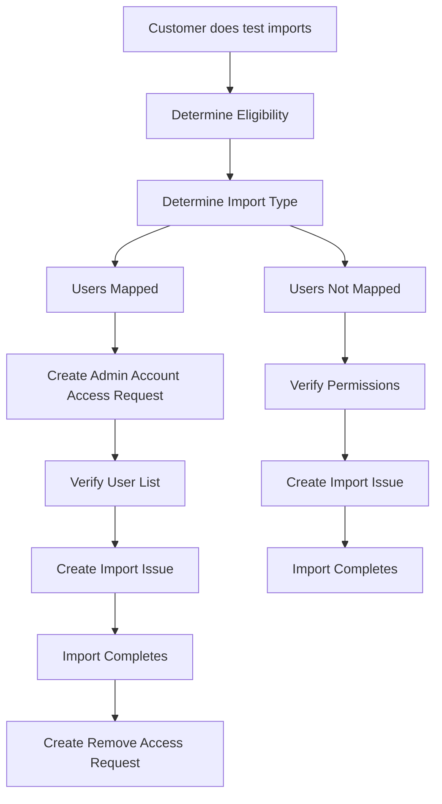

- TOC
{:toc .hidden-md .hidden-lg}

## Overview

This workflow is meant to provide guidance on when GitLab Team members might offer to import projects on behalf of customers or prospects as a courtesy, and the process for doing the imports. Due to the shifting nature of what issues might be relevant, the specifics of this workflow may change. Overall though, the import process should follow the flow outlined below.



## Stage 1: Determine Eligibility

When a request to import a project on behalf of a customer or prospect is received, we first need to determine if the request fits the criteria.

If the customer requires that only a couple projects or less be imported **and** those projects have a reasonable number of users within them, we can do it. If the request is complex or there are many projects that need importing, the requester should be referred to [Professional Services](/services/migration/) instead.

Once you've determined that GitLab Support is able to process the import, proceed with verifying the [Baseline Eligibility](#baseline-eligibility) of all of the projects to be imported or determine that the requestor is approved because they meet the criteria of a [Pre-Approved Case](#pre-approved-cases).

### Baseline Eligibility

1. The import method is a GitLab project export file.
1. The requestor is an existing **customer** or **prospect**.
1. The import was attempted and failed one or more times already.
1. The target location is a group on GitLab.com, not a personal namespace. If this isn't the case, we can advise the user on how to create a group if needed.
1. The target group is not empty.
1. No import error is found (see [Identify Import Errors](#identify-import-errors)).

### Pre-Approved Cases

In addition to the above criteria, we can automatically offer to import a project for a customer if their case falls under the criteria of any of the following sections.

#### Large Imports

Due to [24806](https://gitlab.com/gitlab-org/gitlab/issues/24806), users with large projects (typically ~1GB+ or 1000+ MRs) will often hit the sidekiq timeout. Imports stop when they hit a timeout, but an incomplete project will always be created, resulting in a partial import.

A project's size can be reduced by:

1. Cutting down the repository size (if that's what's large) via a cleanup first using [git filter-branch](https://docs.gitlab.com/ee/user/project/repository/reducing_the_repo_size_using_git.html#using-git-filter-branch) and running `git gc` and `housekeeping` afterward.
1. Cutting down what's exported by editing the `import_export.yml` file on the self-managed instance. For more context see [this comment](https://gitlab.com/gitlab-org/gitlab/-/issues/24806#note_215512112).

These are also noted in the `GitLab.com::Import::Determine_Eligibility.json` macro.

>**NOTE:** Once [196875](https://gitlab.com/gitlab-org/gitlab/issues/196875) is implemented, imports should be able to be restarted, which should get around this case.

#### User Mapping

A GitLab.com admin is required to correctly map users in GitLab, [per our documentation](https://docs.gitlab.com/ee/user/project/settings/import_export.html). Without an admin account, repository commits will have correct user attribution but issues and merge requests will not. We can import a project for a customer if they require this.

>**NOTE:** Using an admin account will not be required once [223137](https://gitlab.com/gitlab-org/gitlab/-/issues/223137) is implemented.

#### Other Cases

If you're unsure of whether or not we should perform an import for a specific requestor, get input via #support_managers Slack channel or an [internal issue](https://gitlab.com/gitlab-com/support/internal-requests/-/issues/new). If a manager approves, proceed with the import.

### Identify Import Errors

We can only offer an import if no validation (not timeout) error is found on a previously attempted import. Most timeout related imports end up with a partial import with very few or zero issues or merge requests. Where there is a relatively smaller difference (10% or less), then there are most likely errors with those specific issues or merge requests.

Anytime there is an error, ensure that the export originated from a [compatible version of GitLab](https://docs.gitlab.com/ee/user/project/settings/import_export.html#version-history).

>**NOTE:** See the [Diagnose Errors on GitLab.com](/handbook/support/workflows/500_errors.html) workflow for more details on searching Kibana and Sentry.

- In Kibana, search sidekiq log, and use
  - json.path and filter: json.severity: (not `INFO`) or
  - json.controller: `Projects::ImportsController` with error status
- In Sentry, search/look for: `Projects::ImportService::Error` ; make sure to remove the `is:unresolved` filter.

If there is an error, search for an existing issue. Errors where the metadata is throwing an error and no issue exists, consider creating one from Sentry.

If no error is found and the import is partial, most likely it is a timeout issue.

> **NOTE:** In all cases, the import process is the same except that infra has a longer timeout period. If any validation errors are not worked out ahead of time, these will crop up during the infra import as well.

### Known Import Issues

- **Imported project's size differs from where it originated**
  - See [this comment](https://gitlab.com/gitlab-org/gitlab/-/issues/27742#note_215721494) for an explanation as to why. As artifacts are part of repository size, whether they are present can make a big difference.
- **Repository shows 0 commits**.
  - See [15348](https://gitlab.com/gitlab-org/gitlab/issues/15348).

Use the `GitLab.com::Import::Determine_Eligibility.json` Zendesk macro to make the requestor aware of all of these requirements and get additional details from them. If the requestor's case is approved based on their followup reply, move on to [Stage 2: Offering Import & Preparation](#stage-2-offering-import--preparation).

## Stage 2: Offering Import & Preparation

Follow the steps for either [Users Mapped](#users-mapped) or [Users Not Mapped](#users-not-mapped) depending on the type of import we're performing. Once the steps in either section are complete, move on to [Stage 3: Import](#stage-3-import).

### Timing and scheduling ahead

When customers request a specific time period for the imports to be done, they should *always* do a test import for each project and make note of how long it takes. It can be approximate, but should give everyone a clear idea of whether it's reasonable to be done within the given time period. Remember that both Support and Infra require additional time in addition to the actual import time, and too short of a time interval might be interrupted by an incident.

### Users Mapped

If the customer requires that all issues, merge requests, and commits be mapped to the appropriate users in their organization, use the `GitLab.com::Import::Offer Import (Users Mapped)` Zendesk macro and then follow the next sections in sequence.

#### 1. Create Admin Account Access Request

1. Open an issue using the [Single Person Access Request](https://gitlab.com/gitlab-com/team-member-epics/access-requests/-/issues/new?issuable_template=Individual_Bulk_Access_Request) template and fill it out in its entirety (replace any instances of `group` with the group name).
1. Add the `AR-Priority::1` (24 hour turnaround) label.
1. Comment on the issue and tag your manager requesting their approval.
1. Tag `@it-ops-team` in the [#it_help](https://gitlab.slack.com/archives/CK4EQH50E) Slack channel with a link to the request to ensure quick provisioning as soon as you receive a manager's approval.

In the access request, enter the following in the **Person Details** section.

```plain
- Admin user access for customer import for Infra's use with username: `group-import`
- Set email to: `group-import@gitlab.com`
- Ticket: <TICKET LINK>
- Import request: <INFRA ISSUE LINK>

**Note:** This is part of the [project import process](/handbook/support/workflows/importing_projects.html) for customers.
```

Then, enter the following for the **Account Creation** section.

```plain
GitLab PRD | Role: `admin` | Rationale: `customer import` ; Please confirm, and enable 2FA for this user.
```

#### 2. Verify User List

The customer should send you a copy of the project export ahead of their chosen import time (if scheduled) so that there is ample time to do the next section and for the customer to verify the list and correct any errors.

1. In your terminal use [DCEF](https://gitlab.com/gitlab-com/support/toolbox/dcef) to pull a report that contains a list of user **primary** email addresses that are unique to the export file and ones that are unique to just the requestor's GitLab.com group.
1. Examine the `User emails unique to export file:` section of the results and ensure that all email addresses listed are on the requestor's company domain, meaning no users have an email address on a generic domain such as Gmail.com.

**If issues within the list are found:**

3. Reply to the requestor with the `GitLab.com::Import::Verify User List (Problem Found)` Zendesk macro, which will ask them to resolve the issues we found and send us a new project export once that's done. Once they have, repeat the [2. Verify User List](#2-verify-user-list) section.

**If no issues within the list are found:**

3. Send the resulting list of users not in GitLab.com to the customer to confirm using the `GitLab.com::Import::Verify User List (Looks Good)` Zendesk macro and await their reply. Once they reply and confirm that all email addresses that were found only in the export file are from employees no longer with the company, this section is complete.

>**NOTE:** For these users, items will be mapped to the admin account, then the [ghost user](https://docs.gitlab.com/ee/user/profile/account/delete_account.html#associated-records) once the admin account is deleted.

### Users Not Mapped

If the customer does not mention that they need project contributions (issues, MRs, etc.) mapped to their users, then we'll be importing their project(s) as a user of their choosing. Use the `GitLab.com::Import::Offer Import (Users Not Mapped)` Zendesk macro and then perform the steps in the following section:

#### 1. Verify User Permissions

The customer should have replied stating which GitLab.com account they'd like the project imported as. The user they choose will have all contributions mapped to it. We need to verify that the following are true of this user.

1. They have **Owner** permissions in the namespace that the project will be imported into.
1. That user is [Allowed to Create Projects](https://docs.gitlab.com/ee/user/group/#default-project-creation-level) in the namespace that the project will be imported into.

If the user is not an **Owner**, use the `GitLab.com::Import::Require Group Permission` macro as a response.

## Stage 3: Import

This stage is applicable to both **Users Mapped** and **Users Not Mapped** imports. For **Users Mapped**, it may be started once the requestor has confirmed that the [User List](#2-verify-user-list) has been verified. For **Users Not Mapped**, it may be started once [User Permissions](#1-verify-user-permissions) have been verified.

Proceed in the following order:

1. [Check Project Export](#check-project-export)
1. Either [Import Scheduled](#import-scheduled) or [Import ASAP](#import-asap) depending on when the user has requested that the import be performed.
1. [Stage 4: Cleanup](#stage-4-cleanup) once previous step and the import is finished.

### Check Project Export

1. Unpack the project export file into a folder: `tar -zxvf filename.tar.gz -C project_export`.
1. **[USERS MAPPED ONLY!]** Perform one last [Verify User List](#2-verify-user-list) check to ensure no changes have been made.
1. If the customer shared a one-time download link, upload the export to the [appropriate team's GDrive folder](https://drive.google.com/drive/search?q=parent:1RpCb_li2RTYsE8GnVFExCux3QpZ2i0TD) and use the link to this version for the import issue.
1. Delete the export from GDrive once Infrastructure has confirmed that they have a copy (as per the infra import issue).
1. Delete any local copies of the export.

### Import Scheduled

Note that the expectation from the Reliablity team is 5 business days of lead time to accomodate proper scheduling of the work.

1. [Open an issue](https://gitlab.com/gitlab-com/gl-infra/infrastructure/-/issues/new?issuable_template=Project%20Import) in the Infrastructure tracker using the `Project Import` template with all available information. This issue template will auto-assign the Reliability team managers and label the issue for triage.
1. Add date/time with timezone (~1 hour later than expected time of receiving the import is recommended).
    - If there is no scheduled time, use 5 business days from date of receipt with "anytime" for time.
1. Add the infrastructure issue link as an internal note to the Zendesk ticket.
1. Once we receive a link to the export, update the issue with the link to the project.


## Stage 4: Cleanup

After the import has completed successfully, perform the following steps.

1. Close the infrastructure issue once an SRE has commented on it that the import has completed.
1. Ensure the export file is deleted, or remind the customer to delete theirs in your next response.
1. Send the macro `GitLab.com::Import::Complete Customer to Verify` to let the customer know that the import has completed and that they should double check that everything is in order.
1. **[USERS MAPPED ONLY!]** After the customer confirms that everything looks okay, open an issue using the [Access Change Request](https://gitlab.com/gitlab-com/team-member-epics/access-requests/-/issues/new?issuable_template=Access_Change_Request) template to request that the admin account used for the import be deleted.

## Zendesk Macros & Resources

### Macros

- `GitLab.com::Import::Determine Eligibility`
- `GitLab.com::Import::Require Group Permission`
- `GitLab.com::Import::Offer Import (Users Mapped)`
- `GitLab.com::Import::Offer Import (Users Not Mapped)`
- `GitLab.com::Import::Verify User List (Looks Good)`
- `GitLab.com::Import::Verify User List (Problem Found)`
- `GitLab.com::Import::Complete Customer to Verify`

### Resources

If it's helpful, there is a [video recording from 2019-05-22](https://drive.google.com/drive/u/0/search?q=2019-05-22_import-session parent:1Yli_1UlO1vrzhCuNN1pdZLRpqbfYQW7Q) (GitLab internal) where the first half is a walkthrough of the process, and the second half talks through troubleshooting issues.

[Time And Date](https://www.timeanddate.com/worldclock/converter.html?iso=20200615T220000&p1=1440) can be used to convert timezones to UTC, useful for when imports are scheduled for a future time.
