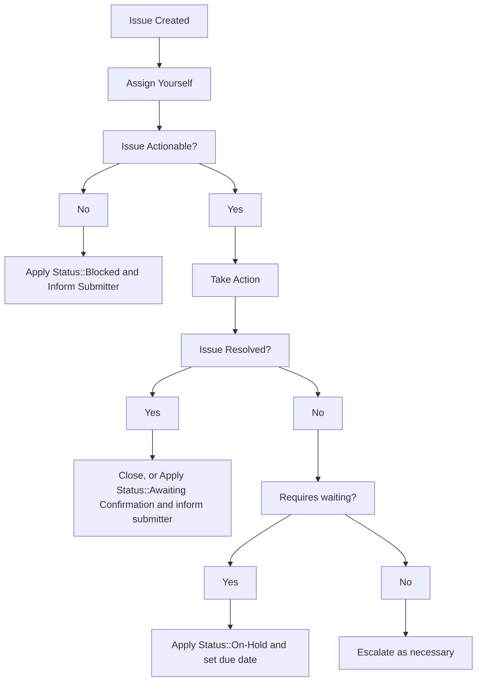

### On this page
{:.no_toc}

- TOC
{:toc}

----

For GitLab team members wanting to file an internal request, please see the [Support Internal Requests handbook page](/handbook/support/internal-support/).

Note: For internal requests relating to licenses and subscriptions, please refer to the [relevant license and subscription workflow](/handbook/support/license-and-renewals/workflows/), or [CustomersDot console workflow](/handbook/support/license-and-renewals/workflows/customersdot/customer_console.html).

## Overview

This document details the various templates and workflows that should be followed in order to properly service GitLab.com related requests that Support receives in the [internal-requests](https://gitlab.com/gitlab-com/support/internal-requests/-/issues) issue tracker.

Internal requests can and should be addressed by any GitLab Support team member who is able to resolve the request.

Those who are at least 50% SaaS focused and have a GitLab.com administrator account should subscribe to and handle any issue that is an [Admin Escalation](https://gitlab.com/gitlab-com/support/internal-requests/-/labels?subscribed=&search=admin+escalation).

Internal requests are typically created by other team members who are not within the Support organization, but you can always create an internal request to track work being done, especially in cases where the request originates internally (and there is no ZenDesk ticket to track).

At the very least, you should subscribe to the following labels:

- [Admin Escalation](https://gitlab.com/gitlab-com/support/internal-requests/-/labels?subscribed=&search=admin+escalation)
- [Dotcom Escalation Weekly Report](https://gitlab.com/gitlab-com/support/internal-requests/-/labels?subscribed=&search=dewr)

You may want to consider subscribing to [Platform::SaaS](https://gitlab.com/gitlab-com/support/internal-requests/-/labels?subscribed=&search=platform+saas) but be aware this will be noisier.

By subscribing to the labels, you'll receive notifications on when a request is created. You should try to work them into your regular workflow, ensuring that you are assigning it to yourself like a customer ticket if you decide to take it.

If you are interested in servicing internal requests that require console access, consider speaking with your manager about completing the [Gitlab.com Console module](https://gitlab.com/gitlab-com/support/support-training/-/blob/master/.gitlab/issue_templates/GitLab-com%20Console.md).

## General Workflow

## Activate Trial Runners

For sales assisted trials, only we can override the credit card validation requirement for a namespace. Note that there is a [special process](https://gitlab.com/gitlab-com/support/support-team-meta/-/issues/3479#consumption-users) for consumption users. These requests require console access.

## GitLab.com Trial Change Request

Sales team members will typically open this on behalf of their prospects in order to extend an active trial. You can follow the [L&R Workflow for Extending Trials](https://about.gitlab.com/handbook/support/license-and-renewals/workflows/saas/trials.html#extending-trials).

## Inactive Namespace Request

GitLab team members can create this request for their own use or on behalf of their customers. See [Name Squatting Policy](namesquatting_policy.html).

## Contact Request

GitLab team members, primarily infra, will use this template to request Support to contact a user on their behalf. If requested to do this via Slack, open an issue on behalf of the requester.

The requestor should contact the [CMOC](/handbook/support/internal-support/#regarding-gitlab-support-plans-and-namespaces) to fulfill the request.

This typically requires GitLab.com admin access, because you will need to look up the relevant email addresses.

See the [Sending notices workflow](sending_notices.html) for more details. If none of the listed cases apply, you can use the [`Support::SaaS::Notices::General Contact Request`](https://gitlab.com/search?utf8=%E2%9C%93&group_id=2573624&project_id=17008590&scope=&search_code=true&snippets=false&repository_ref=master&nav_source=navbar&search=id%3A+360013369860) macro. Leave an internal note with a link to the issue.

## Repo Size Limit Increases

Should a user request a temporary extension of the size limit of their repository the following workflow should be used if that extension is granted.

1. Open an issue in the **[internal-requests](https://gitlab.com/gitlab-com/support/internal-requests/issues)** issue tracker using the `Repo Size Limit` issue template.
1. Apply the `Status::On Hold` label and set the due date to when it should be reverted.
1. Using your GitLab.com admin account navigate to the project in question while appending **/edit** to the URL. For example, if the project in question is located at **https://gitlab.com/group/subgroup/project/** you would navigate to **https://gitlab.com/group/subgroup/project/edit**.
1. Enter a new value in the **Repository size limit (MB)** field.
1. Click **Save changes**.
1. Revert the size limit back to the default on the specified due date.

## Pipeline Quota Reset

See [internal wiki page](https://gitlab.com/gitlab-com/support/internal-requests/-/wikis/Procedures/Pipeline-Quota-Reset).

## GitLab.com Console Escalation

This is a generic template used to request an engineer with GitLab.com console access to take action.

Common issues include the following when the UI and API methods are not working:

- Deletion of projects, groups, cluster integrations, container registries, etc.
- Deletion of uploads or attachments containing sensitive information, until [gitlab#16229](https://gitlab.com/gitlab-org/gitlab/-/issues/16229) (or similar) is implemented.
- User account changes
- Group namespace changes
- Project export

Console escalation requests can also serve a purpose when further information (unavailable through the UI or API) is needed to understand the root cause of a problem. This may be because we are not sufficiently logging in Kibana/Sentry, we're unable to replicate an issue, or the creation of an issue may not be the appropriate action needed to resolve a customer problem. Collaborate with console enabled engineers and product teams to solve these types of problems.

Engineers with console access should search for similar previous requests, look for the relevant function in the code, or work with another engineer to resolve each request. Common or custom functions can be found in the [support runbooks](https://gitlab.com/gitlab-com/support/runbooks/).

Any request requiring disk access requires an [infra issue](https://gitlab.com/gitlab-com/gl-infra/infrastructure/-/issues).
