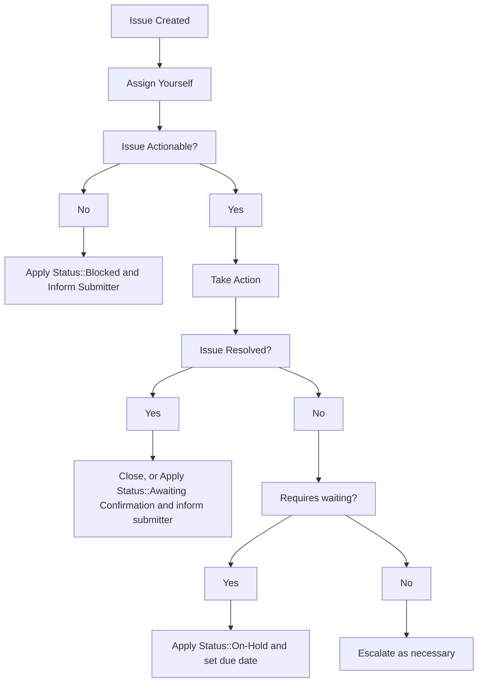

### On this page
{:.no_toc}

- TOC
{:toc}

----

For GitLab team members wanting to file an internal request, please see the [Support Internal Requests handbook page](/handbook/support/internal-support/).

This document details the various templates and workflows that should be followed in order to properly service GitLab.com related requests that Support receives in the [internal-requests](https://gitlab.com/gitlab-com/support/internal-requests/-/issues) issue tracker.

Note: For internal requests relating to licenses and subscriptions, please refer to the [relevant license and subscription workflow](/handbook/support/workflows/#License%20and%20subscription), or [CustomersDot console workflow](/handbook/support/license-and-renewals/workflows/customersdot/customer_console.html).

## General Workflow

## Inactive Namespace Request

See [Name Squatting Policy](namesquatting_policy.html).

## Contact Request

GitLab team members, primarily infra, will use this template to request Support to contact a user on their behalf. If requested to do this via Slack, open an issue on behalf of the requester.

The requestor should contact the [CMOC](/handbook/support/internal-support/#regarding-gitlab-support-plans-and-namespaces) to fulfill the request.

This typically requires GitLab.com admin access, because you will need to look up the relevant email addresses.

See the [Sending notices workflow](sending_notices.html) for more details. If none of the listed cases apply, you can use the `GitLab.com::Notices::General Contact Request` macro. Leave an internal note with a link to the issue.

## Repo Size Limit Increases

Should a user request a temporary extension of the size limit of their repository the following workflow should be used if that extension is granted.

1. Open an issue in the **[internal-requests](https://gitlab.com/gitlab-com/support/internal-requests/issues)** issue tracker using the `Repo Size Limit` issue template.
1. Apply the `Status::On Hold` label and set the due date to when it should be reverted.
1. Using your GitLab.com admin account navigate to the project in question while appending **/edit** to the URL. For example, if the project in question is located at **https://gitlab.com/group/subgroup/project/** you would navigate to **https://gitlab.com/group/subgroup/project/edit**.
1. Enter a new value in the **Repository size limit (MB)** field.
1. Click **Save changes**.
1. Revert the size limit back to the default on the specified due date.

## Pipeline Quota Reset

See [internal wiki page](https://gitlab.com/gitlab-com/support/internal-requests/-/wikis/Procedures/Pipeline-Quota-Reset).

## GitLab.com Console Escalation

This is a generic template used to request an engineer with GitLab.com console access to take action.

Common issues include the following when the UI and API methods are not working:

- deletion
- user account changes
- project export

Engineers with console access should search for similar previous requests, look for the relevant function in the code, or work with another engineer to resolve each request.

Any request requiring disk access requires an [infra issue](https://gitlab.com/gitlab-com/gl-infra/infrastructure/-/issues).
