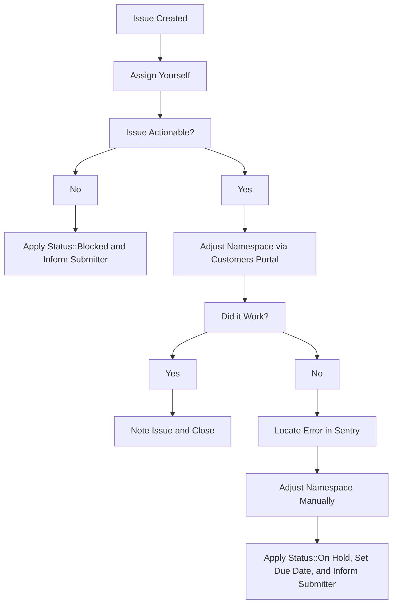
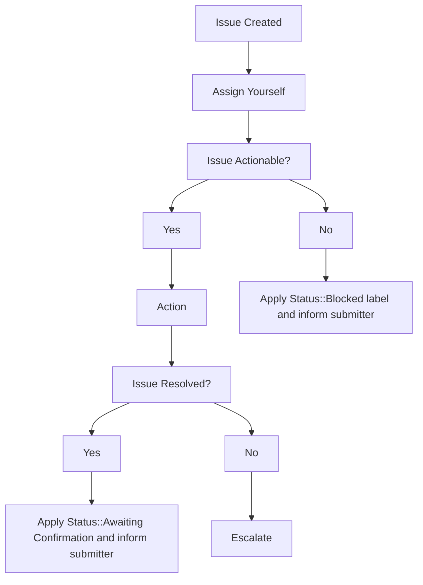

### On this page
{:.no_toc}

- TOC
{:toc}

----

This document details the various workflows that should be followed in order to properly service requests that we receive in the [internal-requests](https://gitlab.com/gitlab-com/support/internal-requests/issues) issue tracker along with which template to use if you need to open an issue in it yourself to document an action taken on a GitLab.com user or group. First, it will go over the general workflow you should follow when faced with a new issue in `internal-requests` and then it will inform you how to perform the specific tasks required to process each type of request.

## General Workflow

### Plan Change Requests & Trial Extensions

### SE Escalations

## Trial Extensions

Sales will often request that we extend the duration of GitLab.com trials on behalf of their prospects. These issues will always have the `Trial Extension` label applied to them and the following workflow should be followed to service them.

If any fields in the issue description were filled out incorrectly by the submitter apply the `Status::Blocked` label and mention them in the issue asking them to supply any missing information.

1. Assign yourself to the issue.
1. Check over the request and ensure that we've been provided enough information to action the request. To do this check that:
   1. The `GitLab.com Link to Namespace:` field contains a valid GitLab.com link to the namespace that holds the active trial. This should not be a Salesforce link or email address.
   1. The `Extend Until:` field contains a future date.
1. Check to ensure that the namespace is currently on an active Gold trial. This process varies depending on whether you're dealing with a personal or group namespace.
    - **Personal namespaces:** Impersonate the user and navigate to their **[billing page](https://gitlab.com/profile/billings)**.
    - **Group namespaces:** Navigate to **Settings -> Billing** within the group.
1. Using the address provided in the `Contact Email:` field log into the **[Customers Portal](https://customers.gitlab.com/admin/)** as an administrator, input the email address into the search field, and search.
1. Navigate to the `GitLab Groups` section of the entry for the customer.
1. Adjust the subscription type and expiration date of the correct namespace according to the details of the issue using the `Plan` and `Trial` columns.
1. Click `Update`.
1. Set the due date of the issue to the value of what was provided in the `Extend Until:` field.
1. Revert the subscription type of the namespace back to Free on the due date.

## Repo Size Limit Increases

Should a user request a temporary extension of the size limit of their repository the following workflow should be used if that extension is granted.

1. Open an issue in the **[internal-requests](https://gitlab.com/gitlab-com/support/internal-requests/issues)** issue tracker using the `Repo Size Limit` issue template.
1. Using your GitLab.com admin account navigate to the project in question while appending **/edit** to the URL. For example, if the project in question is located at **https://gitlab.com/group/subgroup/project/** you would navigate to **https://gitlab.com/group/subgroup/project/edit**.
1. Enter a new value in the **Repository size limit (MB)** field.
1. Click **Save changes**.
1. Revert the size limit back to the default of **10GB** on the specified due date.

## Soft-Deleted Project

Customers may ask that a project they recently marked for deletion be deleted immediately so that they can reuse that project's path without needing to wait. Should a customer request this through Zendesk, do the following.

1. Open an issue in the **[internal-requests](https://gitlab.com/gitlab-com/support/internal-requests/issues)** issue tracker using the `Soft-Deleted Project` issue template.
1. Fill in the details of the template and submit the issue.
1. Add a link to the issue to the Zendesk ticket and inform the customer that we've asked an engineer to process the deletion.

## GitLab Gold Requests

Issues that come in with the `GitLab Gold Request` label require no action on our part as the process of granting Gold to the namespaces specified within them is entirely automated.
