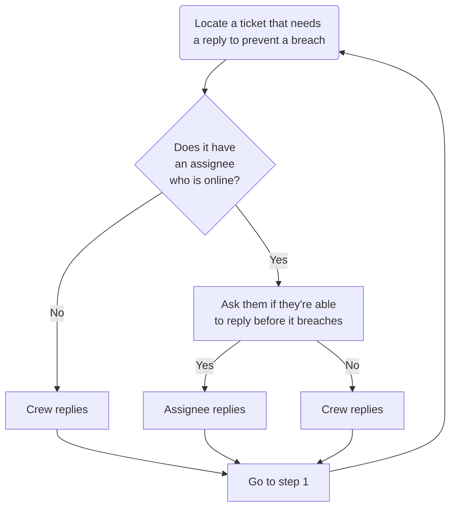

## On this page

{:.no_toc .hidden-md .hidden-lg}

- TOC
{:toc .hidden-md .hidden-lg}

## Introduction

The Support team use one of two systems to ensure tickets get replies within the [Service Level Objective](https://about.gitlab.com/support/#gitlab-support-service-levels) we have with our customers:

1. AMER and APAC: [First Response Time Hawk](#first-response-time-hawk) and [SLA Hawk](#sla-hawk)
1. EMEA: [Support Response Crew](#support-response-crew)

## First Response Time Hawk

### What is a First Response Time Hawk?

This is a rotating role, where someone is "on point" weekly (Monday to Friday), to make sure:

1. new Support tickets get a first response as soon as possible and do not breach
1. all new tickets are appropriately categorized and prioritized as they arrive

First Response Time Hawks directly drive achievement in our [Service Level Agreement KPI](/handbook/support/performance-indicators/#service-level-agreement-sla).

### FRT Hawk in Action

1. Every Week on Fridays, Managers will add a **F**irst **R**esponse **T**ime Hawk for each region to the Support Week in Review to announce who will be responsible that week.
1. If you are FRT Hawk, you are responsible for:
    1. Helping facilitate first replies within SLA times for *new* tickets from 9am - 5pm in your time zone
       - **Note:** if you are a US Citizen and have access to the Federal instance, this should also be a part of your rotation.
    2. [Triaging tickets](/handbook/support/workflows/ticket_triage.html) to make sure they have:
      * The correct ticket form (such as GitLab.com, if they're asking for GitLab.com support). Take special notice of tickets with form `Other Request`. This is usually because the ticket was created by email. **Note that a form change results in an auto-reply for tickets that don't have an org associated yet. Hence, it is recommended to first associate the user with an appropriate org and then change the form to the most relevant form type and fill in additional metadata where possible**.
      * [An associated organization](/handbook/support/workflows/associating_needs_org_tickets_with_orgs.html)
      * [The correct priority](/handbook/support/workflows/setting_ticket_priority.html#setting-ticket-priority)
      * The correct **Problem Type** selected
2. [Keep an eye on the FRTH View in ZenDesk](https://gitlab.zendesk.com/agent/filters/360038124359)
3. Ask your Support team mates for help if volume is high, or you are stumped.
4. You should expect to see new and different things that you are not an expert in. Where possible, take the time to dive deep and try and understand the problem.

### Things for an FRT Hawk to be mindful of

1. Given that there's a FRT Hawk _per region_, your shift will overlap with another hawk.
    * This means you have a teammate within a team; yay! Be sure to communicate with your fellow hawk so you can help each other out in case one of you is stuck on a ticket, and also to make sure you're not
    both quietly working on the same ticket
2. Your focus should be facilitating replies for tickets in the First Response Hawk queue and [associating needs-org tickets with the appropriate organization](associating_needs_org_tickets_with_orgs.html).
3. You might not cover all the tickets you wanted to cover on your shift, and that's okay
   * Just do your best
   * Take a break if you need one - making sure your team knows you're stepping away by posting in `#support_team_chat`
   * Ask the rest of the team for help when needed in `#support_self-managed`
4. You may see tickets requesting information that is not in the realm of support. For example, you may get a ticket from a job applicant to GitLab requesting information on their application. In these cases, do your best to direct them to an appropriate contact and close the support ticket. In the case of hiring questions, you can ping the #recruiting channel in Slack to inform them that the candidate reached out, and update the candidate via the ticket.
   * There is a macro called `General::Job Application Questions` for hiring-specific questions in Zendesk.
   * For other common requests, see the [Triaging tickets](/handbook/support/workflows/ticket_triage.html#other-requests) page.

### FRT Dashboards

You can track your progress and see global results on this [Zendesk Explore Dashboard](https://gitlab.zendesk.com/explore/dashboard/36925DBD1F5E3C7BA541DB38D11AC51E0EAAFDD30DCB63FDE83CF1389E555D96/tab/10602202)

## SLA Hawk

### What is the SLA Hawk role?

The SLA Hawk is a rotating role that you will carry out for one week at a time (Monday to Friday). You can [view the rotations in PagerDuty](https://gitlab.pagerduty.com/schedules#?query=sla%20hawk)

The SLA Hawk is responsible for ensuring that action is taken on the 'most breached' and 'next to breach' tickets in order to meet our SLAs and so that difficult tickets are not ignored. **NOTE:** It is the responsibility of all Support team members to ensure customer tickets are responded to within our SLA times. The SLA Hawk is **not expected to reply to tickets themselves - your job is to find team members to help get a reply out (see below for more info)**

The SLA Hawk should also perform a queue tidy up:

* Ensure tickets are in correct queue
* Tickets have the correct Priority
* Tickets have the correct self-managed problem type
* The Customer has a Support Contract
* Solve the ticket if the support request is solved

SLA Hawks drive achievement via our KPIs for [Service Level Agreement KPI](/handbook/support/performance-indicators/#service-level-agreement-sla) and [Customer Satisfaction](/handbook/support/performance-indicators/#support-satisfaction-ssat) by making sure our customers are updated in a timely manner.

### SLA Hawk in Action

1. Each day, sort the Zendesk view for [SM with SLA](https://gitlab.zendesk.com/agent/filters/360038124139) by '*Next SLA Breach*' ascending, starting with most breached ticket first.
2. Read the ticket yourself and if you feel you know what the next action is, do that (e.g. ask the customer for more information, solve the ticket if the issue is resolved, send your own reply if you have a great idea). There's no need to spend too long at this stage - 10 minutes at most. If the next action requires more work move on to the next step.
3. If you feel the priority does not match our [Definitions of Support Impact](/support/#definitions-of-support-impact) reach out to the customer and agree on the new priority. Use the macro [General::Changed priority](https://gitlab.zendesk.com/agent/admin/macros/360093631494).
4. If a ticket **has an assignee**:
   1. If the assignee is in your Region, link the ticket in `#support-self-managed` and ping them asking if they are able to take a look. We've adopted a convention of prefixing your message in Slack with `[SLAH]` so that folks know you're currently in that role.
   1. If the assignee is from another Region and it's during their “office hours” ask them if they could take a look.
   1. If the assignee is offline and the ticket/customer needs an update, follow the **has no assignee** process below.
   1. If assignee can’t currently work the ticket ask them to follow the Process in action for [Working on Tickets](#the-process-in-action-2).
5. If a ticket **has no assignee**, or **assignee is offline**:
   1. Check to see if an engineer from your region has previously responded on the ticket, if so, ask them would they have the bandwidth to take the ticket.
   2. If the ticket is about a problem with a specific feature or specialized area of GitLab, reach out to any subject matter experts or stable counterparts in your region to see if they can assist in getting a reply out.
   3. If you can't locate a specific teammate to get a reply, let your regional team know (e.g. `@support-team-<region>` ) about the ticket. Once you have one or two volunteers, let the team know the ticket is taken care of via the thread.
   4. If you’re not getting any traction, and you feel you need help, ping your manager to let them know that noone is available to help.
   5. Once someone has taken ownership of the ticket, ask them if they're happy to assign it to themselves.
   6. If there are no imminent breaches (e.g. less than 2 to 4 hours) in the 'SM with SLA' queue - work on Needs Org & Triage and My Assigned Tickets queues.

   ```mermaid
   graph TD
   A[Sort 'Premium and Ultimate view by <br> 'Next SLA Breach'] -->
   B(Open the <br> top ticket)
   B --> C{Can you reply <br> to the ticket?}
   C -->|Yes| D[Send <br> reply] --> H
   C -->|No| E[Ask for help in Slack <br> and link the ticket]
   E -->|Help received| F[Send <br> reply] --> H
   E -->|No help received| G[Mention your manager in Slack <br> on the ticket thread] --> H[Go to the next ticket <br> - if no imminent breaches - <br> go to 'Starter and Free' view] --> B
   ```

### Team Responsibilities for the SLA Hawk

* Help the SLA Hawk! If they ask you for help, please acknowledge (You may not be able to help, just let them know).
* Follow the [Support Modes of Work](#the-process-in-action-2) for the tickets in your own queue (including finding another engineer to help or takeover the ticket).
* When looking for your next ticket, follow the [same process](#the-process-in-action-1) as the SLA Hawk above (most breached ticket first).
* If you take a next response ticket and the ticket doesn’t have an assignee, assign yourself to the ticket.

### FAQ about SLA Hawk role

1. **Do I need to do the SLA Hawk role all day every day?** The role is not to work the tickets yourself but rather find an engineer to respond to the ticket. You probably only need to check for breached and breaching tickets 3 or 4 times per day, which fits in with our asynchronous working environment while ensuring that synchronous customer interaction is still maintained. This should make the role light-weight. Between ticket checkins, you can continue with your planned day.
1. **I feel uncomfortable asking someone else to reply to a ticket** We recommend prefixing your message in Slack with `[SLAH]`, this lets people know that you've been given the role to find people to help. We assume positive intent and the team knows that this is the job of the SLA Hawk.
1. **What do I do if the ticket assignee is on PTO?** It can happen that you come across the ticket that is about to breach and which has the assignee that is on PTO (e.g. you get a message from PTO by Roots after you ping them in the thread). In that case, consider letting the customer know that the person who worked with them so far is on PTO (make the judgment if this is appropriate in your situation) and asking them whether they would like for their ticket to get the new assignee or they would like to wait for the original assignee to come back from PTO to continue working with them. If this is not appropriate, continue with the SLA Hawk workflow without relying on the current assignee (e.g. ask the help from the team or send a next response about their issue if you are able to). Either way, remind the person about [support guidelines for taking time off](../support-time-off.html).
1. **It's my first time as SLA Hawk, any suggestions?**
   - This role feels harder than it really is when you're anticipating it - once you actually do it, you'll be surprised! You'll learn so much and gain confidence in handling any type of ticket.
   - The hawk is the manager of the queues, not the responder to the tickets - if you suspect that getting involved and sending a reply will take more than 15m, try to delegate getting a reply out to someone else (assignee, cc:. recent replier, or subject matter expert).
   - Your best is good enough! Realistically, you're unlikely to stop every ticket from breaching - if you’ve stopped even a handful then you’ve done a great job, that’s 2 or 3 fewer breaches that day.
   - Clear down the easy replies first - `That's great, I'll mark the ticket solved.` and so on. It improves the signal:noise ratio and someone has to write that reply.
   - Look after yourself.  Set a timer to remember to take breaks and eat. The hawk roles are easy to get into a groove and forget to get up all day. Go outside, take a breather, then come back. See the first point in the FAQ as well. 
   - You're not alone. You have a full team with you! Re-read the [SLA Hawk in action](#sla-hawk-in-action) section above - particularly points 4 & 5, and related...
   - Don't be tempted to take ownership of tickets.  You will most likely NOT get to them later!
   - If there's a wave of soon to breach tickets rolling down the queue, ping the team so they know.
   - Remember your manager is there to support you - reach out to them (or other support managers).
   - Communicate/share feedback on your experience with the workflow in an issue or with support managers.

### SLA Hawk Dashboards

You can see how we're doing on [this Zendesk Explore Dashboard](https://gitlab.zendesk.com/explore/dashboard/36925DBD1F5E3C7BA541DB38D11AC51E0EAAFDD30DCB63FDE83CF1389E555D96/tab/10602202).

Look a the 'Self Managed NRT SLA achieved charts' for this week and last week. We're aiming for 85% achievement. If we can get to 95% that would be awesome! The 'this week' chart updates hourly.

## Support Response Crew

### What is the Support Response Crew?

The Support Response Crew replaces SLA Hawk and FRT Hawk to help us meet our service level objectives and to ensure customers get timely replies. The [original issue where the idea was proposed](https://gitlab.com/gitlab-com/support/support-team-meta/-/issues/2684) describes the reasons for introducing a new system. It is currently running in EMEA (AMER to trial the system from 2020-11-30).


**Crew Responsibilities:**
1. **prevent breaches** for **SAAS (.com) and self-managed tickets**
1. **send first replies**
1. **triage tickets**

The response crew does **not** work with **Licensing and Subscription tickets**. Support Engineers focused 100% on those tickets are not part of the response crew rotation.

### How does it work?

- Each regional team that participates will create their own schedule
- The team is divided into five equal size 'crews' (one for each week day, Monday to Friday)
- Think of 'crews' like an airline crew who look after the flight and then swap with another crew
- On the day your crew is allocated, you follow the process below to help prevent tickets breaching SLAs, send first replies and triage tickets
- Work as a group to share the load and help each other
- Each week the day your crew is active changes. This is to make work fair (e.g. Friday's are generally quieter)

### The Response Crew in Action

1. On your crew day you should aim to be available for most of your normal working hours
1. Join the `#support_response-crew` Slack channel
1. Optionally join the permanent Zoom room linked at the top of the channel
    1. This is not a requirement
    1. It's fine to join with camera off
    1. Chat by text in Slack and join the Zoom when it's useful to coordinate / pair on tickets

#### Preventing breaches

Work with your crew to prevent breaches:

1. Reply to tickets linked by bot alerts in Slack about imminent breaches
    1. Add a `white_check_mark` emoji reaction to the bot message when you've replied to the ticket so the rest of your crew knows that it's been taken care of.
1. Reply to tickets in the `SM with SLA` and `.com with SLA` views to get ahead of imminent breaches. Work in Zendesk from the top of these views - there's no need to wait for the bot!
 



**How to reply to tickets where 'Crew Replies':**

1. If the **ticket priority** does not match our [Definitions of Support Impact](/support/#definitions-of-support-impact) reach out to the customer and agree on the new priority. Use the macro [General::Changed priority](https://gitlab.zendesk.com/agent/admin/macros/360093631494).
1. If the ticket **has an assignee**:
   1. If the assignee is in your Region, link the ticket in Slack and ping them asking if they are able to take a look.
   1. If the assignee is from another Region and it's during their “office hours” ask them if they could take a look.
   1. If the assignee is offline and the ticket/customer needs an update, follow the next step below.
   1. If the assignee can’t currently work the ticket ask them to follow the Process in action for [Working on Tickets](#the-process-in-action-2).
1. If the ticket **has no assignee**, or **assignee is offline**:
    1. Read the ticket and if you you know what the next action is, do that (e.g. ask the customer for more information, send your own reply or the solve the ticket if the issue is resolved).
    1. If you're not sure how to respond, talk with your crew in Slack or on Zoom and work together to get a reply out.
    1. If noone on your crew knows how to respond, try to locate a subject matter expert or ping a support manager for advice.
    1. It's OK to send a reply to the customer letting them know you're working on their ticket to prevent a breach. But you must be good on your promise and get back to them. We recommend such replies 'assign to self and submit as Open' while you work on the more detailed reply.

#### Sending first replies

Currently the crew's main focus is to prevent SLA breaches. The [whole team are responsible for replying to new tickets](/handbook/support/workflows/working-on-tickets.html#faq-about-working-on-tickets-workflow). If a new ticket is close to breaching then the response crew will need to reply:

1. New tickets with an SLA will be visible in the main views and be alerted by the bot if they are close to breaching.
1. Since the ticket won't have an assignee, it's the crew's responsibility to send the first reply if it is close to breaching
1. If you send the first reply on a ticket we recommend assigning that ticket to yourself as long as the preferred region is 'your region' or 'all regions'. You can always unassign later if needed.

#### Triaging tickets

The crew is responsible for [Triaging tickets](/handbook/support/workflows/ticket_triage.html) to make sure they have:

- The correct ticket form (such as GitLab.com, if they're asking for GitLab.com support). Take special notice of tickets with form `Other Request`. This is usually because the ticket was created by email. **Note that a form change results in an auto-reply for tickets that don't have an org associated yet. Hence, it is recommended to first associate the user with an appropriate org and then change the form to the most relevant form type and fill in additional metadata where possible**.
- [An associated organization](/handbook/support/workflows/associating_needs_org_tickets_with_orgs.html)
- [The correct priority](/handbook/support/workflows/setting_ticket_priority.html#setting-ticket-priority)
- The correct **Problem Type** selected

Chat with your crew and work on these tickets when there are no imminent breaches and you have some spare capacity.

### Response Crew FAQ

#### How many hours do I have to do?

Be available in the channel during your normal office hours - you don't have to be there for all 8 hours - make sure to be available for 'most of your day' and communicate with the rest of the crew in Slack or the Zoom room for some of the time.

It's OK if you need to go to another call for an hour or head out for your lunch break etc. By being a crew of several people there will usually be someone available. Keep the crew updated with your availability.

If you're in the East of your region consider being available early in your day to handover from the West of the previous region. If you're in the West of your region, consider being available towards the end of your day to handover to the next region.

#### What happens if lots of people are out on a day?

If you notice that several people are out, please contact a manager and ask them to request volunteers to help out.

#### I'm in EMEA how do I manage the schedule?

See 'EMEA Crew Schedule' below.

## Regional Crew schedules

Each region will organize the crew schedule to fit the needs of their region.

### EMEA Crew Schedule

#### How do I know what day I am in the crew?

There will be a calendar entry in your calendar

#### I'm not available for some or all of my day - what do I do?

Please follow these steps in order:

1. If you're **out for the whole week**, please edit the entry in the response crew calendar and **delete** yourself from the event for your day. (This shows that you're not available and not available to swap that week) That's it, nothing else to do.
1. If you're unavailable for **part of your day**, that's OK. **Help out with the crew when you can**, but do keep in touch with your crew in Slack and let them know when you'll be unavailable.
1. If you're **on-call** for emergencies, that's OK too - **help with the crew as normal**, and it's OK to stop crew work if an emergency comes in.
1. If you're **unavailable for more than half your day** on a given week, but are available on other days, please **swap** with someone else.
    1. Chat with the team / people you know in Slack and **find someone who is willing to swap**
    1. **Edit the 'EMEA Support Response Crew' calendar** attendee lists to reflect the swap - **delete** yourself from the day you can't do and **add** yourself as an attendee for the day you can do. The person you swap with should do the same.
        1. **Don't 'decline'** the event - you need to remove yourself and save the calendar event.
        1. Only change the calendar for the days you're swapping - there's no need to change multiple weeks or change the crew you are in.

#### The EMEA scheduling system

The schedule is managed and updated by EMEA Support Managers.

We use a **Google Calendar** to schedule events, a **spreadsheet** to track and plan and **Zapier** to glue those together:

1. Calendar: [EMEA Support Response Crew](https://calendar.google.com/calendar/embed?src=c_vp6h7svi03g9ifm57npvt5ho80%40group.calendar.google.com&ctz=UTC)
1. Spreadsheet: [EMEA Support Response Crew Tracker](https://docs.google.com/spreadsheets/d/15o6a-XAQ5MEOowAryDfjuabes3C9cTZzYwdItPxjmSk/edit?usp=sharing)
1. A [zap to update the Sheet when the calendar changes](https://zapier.com/shared/c88fd87638e0c69d75813f3959012e47d8f9e053)

The calendar and sheet are owned by `techsupport@gitlab.com` google account. Login details for this account and Zapier are in 1Password team vaults.

**How it works:**

1. The team have been added to the calendar with edit permissions
1. The [spreadsheet](https://docs.google.com/spreadsheets/d/15o6a-XAQ5MEOowAryDfjuabes3C9cTZzYwdItPxjmSk/edit?usp=sharing) has a tab called Crew Rotations' with team details pulled from [support-team.yml](https://gitlab.com/gitlab-com/support/team/-/blob/master/data/support-team.yaml)
    1. A column on this tab shows `Roation 1` with 5 crews
    1. Each crew has at least one person with .com admin access to help with SAAS tickets
1. Calendar entries have been manually created for the next 5 weeks
    1. Each crew does one day per week
    1. Each week the day your crew does changes (rotating through the week, e.g. Week 1 = Monday, Week 2 = Tuesday)
1. At the end of 5 weeks we can create a new set of crews if desired (so that people get to work with new people)

**For people onboarding:** You'll be added to the calendar during your third or fourth week at GitLab. While you're still onboarding don't worry about crew work - but please feel free to join in to help learning as soon as you feel ready.

**Weekly review by managers**:
1. Each Friday, a support manager will check the calendar for next week and make sure it is up-to-date to reflect people's out of office (have they swapped / removed themselves from their day).
1. If we notice a day where there are not enough people we will ask for volunteers to cover the light days.
1. Since the spreadsheet tracks days you've completed with the crew, volunteering can free you up in the future while we ask others to volunteer to ensure fair distribution of contributions.

#### Daily reminders to Slack

The [Support Response Crew Bot](https://gitlab.com/gitlab-com/support/toolbox/response-crew-bot) sends reminders to the crew in Slack each morning.

### Response Crew Dashboards

You can see how we're doing on [this Zendesk Explore Dashboard](https://gitlab.zendesk.com/explore/dashboard/36925DBD1F5E3C7BA541DB38D11AC51E0EAAFDD30DCB63FDE83CF1389E555D96/tab/10602202).

Look at the '.com and Self Managed NRT SLA achieved charts' for this week and last week. We're aiming for 85% achievement. If we can get to 95% that would be awesome! The 'this week' chart updates hourly.
