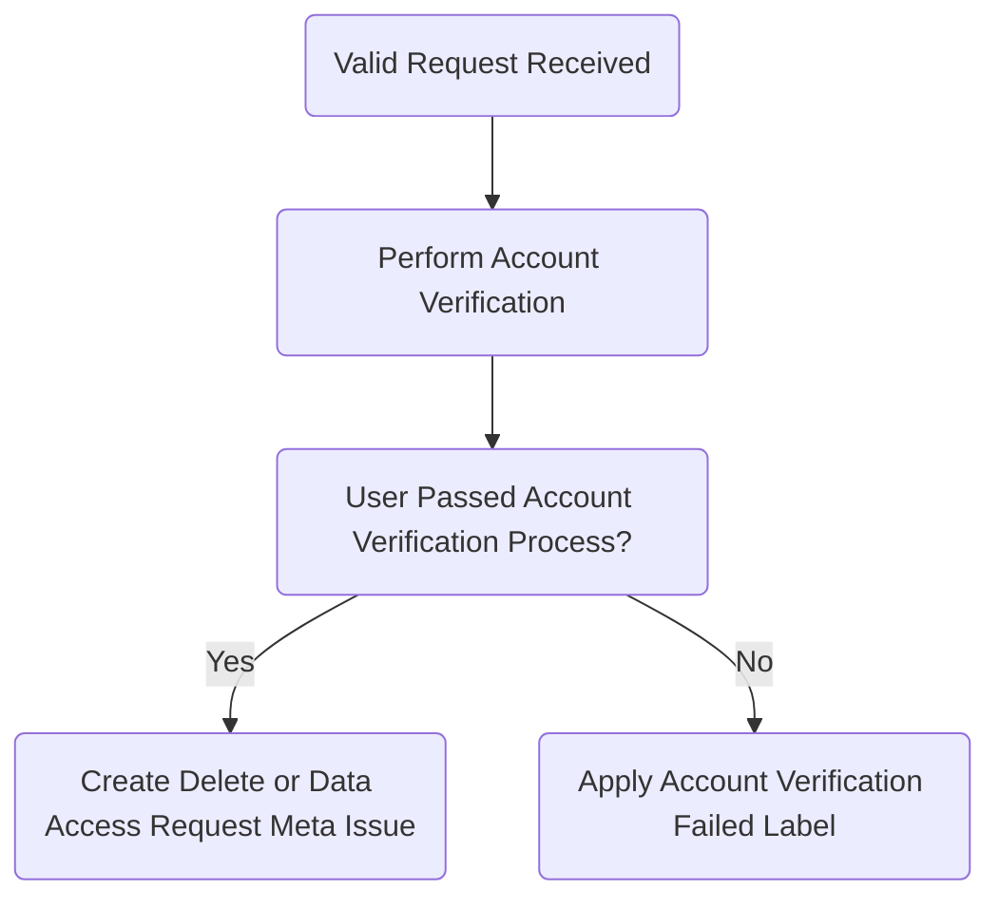

## On this page
{:.no_toc .hidden-md .hidden-lg}

- TOC
{:toc .hidden-md .hidden-lg}

## Purpose/Overview

Use the appropriate workflow on this page when a user requests one of the following (under [GDPR Article 15](https://gdpr-text.com/read/article-15/), [CCPA](https://oag.ca.gov/privacy/ccpa)) through a Zendesk ticket or via form submission to our [Account Deletion and Other Requests](https://gitlab.com/gitlab-com/gdpr-request/issues/service_desk) project. **These requests must be filled within 30 days.**

- deletion of everything (GitLab.com and all other data associated with their account)
- deletion of their GitLab.com account only
- deletion of their [Customer Portal](http://customers.gitlab.com/) data
- access to their data or questions about their data

## Scope

This data deletion process applies to deletion requests made by individual users of gitlab.com.

## Roles and Responsibilities

| Role | Responsibility|
| ---- | ------ |
| Support Team | Maintaining this deletion process handbook page and related deletion request project and issue templates |
| GitLab system owners | Processing user deletion for each system as required by the data deletion issue created through this process |

## Before You Begin

Account deletion and data access requests go through a few stages before they can be closed, and it can be difficult to keep track of what stage in the process each request is in at any given time. Consider creating an issue board within the account deletion project and use the `Awaiting::Challenge Answers`, `Awaiting::Deletion`, and `meta-issue` labels to track the progress of each request. See [this board](https://gitlab.com/gitlab-com/gdpr-request/-/boards/2316580?assignee_username=tristan&) for an example.

Users requesting deletion are required to confirm their intent to delete at the time of submission. After submission, the form entries are automatically checked and validated (such as the username, email address, and if the account is part of a paid namespace).

An issue in our [Account Deletion and Other Requests](https://gitlab.com/gitlab-com/gdpr-request/issues/service_desk) project *will be created* for invalid requests, however all invalid requests will have `Invalid request received` in the title of the issue, and are scheduled to automatically close. No action is required for these issues.

## Example Requests

Examples of personal requests that you may receive (based on the request type) are below.

### Examples of **account deletions requests**:

- Please delete my account in GitLab.com, along with all other associated data tied to my account.
- I am looking to delete my GitLab.com account so I can recreate it using the same email.
- Please delete all of my personal information and data tied to any of your services. I want to be forgotten for good.
- I am hereby requesting immediate erasure of personal data concerning me according to Article 17 GDPR. Please erase all personal data concerning me as defined by Article 4(1) GDPR.

### Examples of **data access requests**:

- Please confirm whether or not my personal data is being processed. If it is, please provide me with the categories of personal data you have about me in your files and databases.
  - In particular, please tell me what you know about me in your information systems, whether or not contained in databases, and including e-mail, documents on your networks, or voice or other media that you may store.
  - Additionally, please advise me in which countries my personal data is stored, or accessible from. In case you make use of cloud services to store or process my data, please include the countries in which the servers are located where my data are or were stored.
- Please provide me with a copy of, or access to, my personal data that you have or are processing.
- Please provide me with a detailed accounting of the specific uses that you have made, are making, or will be making of my personal data.
- Please provide a list of all third parties with whom you have (or may have) shared my personal data.
- If you are additionally collecting personal data about me from any source other than me, please provide me with all information about their source, as referred to in Article 14 of the GDPR.
- If you are making automated decisions about me, including profiling, whether or not on the basis of Article 22 of the GDPR, please provide me with information concerning the basis for the logic in making such automated decisions, and the significance and consequences of such processing.
- I would like to know whether or not my personal data has been disclosed inadvertently by your company in the past, or as a result of a security or privacy breach.

## Workflows

### Zendesk

>**NOTE:** As there is a [known bug with Group Managed Accounts](https://gitlab.com/gitlab-org/gitlab/-/issues/209081), see the [Group Managed Accounts section](#group-managed-accounts) for the process.

When a request is received through Zendesk as a ticket, do the following:

1. For **account deletions**, apply the [**Support::SaaS::Account Deletion Instructions - GitLab.com**](https://gitlab.zendesk.com/agent/admin/macros/360027176693) macro, and mark the ticket as solved.

1. For **data access requests**, apply the [**General::Personal Data Access Request Instructions**](https://gitlab.com/search?utf8=%E2%9C%93&group_id=2573624&project_id=17008590&scope=&search_code=true&snippets=false&repository_ref=master&nav_source=navbar&search=id%3A+360043149613) macro, and mark the ticket as solved.

This will direct the user to the [Personal Data Request form](https://support.gitlab.io/account-deletion/), in order to have their request processed. The request will then be serviced when received in the [Personal Account Requests Service Desk](https://gitlab.com/gitlab-com/gdpr-request/issues/service_desk).

The only requests we need to take action on are:

- validated account deletion requests (user is automatically sent challenge questions)
- validated data access requests (user is automatically sent challenge questions)
- general questions

### Personal Account Requests Service Desk

When a user submits a personal request using the [Personal Data Request form](https://support.gitlab.io/account-deletion/), an issue is automatically created in the [Personal Account Requests Service Desk](https://gitlab.com/gitlab-com/gdpr-request/-/issues/service_desk), meaning comments made on it will be emailed to the submitter.

Upon submission, the submitter will receive an autoresponder depending on the request and outcome of the initial validation. The autoresponse they receive will be in the initial description of the issue, along with a copy of the form entries that were submitted.

#### **Stage 1: Ownership Verification**

>**NOTE:** Users have a total of 14 days to respond to the challenge questions. In order to keep track of the requests that are pending a response to the challenge questions, you can apply the `Awaiting::Challenge Answers` label, if it does not already exist.

##### Verifying Ownership

The user will automatically receive a set of [Verification Challenges](https://gitlab.com/gitlab-com/support/internal-requests/-/wikis/Account-Verification-Challenges) after form submission, as long as the following form entries have been validated:

- username is found / exists
- email is found / exists
- username and email match for the same account
- account is not part of a paid namespace
- the user checked the box confirming their intent to delete their account (required field)

If the user replies back with their answers to the challenges, perform the following steps:

1. Evaluate the users answers to the challenge questions using the [Account Verification](https://about.gitlab.com/handbook/support/workflows/account_verification.html#evaluating-challenge-answers) workflow with a data classification of `RED`, as all user data is [classified as red](https://docs.google.com/spreadsheets/d/1eNuSLuBcZWQe13SV1TfEjtNdCOZw7G7ofY9A42Y0sPA/edit#gid=797822036).
1. Proceed to [Stage 2](#stage-2-processing-the-request) if ownership verification was successful.
1. Proceed to [Verification Failure](#verification-failure) if ownership verification was unsuccessful.

If the user does not reply back with their answers to the challenges, do the following:

1. Proceed to [No Response](#no-response).

##### Verification Failure

If verification fails or is otherwise not possible, apply the `Account Verification Failed` label and respond with the following:

  
Request Closed - Verification Failed

  
Greetings,

  
Unfortunately, the answers to our verification challenges have failed. As a result, we are unable to process your account deletion request. This issue will be closed.

  
Regards,

##### **Closure Reasons**

In certain circumstances we will need to close a users request without processing it. Outside of ownership verification failure this should only be done in the following scenarios.

###### Request Submitted Directly

If a request is received because the requestor submitted it directly to the Personal Account Requests Service Desk email address rather than using [the form](https://support.gitlab.io/account-deletion/), close the issue and inform the requestor with the following snippet to open a new request through the form so that we can assist them.

  
Request Closed - Request Submitted Directly

  
Greetings,

  
It looks like you've emailed this request in to us directly. In order for us to best assist you please re-submit this request via our [Personal Data Request Form](https://support.gitlab.io/account-deletion/). Doing so will allow us to process your request more quickly and efficiently. This request will now be closed, and we're eagerly awaiting your resubmission. Thank you!

  
Regards,

###### No Response

If a user fails to respond to our verification challenge questions after 14 days, apply the `Account Verification Failed` to the issue and close it with the following snippet:

  
Request Closed - No Response

  
Greetings,

  
We have not heard back from you with responses to our verification challenge questions, which are required in order to verify your identity before we process your request. We will now close this request. If you still wish to proceed please feel free to submit a new request via our [Personal Data Request Form](https://support.gitlab.io/account-deletion/).

  
Regards,

#### **Stage 2: Processing the Request**

>**NOTE**: Please be aware of the *type of deletion request* submitted by the user. Some users may **only** want their CustomersDot account or their GitLab.Com account deleted, versus a full deletion (right to be forgotten). It's important to make that clear when working through the confidential issue to process the users request.

1. In the `gdpr-request` issue tracker, create a new confidential issue using the [delete_meta_issue template](https://gitlab.com/gitlab-com/gdpr-request/issues/new?issuable_template=deletion_meta_issue) for **account deletions**, or the [personal_data_request template](https://gitlab.com/gitlab-com/gdpr-request/-/issues/new?issuable_template=personal_data_access_request) for **data access requests**. Populate the title with the email address of the original requestor.
1. Link the original issue in the **Related issue** field.

1. Follow the instructions in the top of the template, then complete each step in the issue template that begins with `Support Engineer:` in order.

#### Flow Chart

An overview of this process is outlined in the chart below.

## Group Managed Accounts

If a group is using [group managed accounts](https://docs.gitlab.com/ee/user/group/saml_sso/group_managed_accounts.html), user accounts may be orphaned until [gitlab#209081](https://gitlab.com/gitlab-org/gitlab/-/issues/209081) is fixed. You can use ChatOps to check whether a group has the relevant feature flags enabled.

When checking the user account in admin, the user will be badged as a "Group Managed Account". Double check that the user is no longer a member of any group.

In these cases, we can delete the account so that a new user account can be created.

1. Use the [`Support::SaaS::Group Managed Account Deletion` macro](https://gitlab.com/search?utf8=%E2%9C%93&group_id=2573624&project_id=17008590&scope=&search_code=true&snippets=false&repository_ref=master&nav_source=navbar&search=id%3A+360073474899), which outlines the criteria and deletion.

1. Once Support receives permission from *both* the account holder and a group owner:
1. Create an [internal request issue](https://gitlab.com/gitlab-com/support/internal-requests/-/issues/new) titled "Account Deletion" with the username, email, ticket number, and the reason in brief in the description.
1. Email both the account holder and group owner informing them that you are going to delete the account asking them to confirm for a final time.
1. Once confirmation has been received go to the user's admin page and click on "Delete user and all contributions".
1. Close the internal issue, and respond to the customer that the account has been deleted.

## Exceptions

Exceptions to this procedure will be tracked as per the [Information Security Policy Exception Management Process](https://about.gitlab.com/handbook/engineering/security/#information-security-policy-exception-management-process).

## References

- [Controlled Document Procedure](https://about.gitlab.com/handbook/engineering/security/controlled-document-procedure.html)
