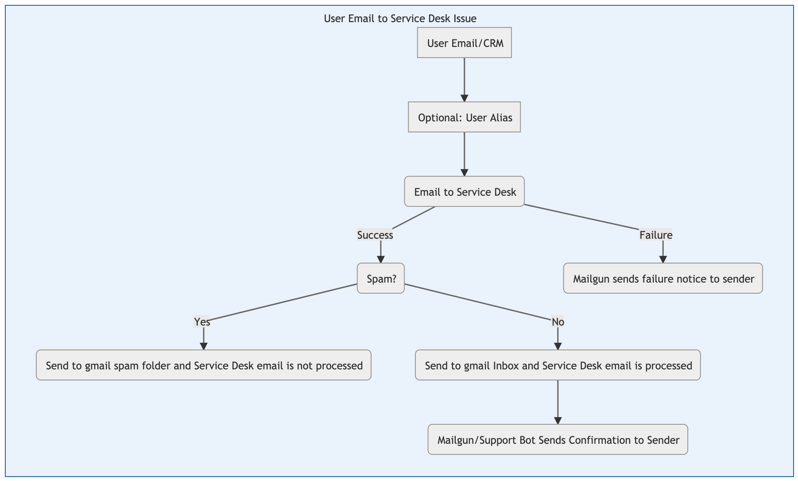
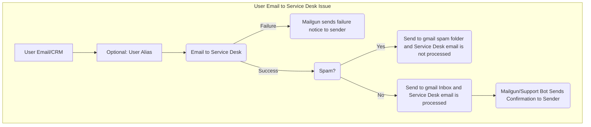

## On this page
{:.no_toc .hidden-md .hidden-lg}

- TOC
{:toc .hidden-md .hidden-lg}

### Overview

Users can experience various issues while utilizing [Service Desk](https://docs.gitlab.com/ee/user/project/service_desk.html). This guide walks through troubleshooting when an email does not generate a Service Desk issue.

### Troubleshooting Steps

1. When an issue related to Service Desk is received, reply with the [`Support::SaaS::Service Desk Issues First Response`](https://gitlab.com/gitlab-com/support/support-ops/zendesk-macros/-/blob/master/macros/active/Support/SaaS/Service%20Desk%20Issues%20First%20Response.yaml) Zendesk macro to rule out any known issues.
1. If known issues cited in the macro are not the cause, request the following from the user:
    1. The source email (including headers) for an example email sent to the Service Desk which did not create an issue
    1. A link to the GitLab.com project which the email was attempting to send to
    1. Did the sender received a reply (failure)? If yes,
        1. Request a screenshot of the failure message.
        1. Search [Kibana](https://log.gprd.gitlab.net/app/kibana#/) by sender's IP address (if known)
        1. Search the `mg.gitlab.com` mail logs in [Mailgun](https://app.mailgun.com/app/sending/domains/mg.gitlab.com/) for suppressions
        1. Create an issue in [EE issue tracker](https://gitlab.com/gitlab-org/gitlab-ee/issues) providing all information found
    1. Did the sender received a reply (failure)? If no,
        1. Send a Slack message to [#production](https://gitlab.slack.com/messages/C101F3796), asking for a check of the spam folder in the `incoming` gmailbox for the Service Desk target email

### Email to Service Desk Email Flow



Mermaid source:
```

```
