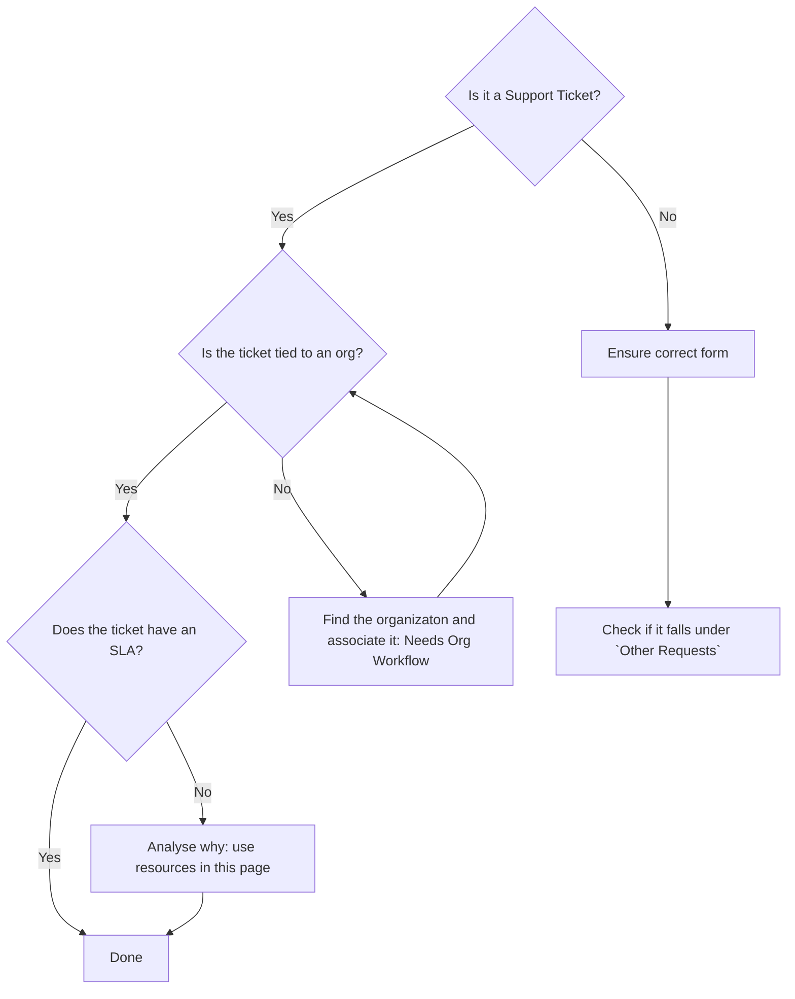

## On this page

{:.no_toc .hidden-md .hidden-lg}

- TOC
{:toc .hidden-md .hidden-lg}

## Purpose of this page

This page aims to walk you through some basic checks and items to tick off when working on the Needs Org and Triage queue in ZenDesk. While this will be useful for any Support Engineer or Support Manager when working on tickets, it is especially aimed to help those performing the FRT Hawk role.

## Overall Flow

## Applying the Correct Form

A ticket should have the correct [form](https://gitlab.com/gitlab-com/support/support-ops/zendesk-ticket-forms-and-fields/#ticket-form-id-numbers) applied to it to help route it to the right set of individuals who can assist with that request.

Most of the forms are self-explanatory, but here are some extra considerations:

- GitLab.com Account: user account issue only, all others go to GitLab.com
- Security: See [when to transfer to security](/handbook/support/workflows/working_with_security.html#identifying-issues-for-transfer-to-security).
- Accounts Receivable: refunds, VAT and invoices.

## Needs Org Workflow

Use this [Needs Org workflow](/handbook/support/workflows/associating_needs_org_tickets_with_orgs.html) to tie a ticket to the right organization.

## Looking up customer details

Check out the [Looking up customer details](https://about.gitlab.com/handbook/support/workflows/looking_up_customer_account_details.html) page to understand how and where you can find customer information from ZenDesk, Salesforce and the customer portal.

## Organizations with Multiple Subscriptions

Sometimes, we might find organizations with multiple subscriptions associated with them. Follow the solution described [in this section](/handbook/support/support-ops/zendesk/organizations.html#what-is-an-organization-has-multiple-subscriptions) in such cases.

## Other Requests

We also receive non Support requests in our queue - if you see something not listed below or something you are unsure about, ask in the #support_managers slack channel and make a MR to update the list below when you find out the answer.

|Request|Workflow|
|--|--|
|Training|Redirect requester to [Education from Professional Services](https://about.gitlab.com/services/education/)|
|New Set Up/Installation|Follow the [Passing a Lead to Sales](/handbook/support/workflows/passing_a_lead_to_sales.html) workflow|
|Requests for swag|Ask in the #swag internal slack channel or direct to [the FAQ](https://shop.gitlab.com/pages/f-a-q) for existing orders. For general requests for free swag, use the `General::Free Swag Request` Macro.|
|Questions related to jobs/openings|Redirect requester to [Outbound Recruiting Model](https://about.gitlab.com/jobs/faq/#gitlabs-outbound-recruiting-model) page|
|Questions related to status of job application| Use the `General::Job Application Questions` [macro](https://gitlab.com/gitlab-com/support/support-ops/zendesk-macros/-/blob/master/macros/active/General/Job%20Application%20Questions.yaml) and send a note to the internal `#recruting` Slack channel.|
|Legal Questions and Concerns|Ask in the #legal internal slack channel|
|Missing Certificates | Direct requester to review  [Missed Certificate](https://about.gitlab.com/handbook/people-group/learning-and-development/certifications/#missed-certificate) and contact `learning@` with a note about which certificate/knowledge assessment is missing. |
