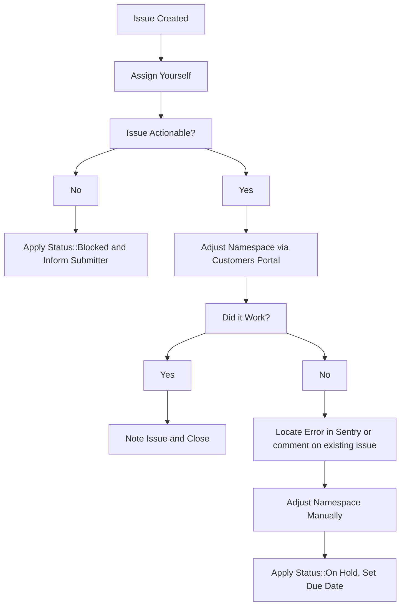

### On this page
{:.no_toc}

- TOC
{:toc}

----

## Overview

Use these workflows if you need to extend a GitLab trial.

## Plan Change Request

Most plan change requests are related to requesting a trial with an existing subscription on GitLab.com, which is an [open feature request #12186](https://gitlab.com/gitlab-org/gitlab/-/issues/12186).

At times, it is to immediately expire the trial or downgrade the namespace to Free.

For these issues, follow the same procedure as the extending GitLab.com trials process below, but in short:

1. Try it in customers portal admin first.
1. If you receive an error, follow the usual troubleshooting procedures in looking up the error in sentry and/or for an existing customers portal issue, adding to an existing issue or creating a new one as required.
1. As a workaround, the plan can be changed manually in one of two ways:
    1. GitLab.com: Add ~"Admin Escalation" label and if needed, ping the dotcom group.
    1. Customers Console: Add ~"Console Escalation::Customers" and if needed, ping the customers-console group.

## Extending GitLab.com Trials

> **NOTE**: Due to [customers #973](https://gitlab.com/gitlab-org/customers-gitlab-com/-/issues/973) and [customers #1643](https://gitlab.com/gitlab-org/customers-gitlab-com/-/issues/1643), these issues are currently marked for those engineers who have access to resolve them through [customers portal console](/handbook/support/workflows/customer_console.html#change_plan). Once those issues are resolved, these requests should be done via customers portal admin.

Sales will often request that we extend the duration of GitLab.com trials on behalf of their prospects. These issues will always have the `Trial Extension` label applied to them and the following workflow should be followed to service them.

If any fields in the issue description were filled out incorrectly by the submitter apply the `Status::Blocked` label and mention them in the issue asking them to supply any missing information.

1. Assign yourself to the issue.
1. Check over the request and ensure that we've been provided enough information to action the request. To do this check that:
   1. The `GitLab.com Link to Namespace:` field contains a valid GitLab.com link to the namespace that holds the active trial. This should not be a Salesforce link or email address.
   1. The `Extend Until:` field contains a future date.
1. Using the address provided in the `Contact Email:` follow the [customers admin docs](/handbook/internal-docs/customers-admin/index.html) to find the customer and action on the request.
1. If there is an error while taking action, locate the [error in sentry](https://sentry.gitlab.net/gitlab/customersgitlabcom/) (see [Searching Sentry](/handbook/support/workflows/500_errors.html#searching-sentry) if needed) and file an issue, or comment on an existing one.
1. If namespace needs to be adjusted manually, then add the `~Admin Escalation` label, and if you do not have GitLab.com admin access, ping `gitlab-com/support/dotcom`.

## Extending GitLab Self-managed Trials

Self-managed trials cannot be extended -  a license must be re-issued and applied to the instance in order to "extend" a trial.
Self-managed licenses are managed in the [license app](https://license.gitlab.com). In order to sign-in, you will need an account on `dev.gitlab.org`. If you don't have one, open an [access request](https://gitlab.com/gitlab-com/team-member-epics/access-requests/-/issues/new?issuable_template=Single_Person_Access_Request) and refer that your role entitles you to access with [this link](https://gitlab.com/gitlab-com/team-member-epics/access-requests/-/blob/master/.gitlab/issue_templates/role_baseline_access_request_tasks/department_customer_support/role_support_engineer.md).

To re-issue a license:

1. Log in to the [license app](https://license.gitlab.com).
1. Identify the trial license by searching by customer or company name.
1. Click the name on the license to view its details.
1. In the **Edit license** section, choose _Duplicate license_.
1. Modify the `Users count` and `Expires at` fields, consider adding a note to describe why you're issuing this license.
1. Click **Create license**.

The license should be emailed out immediately, but you're also welcome to download it and pass it along to the customer directly.
