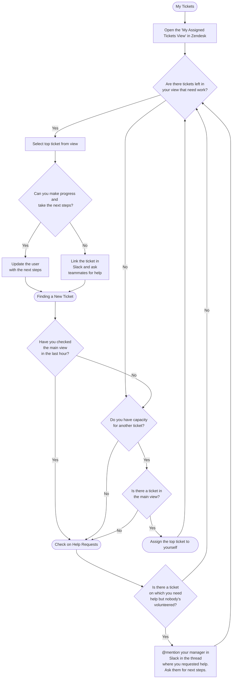

## On this page
{:.no_toc .hidden-md .hidden-lg}

- TOC
{:toc .hidden-md .hidden-lg}

## What is the "Working on Tickets" workflow?

The [core responsibility of GitLab Support Engineers](/handbook/support/support-engineer-responsibilities.html) is to resolve user problems by solving support tickets on a daily basis. You accomplish this using the "Working on Tickets" workflow. The focus is **being responsible for the continuous progress toward resolution of a specific set of tickets**. What does this look like?

**It starts with taking responsibility for a ticket by assigning it to yourself at the moment you make the first public comment on it.** From that point forward you should be thinking about how you can keep that ticket moving toward a resolution that's acceptable to the user. Don't worry - you're not responsible for creating the solution, only for making the solution happen and ensuring the user is kept up to date with what's happening. **You're the leader, not the sole contributor.** If you can resolve the ticket independently, great! If not, ask others (*e.g.* create a Slack thread) to help by pairing with you or by providing internal comments in the ticket to suggest next steps. Note that Senior and Staff Support Engineers are specifically charged with putting a large percentage of their time into helping the rest of the team, so they're a great resource when you need ticket help. If you're not able to find someone to work with you, please let your manager know so that they can help with next steps.

Benefits of working on tickets assigned to yourself:
1.  You won't have to read through a series of updates from multiple support engineers, and the user, to understand the ticket history, current status, or plan of action. In fact, we encourage you to include a brief description of those items - history (what's happened so far), current status, next steps - in most of your updates to the user so that your last update always tells you what you need to know.
1.  With one person in charge of each ticket, you can take a consistent approach to resolving the problem, you can explain why and what you're doing, and you won't repeat or contradict an action taken by somebody else on the ticket. This is a much better experience for the user.
1.  Knowing that you're in charge of a ticket gives you freedom to set and manage user expectations at each step along the way, so the user will know what's going on and who's working on their behalf. Again, this is a user experience enhancement.

When you're "Working on Tickets", you're driving achievement of our KPI of [Support Satisfaction](/handbook/support/performance-indicators/#support-satisfaction-ssat) by helping to resolve tickets as quickly and effectively as possible.

## How do we prioritize tickets?

The global priority order for handling tickets is:

| What | Description | Why? | What PI does this affect? |
|---|---|---|---|
| New Tickets | All Regions + Tickets in your Preferred Region | These tickets represent a contractual obligation. We must respond within SLA | [First Reply Time SLA](/handbook/support/performance-indicators/#service-level-agreement-sla) | 
| Tickets without owners | All Regions + Preferred region tickets | These tickets represent risk. Without a DRI they are likely to languish. | [SSAT](/handbook/support/performance-indicators/#support-satisfaction-ssat), [Customer Wait Time](/handbook/support/performance-indicators/#customer-wait-times) |
| Tickets you own | | These tickets are the ones you're the DRI of. Keep your customers up to date and moving towards solutions.| [SSAT](/handbook/support/performance-indicators/#support-satisfaction-ssat), [Customer Wait Time](/handbook/support/performance-indicators/#customer-wait-times) |
| Everything else | Collaborate with others on the tickets they own, work on learning tasks, handbook or docs updates | | [SSAT](/handbook/support/performance-indicators/#support-satisfaction-ssat), [Customer Wait Time](/handbook/support/performance-indicators/#customer-wait-times), [Support MR Rate](/handbook/support/performance-indicators/#support-mr-rate-inherited), [Support Handbook MR Rate](/handbook/support/performance-indicators/#support-handbook-mr-rate-inherited) |

### The Process in Action

#### Brief Summary
Here's what to do when you're actively working on tickets in Zendesk. Divide your efforts between:

1. taking **next** steps on tickets that are already in your
   [My Assigned Tickets](https://gitlab.zendesk.com/agent/filters/360062369834)
   view
1. replying to new tickets from the `Needs Org / FRT` and `Handover Needed` views (see [Meeting FRT SLA](/handbook/support/workflows/meeting-frt-sla.html)).

#### Main Views

1. My Assigned Tickets - Keep your customers up to date and moving towards solutions
1. [Needs Org / FRT](https://gitlab.zendesk.com/agent/filters/360076150200) - all SEs find new tickets here
1. [Handover Needed (REGION)](https://gitlab.zendesk.com/agent/filters/360076150280) - all SEs find new tickets here
1. [SaaS Account](https://gitlab.zendesk.com/agent/filters/360050768099) - SaaS focused SEs find new tickets here
1. [Free user tickets](https://gitlab.zendesk.com/agent/filters/360038103100) - help when you have capacity
1. [L&R](https://gitlab.zendesk.com/agent/filters/360038103700) - for L&R focused SEs

#### The Full Workflow

1. Start your work at the top of your own view
1. Determine whether you can identify any next steps to make progress
   1. If you can, then take those steps, including updating the user
   1. If not, then link the ticket in Slack and ask for help from your teammates
1. If **you have the capacity to take on another ticket**, find a new ticket to take ownership of by following the steps in [Meeting FRT SLA](/handbook/support/workflows/meeting-frt-sla.html)

1. If you've asked in Slack for help on a ticket, and nobody has stepped up to help, and you feel you can't wait any longer for help, then:
   1. `@mention` your manager in Slack in the thread where you requested help, and ask them what the next steps should be
1. If there are tickets left in your view to work on, then go back to step 1, else go back to step 3

#### Workflow Visual

See the [Working on Tickets Flowchart](#working-on-tickets-flowchart) for a visual representation.

<!--  -->

### Zendesk Housekeeping and Things To Keep In Mind:

1. Teamwork is really important with this workflow. Be aware of what's happening
   across the board: watch Slack channels for requests from other SEs on their
   tickets, and check the `Needs Org / FRT`, `Handover Needed`, `SaaS Account` and `Free user tickets`
   views for tickets you can work on.
1. Ensure that the subject of a support ticket is both descriptive and
accurate. You can edit the Subject to fix typos or make the problem
clearer. Some examples include:

    - gitlab error 500 on login -> gitlab error 500 on login due to no partition of relation "audit_events"
    - My Account was Blockes -> My Account was Blocked
    - git reconfigure with below errors -> git reconfigure with letsencrypt_certificate errors
1. When you send a user an update, the normal action is to set the ticket
  status to `Pending`, which indicates that you are waiting for a reply
  from them. Even though at that point there will be no SLA clock running,
  you might consider setting an expectation with the customer that you'll
  check back with them after an appropriate amount of time to ensure
  continued progress. Should you choose to do that, please consider using
  our [Due Date](https://about.gitlab.com/handbook/support/support-ops/documentation/zendesk_global_apps.html#due-date-picker)
  and [Reminders](https://about.gitlab.com/handbook/support/support-ops/documentation/zendesk_global_apps.html#gitlab-reminders-app)
  apps to help you to meet that commitment.
1. Add research notes to your tickets, as it's important that we clearly document all of our work performed throughout a ticket's lifecycle. Not only is this a good way for you to track your own progress, particularly for lengthy and challenging tickets, but it also provides your colleagues with a clear understanding of what has been tried thus far, and enables a smoother transition if a ticket needs to be reassigned.
1. Occasionally you will send a customer a reply letting them know that you're going
   to follow up with further information.
   1. In this case you should set the ticket status to `Open` or `On-hold`. Either
      way ZenDesk still removes the SLA and assigns the ticket to you (if it's not
      already assigned to someone else).
   1. In your reply you should also inform the customer when to expect your follow-up
      message, and invite them to inform you if your chosen schedule does not meet
      their needs. If it does not, please take steps to ensure you understand the
      impact to their business so that you can adjust your plans accordingly.
   1. To help yourself with meeting any schedule expectation you've set, consider
      using our [Due Date](https://about.gitlab.com/handbook/support/support-ops/documentation/zendesk_global_apps.html#due-date-picker)
      and [Reminders](https://about.gitlab.com/handbook/support/support-ops/documentation/zendesk_global_apps.html#gitlab-reminders-app)
      apps.
1. For any ticket in which the user is waiting on a response from Support, **always
   provide a timely update** on its status and on the work that has been done. You
   are encouraged to set your own definition of "timely" by setting the customer's
   expectations and using the Due Date and Reminders apps, as described in the
   preceding tip. Otherwise, please aim to provide updates daily, and definitely
   no less than every four days, which is the on-hold period length.
1. After 1 on-hold period or a week, generally, an issue should be created in the appropriate tracker especially if there is discussion with the development team.
1. If you are the assignee of a ticket, and the customer has confirmed that the solution you provided has resolved the issue, add a **closure summary** to the ticket prior to changing the ticket status to solved.  
The closure summary should provide a brief outline of the confirmed solution. It should be written with the goals of giving clarity to the customer with regard to the solution as well as providing your colleagues with a quick and easy way to see what solved the customer's problem. A good closure summary is helpful when searching for solutions to future tickets. To make it easier for yourself to create a summary, please consider using the [General::Closing Summary](https://gitlab.com/gitlab-com/support/support-ops/zendesk-macros/-/blob/master/macros/active/General/Closing%20Summary.yaml) macro, which adds a template as an internal note populated with some information. You will then need only to fill in the remaining items with relevant information before copying the completed message to a public comment for the customer.  
Some caveats to bear in mind:  
    1. You should add a closure summary if the ticket is a long ongoing ticket where multiple suggestions have been provided to the customer throughout the ticket lifecycle.
    1. The macro template ‘Closure Summary’ is available in Zendesk to help guide you with formatting a closure summary, you can modify or remove template content as deemed necessary.
    1. You should not feel the need to add a closure summary if the customer has not responded and the ticket has been automatically closed.
    1. You should not feel the need to add a closure summary if the ticket has a short life span and the solution is easy identifiable from the ticket history. (For example: If the resolution was a simple link to documentation.)

### FAQ About Working on Tickets workflow

1. **How many new ticket should I pick up each day?** See [Meeting FRT SLA](/handbook/support/workflows/meeting-frt-sla.html).
1. **How many tickets should I have assigned to me?** There's no specific number. Aim to take as many tickets as you can while being sure that you can give good attention to each of them daily. You might expect that to be somewhere between three and ten open, pending or on-hold tickets in your [My Assigned Tickets](https://gitlab.zendesk.com/agent/filters/360062369834) view.
1. **A ticket is assigned to someone else - can I work on it?** Absolutely!
   Support Engineers should
   [balance their day](/handbook/support/support-engineer-responsibilities.html#2-help-meet-our-service-level-objectives-for-ticket-reply-times-daily)
   between working on their assigned tickets and helping others to make progress
   on their tickets. If your own tickets are up to date then please look for opportunities to contribute on someone else's. Tickets breaching soon may be assigned to a team member
   in a different region. When replying to these tickets, be sure that your next
   steps align with the action plan that the assignee has described on their
   replies or ticket summary.
1. **If I can provide a good response on a new (unassigned) ticket, but I don't
   want to assign to myself, may I?** 
   Every response should be part of a ticket
   that is assigned to somebody. If the ticket is unassigned (new) and **it's in your region** or all regions, please
   assign it to yourself and then send your first response to the ticket
   requester. And remember, you have a whole team ready to help you drive that
   ticket to a great resolution, so you're never alone.
1. **I'm going to be absent, what do I do with my assigned tickets?**  Please
   see the [Support Team Member Time Off page](/handbook/support/support-time-off.html) for a full description of this
   situation.
1. **A ticket has diverged into more than one problem. What do I do?** It's recommended to keep tickets focused on a single problem that's clearly described by the ticket Title. If the user asks about another problem, you are encouraged to "**split**" the ticket **by creating a new ticket on behalf of the user**. The new ticket should focus on a single issue and keep the original ticket on the original issue. This helps reduce time to resolution and makes it easier for us to focus on fixing the problem at hand:
    1. Click `+ Add` near the top of the Zendesk screen to create a new ticket
    1. Set the user as the Requester (use the same email address as the original ticket)
    1. Give the new ticket a helpful 'Subject'
    1. Paste or write in the relevant text for the new ticket description
    1. Set the correct ticket form and other meta data from the sidebar
    1. Submit as 'New' if the next action is for GitLab or as 'Pending' if the next action is for the user
    1. Add a reply on the original ticket, letting the user know that you've split their ticket. (You could also add an internal note with a link to the new ticket you created if that seems helpful.)
1. **Can I reassign a ticket to someone else?** There are some situations in which you should look to reassign a ticket:
   1. If you'll be absent, see the FAQ above about reassigning tickets when you'll be absent.
   1. If you've determined that specific expertise outside your own is required to resolve the ticket, your first choice should be to pair with an expert so that you can get the ticket resolved and learn in the process. If pairing is not reasonable, then:
      1. ask the expert to review the ticket
      1. get agreement from them to take assignment
      1. add an internal note to the ticket that you have their agreement
      1. add a public message to the ticket informing the user that you’ve asked another support engineer with relevant expertise to take the ticket, and that you’ve reviewed the ticket with that engineer
      1. assign the ticket to the expert
   1. If you've become overloaded with tickets, feel free to rebalance your load by finding one or more teammates to take some of your tickets. Be sure you discuss each ticket before reassigning it to gain agreement and so that the other support engineers don't have to start from scratch. Then add an internal note stating the reassignment agreement **and** add a public meessage informing the user that you’ve asked another support engineer to take the ticket due to your time constraints.
1. **I am interested in a specific subject area that's not covered by the views provided and I would like to see tickets assigned to other team members.** Create [Zendesk personal views](https://support.zendesk.com/hc/en-us/articles/203690806-Creating-views-to-manage-ticket-workflow) and add filters for the subject area. This will list all the new tickets and the already assigned tickets for that area.

## Working on Tickets Flowchart

## Tips for working on tickets (all roles)

### I've taken a new ticket, what are some important things to consider as I make the first response?
 
1. Does the user already have some recently opened tickets with us? Is there background information in those tickets that it is safe to reuse or use to confirm back to the user that the information is still valid for this new ticket. For example, this could be logs/information we have very recently collected, or an attached architecture document from a Professional Services team engagement.
   1. Referring back to recent docs where applicable, could cut down investigation time and provides an improved user experience.
   1. **Check the organizational notes** for any details about the customer that may require a specific action be taken by Support, such as what NOT to ask. Additionally, the organizational notes may provide insight into how we need to communicate with the customer, or provide special handling instructions.
1. While waiting for a resolution to this ticket, is the user's business being affected?
   1. If you don't know the answer to this, make sure you check with the user early on in the life of the ticket to prevent the ticket becoming an escalation. Understanding the timescales the user is working to will help you set expectations and help them meet or adjust project timescales. 
1. If this is a "how to" question is it clear why the user is asking the question?
   1. Make sure that you fully understand the reason for their question and what the end result is they are looking for. There may be a different and better way for to achieve the results so always feel comfortable in asking 'Why'.

### I'm working on a ticket, how do I let the team know?

1. If the ticket is unassigned, then:
   1. Assign the ticket to yourself if it's **in your region** or all regions:
      1. This takes it out of the 'Needs assignee' view so other engineers won't waste
         time on it
      1. *NOTE: The SLA clock continues to run!*
   1. Work on the ticket and aim to get a helpful reply out to the user. Work with the team if needed as described above.
   1. If you're not able to get a reply out to the user even after seeking
      help, please speak with a manager to determine an appropriate course of
      action.
1. If the ticket is already assigned to someone else and you're stepping in to
   help them, then:
   1. Add yourself to the **CCs**
   1. Enter a short internal note stating "assisting"
   1. Proceed to write and send your reply to the user, or to pair with the
      assignee to work on the ticket

### What if someone is working on a ticket that I’d like to work on?

If another engineer is looking at a ticket that you’re interested in working on:

1. Contact them in Slack to confirm whether they're actively working the ticket.
1. If they are, ask to pair on the ticket, or share with them any information
   and questions that you have.
1. If they don’t respond in Slack, go ahead and work on the ticket - [Bias for Action](/handbook/values/#bias-for-action) is part of GitLab's core Value, Results.

### A ticket is close to breaching SLA; I'm working on it, but I need more time for my full reply.

1. Please send the user a short message to update them on the action plan:
   what you're doing, what progress you've made, and what's left to do. Let
   them know when you expect to have next steps for them to take. Doing this
   will not only prevent an SLA breach, it will very likely be well-received by
   the user. Remember, you don't need to have a full answer in order for
   your message to be useful.
1. When sending the short public reply, set the ticket status to `On-hold` or `Open`. `On-hold` is useful when waiting for information from another team. `Open` is useful when you want to keep the ticket visible to the rest of the Support team. (See below for more details on choosing a ticket status.)
1. When you take the above action, **keep your commitment and get back to the
   user on time and with a full reply including next steps**. Keep in mind
   that you've stopped the SLA clock, so it's up to you to respond on time. **Do
   not take this action if you are not planning to be the one to follow up.**

### I need deeper technical assistance on a non-emergency case - what do I do?

Sometimes, you might require help from senior support engineers, subject matter experts or developers on your tickets. These tickets are most likely either long-running or technically challenging. We encourage [collaboration](/handbook/values/#collaboration) and you can use the following steps as a general guideline if you are unsure of what to do next:

1. Start by posting an internal message in the ticket clearly summarizing the problem, the steps that have been taken so far (including the reasoning behind them), the results of those steps, and the current status.
1. Check the [Support Team Knowledge Areas](/handbook/support/workflows/knowledge_areas.html) handbook page to see if someone would be able to assist you.
1. Look for assistance in the internal Support Slack channels.
   1. Initiate a crush session or a [pairing session](https://gitlab.com/gitlab-com/support/support-pairing) in the [#support_self-managed](https://gitlab.slack.com/app_redirect?channel=support_self-managed) or [#support_gitlab-com](https://gitlab.slack.com/app_redirect?channel=support_gitlab-com) Slack channels.
   1. If you now have some new ideas to try, make sure you have a clear plan of action and engage with the user.
1. If you still require further assistance, reach out in the Slack channel of the appropriate [stage/group](https://about.gitlab.com/features/).
   1. If the situation demands (bug, regression, feature request etc) and an issue doesn't already exist, a new issue must have been filed related to the ticket and linked in all appropriate places.
1. If you are unable to get assistance from a developer through the previous step, a Product Manager might need to be involved - reach out to a Support Engineering Manager via the [#support_escalations](https://gitlab.slack.com/messages/CBVAE1L48) Slack channel for assistance.

### Working on emergency or escalated tickets

At times the usual ticket workflow may be interrupted by a new customer [emergency ticket](/handbook/support/on-call/#sts=Taking%20an%20emergency%20customer%20call) or an [escalated situation](/handbook/support/internal-support/#i-want-to-escalate-a-ticket). There may be a need to reprioritise workload to accomodate these. If you anticipate a problem with prioritization please let your manager know so that they can help with next steps.

### A customer has confirmed a ticket can be closed but the ticket has no assignee - what should I to do?

When reviewing tickets or monitoring them to prevent SLA breaches you may encounter instances where a customer has confirmed that they have been provided with a solution however the ticket has not been assigned to an individual support engineer.  In this type of situation you should inform the customer that you are changing the ticket status to solved and assign the ticket to either the engineer who provided the technical solution or if this is not distinguishable then use good judgement and assign the ticket to an engineer who has significantly contributed to the ticket throughout its life cycle. 

### Understanding Ticket Status

Each ticket in Zendesk has a [status](https://support.zendesk.com/hc/en-us/articles/212530318-Updating-and-solving-tickets) that tells you what state it's currently in. They are as follows.

|  **Status** | **Meaning** | **Notes** |
| --- | --- | --- |
|  New | The ticket has just been opened and has had no replies. |  |
|  Open | The ticket has had one or more replies, and the user is waiting on GitLab Support to provide the next reply. |  |
|  Pending | Support has replied to the ticket and is waiting on the user to provide additional information. | If there are no responses after a total of 20 days, Zendesk will move the ticket to Solved. |
|  On-Hold | GitLab support is working on the ticket and may be waiting for information from another team | Placing a ticket on hold will assign it to the engineer. After four days Zendesk will move the ticket back to open status, requiring an update to the user. On-hold is transparent to the user (they see the status as 'Open') so there is no need to inform the user that the ticket is being put on-hold. It's the engineer's responsibility to ensure timely replies or to set the ticket back to 'Open' if they are no longer working on it. Setting a ticket to 'on-hold' while working on it can be useful as it takes it out of the main view, thus saving other engineers from wasting time reading it. |
|  Solved | The ticket has been solved | When a user replies to a Solved ticket, Zendesk reopens it. A Solved ticket will transition to 'Closed' after 7 days. |
|  Closed | The ticket is archived | When a user replies to a Closed ticket, Zendesk opens a new ticket with a note that relates the new ticket to the closed ticket. |

### Avoiding status change automations

By default, Zendesk will move a ticket from pending to solved after 20 days
with no replies. It will also move a solved ticket to closed after 7 days with
no replies. While this is normally the right workflow, there might be situations
in which you need to prevent this from occurring. To do so, use the appropriate
Zendesk labels:

| Label | What it does |
|-------|--------------|
| skip_autosolve | This tells Zendesk to refrain from moving the ticket to `Solved` automatically |
| skip_autoclose | This tells Zendesk to refrain from moving the ticket to `Closed` automatically |

### Handling Large Files

Zendesk has a [fixed maximum attachment size](https://support.zendesk.com/hc/en-us/articles/235860287-What-is-the-maximum-attachment-size-I-can-include-in-ticket-comments-) of 20MB per file. If you need a user to share a larger file than this, then see [Provide Large Files to GitLab Support](/support/providing-large-files.html) for information on how to do so.

### Filling Out Ticket Fields

Depending on the view you are working on and the form the ticket belongs to, you might need to fill out some ticket fields manually. Those fields help us capture important data that will help us improve the user experience. As a high percentage of our tickets are solved/closed automatically through our workflows, it is important to make sure that before you submit your response to a ticket, you check that all required (*) fields and relevant non-required fields have been filled out.

### Copying contents of Slack threads to internal notes

When using Slack to work with others or communicate internally regarding a support ticket, please bear in mind [our chat retention policy](/handbook/communication/#slack) and the [Communication Guidelines (esp. 9.)](/handbook/communication/#general-guidelines). It's best for future searches in Zendesk to copy relevant advice, notes, ideas, etc. from Slack to an internal note in Zendesk.

### Understanding SLAs

Our SLA workflow relies on end-users who submit tickets belonging to an organization and that organization having a GitLab Plan. Organization information is automatically added to Zendesk via a Salesforce Integration. We sync all records with Account Type equal to `Customer` from Salesforce to Zendesk. The information we get from Salesforce includes but is not limited to: Account Owner, Technical Account Manager, GitLab Plan and Salesforce ID. Organizations should never be created manually in Zendesk as that can cause our sync to be ineffective.  If you think an Account in Salesforce doesn't have an equivalent Organization in Zendesk, please let the [Support Operations Specialist](/handbook/support/support-ops/#introduction-to-support-operations-team-support-ops) know so a manual sync can be run.

We have a Slack integration that notifies us if a ticket from a paying customer will breach in less than 2 hours.

If you see an SLA notification in Slack, start a thread and consider this a _small emergency_. If you need help, draw the attention of other support engineers by tagging them, and work to move the ticket forward.

If a customer's reply is the last one in the ticket, do not set it to any status silently (except for Solved), because the breach clock will continue to run and the ticket may breach silently. Instead, send a confirmation, greeting, or other message, while also changing the status.

### Using On-Hold Status

You should use the On-hold status when it is necessary to do some internal work,
e.g. reproduce a complex bug, discuss something with developers or wait for a
session scheduled with a user. When setting the status to On-hold it will be
automatically assigned to you by the trigger
[`Automatically assign on-hold ticket to the engineer who put it to the on-hold status`](https://gitlab.zendesk.com/agent/admin/triggers/360033242313).

If you think that it should be assigned to someone else (*e.g.* session is
scheduled for another engineer), feel free to re-assign it. Tickets without an
assignee will be automatically reopened by the trigger
[`Automatically reopen on-hold tickets without assignee`](https://gitlab.zendesk.com/agent/admin/triggers/360028981853).
Tickets in on-hold status _with_ an assignee will be automatically reopened in 4
days by the automation
[`Reopen on-hold tickets after 4 days`](https://gitlab.zendesk.com/agent/admin/automations/360028978393).
Before setting any ticket to on-hold, set expectations with the user of what you are intending to do and when you will next be in contact with an update. Make sure that your timescales are acceptable for the user and take into consideration any business urgency the user has. 

If a user's reply is the last one in the ticket, do not set it to the On-hold status silently due to the same reasons as stated above in the
[Understanding SLAs](#understanding-slas). Instead reply to the ticket while also changing the status.

### Merging Tickets

**WARNING:**
Any attached files in the to be merged tickets will be shared across the tickets. Everyone in cc on both of these tickets will receive the files.

If you're merging two of a user's tickets that are related or are duplicates, be sure to send a message letting them know what you've done and why. If you don't, it often causes confusion and they open follow-ups asking why it was closed without comment. Please note that your Zendesk signature will not be automatically applied to this message.

Additionally, when [Merging Tickets](https://support.zendesk.com/hc/en-us/articles/203690916-Merging-tickets), leave `Requester can see this comment` **unchecked** in the ticket that's being merged into (the second ticket from the top) in order to maintain the SLA. If the merge comment is made public, Zendesk considers it a response and removes the SLA. The ticket that was merged into another ticket is closed while the status of the target ticket is unaffected.

**NOTE:** Any ticket merge is final -- there is no option to undo it.

### Removing Information From Tickets

We ask users to send us logs and other files that are crucial in helping us solve the problems they are experiencing. If a user requests deletion of information shared in a support ticket, or if we suspect sensitive information was accidentally shared, the information can be deleted using the [`Ticket Redaction`](https://www.zendesk.com/apps/support/ticket-redaction/) app.

To delete text or attachments from a ticket:

1. Go to the ticket in question and on the right hand nav bar, scroll down until you are able to locate the Ticket Redaction app.
1. In the text box, enter a string of text or source image URL you wish to redact.
1. If you wish to remove an attachment, you can click on the `Redact Attachment` button and choose the attachment you would like to remove.
1. Let the user know what actions you have taken and why.

If you don't see the Ticket Redaction App in the sidebar, it is likely that you are not assigned to one of the authorized roles (you can check your role in Zendesk profile). In this case, please reach out to `@support_operations` or `@support-managers` in Slack to request deletion. Zendesk roles that have access to Ticket Redaction App:

* Support Staff - Explore
* Support Staff
* Support Managers
* Administrators

### Handling emails forwarded from others at GitLab

Every now and then, a GitLab team member will forward a support request from a customer, prospective customer, user, etc. These requests then appear as tickets from the team member, instead of from the original requestor. Always reply directly to the original requester, keeping the person who forwarded it in the cc. You will need to manually alter the "Requester" field of the ticket, by clicking on the "(change)" link next to the email address of the apparent requester in the ticket title.

Please see [Requesting Support for Customers](/handbook/support/internal-support/#requesting-support-for-customers) for more details.

### Handling emotionally-charged tickets

When customers are putting negative emotions into ticket communications, refer to the handbook entry on 
[how to keep a ticket moving toward resolution when emotions are getting involved](./emotionally-charged-tickets.html)
for helpful tips and guidance. 

### Handling Free User tickets

Free users receive support in a few specified cases following the [free users section of the statement of support.](/support/statement-of-support.html#free-users). See the [Handling Free User tickets section of the triaging workflow](/handbook/support/workflows/ticket_triage.html#handling-free-user-tickets) for more details on how to triage these tickets.

# How to succeed at working on tickets

## 1. Weekly ticket review

### Aim

1. Make your work visible
1. Develop consistent high quality ticket work across the team

### How to do it

1. Review at least two tickets each week in your 1:1 call with your manager
1. Tickets can be selected by you or your manager
1. They can be tickets with work you're proud of or where you would like feedback
1. Your manager will give you feedback on:
     1. Technical quality
     1. Communication quality
     1. Collaboration quality (where appropriate, did you work with other Support Team members, managers, other GitLab team members or directly with the user on a call)

### Context

1. This is currently an informal process between you and your manager.
1. It is not part of a formal performance review.
1. We're investigating a more comprehensive [ticket retrospective process](https://gitlab.com/groups/gitlab-com/support/-/epics/23).

## 2. Take ownership of new tickets

### Aim

Help the team in [Meeting FRT SLA](/handbook/support/workflows/meeting-frt-sla.html)) by replying and taking ownership of new tickets each day. Follow the link to see how many to reply to.

### How to do it

1. Reply and take ownership of at least the [recommended number of new tickets](/handbook/support/workflows/meeting-frt-sla.html#reply-and-assign-new-tickets-every-day) each week for the days you have worked.

## 3. Meet the ticket baseline

### Aim

Help encourage an even distribution of 'volume' of ticket work amongst the team.

### How to do it

1. Focus on solving user problems via tickets as the core part of your work. 

That's it! For most people that's all you need to do. Once you've completed onboarding and have been helping out with tickets for two months or more, it's useful to gauge your contribution compared to the rest of the team.

### Context

Each week we publish the 'mean average per Support Engineer' for solved tickets, public replies and internal notes in the Support Week in Review.

We produce separate reports for SM/SaaS/L&R in recognition that the volume of tickets for each focus area is different.
- The following [Dashboard](https://gitlab.zendesk.com/explore/dashboard/36925DBD1F5E3C7BA541DB38D11AC51E0EAAFDD30DCB63FDE83CF1389E555D96/tab/11700022) contains the current values.

We establish a **dynamic baseline** that is 0.85 of the mean average* for each metric. 
(*value is chosen based on the [threshold for the lower quartile](https://en.wikipedia.org/wiki/Quartile)).

Here's an example week for folks working on self-managed tickets:

<table>
  <tr>
   <td><strong>Number of self-managed Support Engineers</strong>
   </td>
   <td>

<strong>42</strong>

   </td>
   <td>
   </td>
   <td>
   </td>
  </tr>
  <tr>
   <td>
   </td>
   <td><strong>Solved</strong>
   </td>
   <td><strong>Public Comments</strong>
   </td>
   <td><strong>Internal notes</strong>
   </td>
  </tr>
  <tr>
   <td><strong>Totals for last week</strong>
   </td>
   <td>

300

   </td>
   <td>

1050

   </td>
   <td>

500

   </td>
  </tr>
  <tr>
   <td><strong>Average per agent</strong>
   </td>
   <td>

6

   </td>
   <td>

25

   </td>
   <td>

10

   </td>
  </tr>
  <tr>
   <td><strong>Baseline (0.85 of avg)</strong>
   </td>
   <td>

<strong>5.1</strong>

   </td>
   <td>

<strong>20</strong>

   </td>
   <td>

<strong>8.5</strong>

   </td>
  </tr>
</table>

1. Support Engineers that have completed onboarding are expected to achieve the baseline as a minimum. Don't worry in a given week if you don't meet the numbers. The baseline is a guide to help balance team contributions - it is not a method to penalize anyone.
1. There are good reasons why you might not achieve the baseline on a given week (e.g. vacation, illness, working on other projects, carrying out interviews) and you should keep your manager informed when you're not able to focus on resolving user problems by contributing to support tickets.
1. If you don't meet the baseline you should discuss the reasons with your manager. If they're not satisfied that there are good reasons for not meeting the baseline, they will ask you to focus more on solving user problems on Support tickets so that you meet the baseline in future weeks. This helps balance contributions across the global team.
1. We believe in quality, not quantity - more is not automatically better.
1. We recognize that the three metrics selected are not a complete indication of 'good work' on their own.
1. We recognize that the metrics for 'public replies' and 'internal notes' can
   be 'gamed' by making small updates. We trust the team to do the right thing
   for the user and GitLab. This is why the ticket baseline is the last part of
   'how to succeed' in this area. It is more important to make quality updates
   on your assigned tickets and to help others to do the same on theirs.
1. There is no automated process to report on people that don't meet the baseline. The baseline is there to help you gauge your contribution and as a conversation starter between you and your manager.
