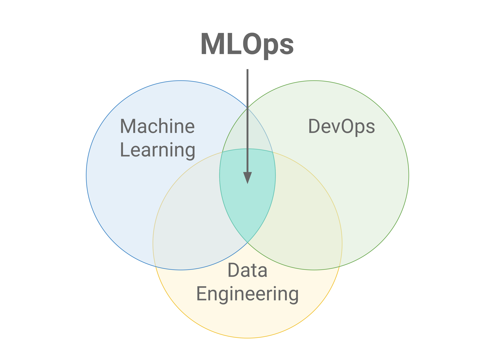

## On this page
{:.no_toc}

- TOC
{:toc}

## Attributes

| Property        | Value           |
|-----------------|-----------------|
| Date Created    | 2021-08-04 |
| Target End Date | - |
| Slack           | #wg_mlops (only accessible from within the company) |
| Google Doc      | [MLOPs Working Group Agenda](https://docs.google.com/document/d/18iOB05cFxS5to1eT55GwsENirBfVSjHCQJ2ostoY3cw/edit?usp=sharing) (only accessible from within the company) |
| Issue Label | ~WorkingGroup::MLOps  |

## Goals

This Working Group has the following goals:

1. Define a process for generating, storing and accessing data for training of models from GitLab.com
    - Determine how to build a GitLab asynchronous event stream for the purposes of getting data for pre-processing and training
1. Establish a framework and tooling for hyper-parameter tuning, retraining, versioning, and deploying new ML models
1. Determine how to distribute machine learning models on self-hosted instances
1. Define a security/legal process for security-related ML models and data pre-processing

## Definitions

### What is MLOps?

As per Wikipedia, **MLOps** or **ML Ops** is a set of practices that aims to deploy and maintain machine learning models in production reliably and efficiently.

Read more about the topic area from the links below:

  - [MLOps Wikipedia](https://en.wikipedia.org/wiki/MLOps)
  - [MLOps: Continuous delivery and automation pipelines in machine learning](https://cloud.google.com/architecture/mlops-continuous-delivery-and-automation-pipelines-in-machine-learning)
  - [Machine Learning Operations](https://ml-ops.org/)
  - [MLOps Slack Group](https://mlops.community/)

### Related GitLab Documentation
  - [MLOps Single-Engineer Group](https://about.gitlab.com/handbook/engineering/incubation/mlops/)
  - [MLOps Primer](https://about.gitlab.com/handbook/engineering/incubation/mlops/modelops-primer.html)
  - [MLOps Exploration](https://gitlab.com/groups/gitlab-org/incubation-engineering/mlops/-/epics/1)
 
## Exit Criteria 

The charter of this working group is to bridge the gap between different teams that are building ML products at GitLab by discussing overlapping architectural concerns:

1. Produce a somewhat standard/conventional definition of tooling and frameworks that GitLab teams can refer to when kicking off ML-related projects.
1. Creation of helpers/libraries (presumably in Python) that can be shared across teams and used for the purposes of similar tasks e.g. data access and storage, data pre-processing.
1. TBD

## Roles and Responsibilities

| Working Group Role    | Person                | Title                                           |
|-----------------------|-----------------------|-------------------------------------------------|
| Executive Sponsor     | Laurence Bierner      | Director, Security Engineering & Research       |
| Facilitator           | Alex Groleau          | Security Automation Manager |
| Functional Lead                | Roger Ostrander       | Senior Security Engineer, Trust & Safety        |
| Functional Lead                | Alexander Chueshev         | Senior Backend Engineer, Applied ML |
| TBD                | Taylor McCaslin         | Principal Product Manager, Secure |
| Functional Lead                | Ethan Urie            | Senior Backend Engineer, Security Automation    |
| Functional Lead                | Jayson Salazar        | Senior Security Engineer, Security Automation   |
| Functional Lead                | Juliet Wanjohi        | Security Engineer, Security Automation          |
| Member                | Alexander Dietrich    | Senior Security Engineer, Security Automation   |
| Member                | Charl De Wit            | Security Manager, Trust & Safety |
| Member                | Wayne Haber         | Engineering director |

