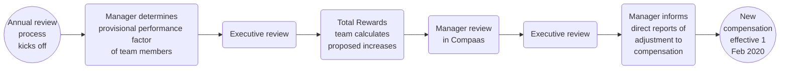

## On this page
{:.no_toc .hidden-md .hidden-lg}

- TOC
{:toc .hidden-md .hidden-lg}

## Introduction

On this page, we explain how we review our Compensation Calculator and carry out the Compensation Review Cycle.

## Contact Total Rewards
If you have any feedback or questions about the compensation review cycle, please contact [Total Rewards](/handbook/people-group/#how-to-reach-the-right-member-of-the-people-group).

## Compensation Review Cycle

GitLab goes through 2 compensation reviews:

1. **Annual Compensation Review** - Happens in the fourth quarter of each year. This is when Compensation Calculator inputs are reviewed and when majority of compensation is reviewed for team members. Any changes will be processed with an effective date of February 1st.
1. **Catch-up Compensation Review** - For team members hired in November to January. The process starts in August with an effective date of September first.

## Annual Compensation Review

The most up to date timeline of the Annual Compensation Review process can be found in the [Total Rewards Schedule](/handbook/total-rewards/#total-rewards-schedule).

During the fourth quarter of each year, the Total Rewards team will conduct a compensation review to ensure all team members are paid based on market rates in the [compensation calculator](/handbook/total-rewards/compensation/compensation-calculator/). This is not a Cost of Living Adjustment, but instead a review of market changes. Location Factor will continue to be a part of the compensation calculator equation.

Increases for Compensation Review Cycles are based on 1) assessing market changes in the compensation calculator inputs and 2) performance in the role.

The increase percentage may vary for each person. If a team member was recently adjusted, the annual adjustment might yield no additional salary during the annual compensation review. This review acts as a sweep for each team member’s compensation to be evaluated at least once per year. If there is an increase in Location Factor and/or Benchmark, team members affected will have the new location factors applied to their compensation, but would not receive an automatic percent increase. For example, if the location factor in a region increases by 10% the team member will not receive an automatic 10% adjustment. The team member would receive an increase aligned to their benchmark, location factor, and performance taking any budget constraints into account.

#### Process overview

### Annual Compensation Review Timeline

1. Benchmarks and Location Factors
  * The Total Rewards team will review all benchmarks and location factors associated with the Compensation Calculator and propose revised inputs to the Compensation Group for approval/implementation.
1. Performance Factors
   * The Total Rewards team will reach out the managers and People Business Partner to obtain performance factors for each active team member with a hire date on or before October 31st.
   * Once all performance factors have been reviewed and approved the executive leaders of each group will review the breakdown with the Total Rewards team along with the People Business Partner for their group. TODO: Build in review for each department leader along with indirect managers before executive reviews.
     * In this breakdown, leaders will be able to analyze all individual performance factors, the distribution of performance factors overall and by department, as well as a gender and ethnicity distribution audit. Total Rewards will outline any concerns based on the aggregated data for the leader and people business partner to review.
   * Remember that this is also a good time to update your team’s position description if it does not reflect the role.
   * Performance Factors should be confirmed in the assessment tool no later than November 30th.
1. Using the revised inputs, the Total Rewards team will calculate a minimum market increase for each team member using the exchange rate as of 2020-01-01.
1. [Manager Review](/handbook/total-rewards/compensation/compensation-review-cycle/#manager-review) in Compaas
  * Each division leader is responsible for making sure their group stays within budget. The company has a 6% budget for all Market and Performance increases.
  * Managers and indirect managers will review the minimum increase from Total Rewards and then propose an increase based on the performance factor for their team members.
  * Depending on budget constraints, the increases for the individual team members may be adjusted up or down by management and reviewed by Total Rewards.
1. Once the People Group gives the ok: Managers will inform the team members of the increase and adjustments to compensation compared to their performance.
1. Total Rewards Analysts will update [BambooHR](https://www.bamboohr.com/d/), and notify all payroll providers to be effective February 1st. Letters of adjustment are not necessary for annual compensation review changes.

### Compensation Change Freeze

To ensure a smooth process, the Total Rewards team will freeze any compensation changes relating to promotions as part of the Annual Compensation Review process leading into the [Manager Review](/handbook/total-rewards/compensation/compensation-review-cycle/#manager-review) portion of the program. Any compensation or promotion change requests need to be [submitted in BambooHR](/handbook/people-group/promotions-transfers/#for-managers-requesting-a-promotion-or-compensation-change) by 2020-12-04 with last available effective date of 2020-12-01 or 2020-12-16. If an exception needs to be made and a compensation change needs to be processed during this time, such as relocations or other reasons, please send an email to Total Rewards.

For internal transfers, Total Rewards will need a list of active applicants from Recruiting on roles as of 2020-12-16. If a team member takes an internal transfer, they will be removed from the Annual Compensation Review process as their compensation will be reviewed per the hiring process.

Any compensation changes that result from Annual Compensation Review will have an effective date of 2021-02-01. If a manager anticipates that a promotion is more suitable to process for a team member, the manager has the option to remove the team member out of the Annual Compensation Review process. If this is the case, please send an email to Total Rewards no later than 2020-12-16.

Promotions and compensation change requests will reopen in BambooHR on 2021-02-01. The effective date for these requests will be processed in the next available payroll date from the time of approval.

## Performance Factor

Performance Factors are assessed twice per year as part of the [Performance/Potential Matrix](/handbook/people-group/performance-assessments-and-succession-planning/#the-performancepotential-matrix). The average performance output (developing - performing - exceeding) will be used for annual compensation review.

For FY22 compensation (effective February 1, 2021) we will only have the ability to have one assessment (scheduled for November 2020). If a team has already submitted a Performance/Potential Assessment in Q3 FY21, they will not be required to submit another assessment in Q4, but may update their assessment if desired.

The People Group is developing guidelines and the assessment tool for how the Performance Factor will be determined/processed. [Related Issue](https://gitlab.com/gitlab-com/people-group/peopleops-eng/people-operations-engineering/-/issues/188).

### Performance Factor and Annual Compensation Review

Recommendations from Total Rewards for discretionary increases based on performance factor:
* Developing in role = 0-3% increase
* Performing in role = 3-7% increase
* Exceeding in role = 6-10% increase

However, do not expect that the final discretionary increases will fall into these ranges, as performance is only one factor out of many that goes into compensation adjustments.

Managers will want to take into account any increases the team member received in the last fiscal year (for example, due to promotion, transfer, catch-up compensation review, etc) or if the team member was recently hired and already aligned to market/performance rates. Once a manager determines the performance increase percent, the manager should be able to clearly communicate to the team member how it was derived.

Increases are not capped at 10%. If a manager would like to suggest an increase higher than the guidelines, they will want to add a justification for each indirect manager to review and approve.

If a manager has a team member on their team who is red circled (paid over the top end of the compensation range), in order for the person to receive an increase, they will need to submit a compensation exception request with their People Business Partner to Total Rewards which will then be reviewed and approved by the Compensation Group. The Total Rewards team will notify the People Business Partners of the team members red-circled once the new ranges are set for proactive review.

### Manager Review

As part of the new [Annual Compensation Review](/handbook//total-rewards/compensation/compensation-review-cycle/#annual-compensation-review-timeline), managers will review, approve, and where necessary update the proposed salary increases to ensure that we are paying each team member to market and increasing based on performance. Please verify the compensation review inputs (performance, level, title) are accurate in Compaas.

It is very important that GitLab team-members understand their performance and how it impacts their salary.

While some GitLab team-members may not receive an increase due to already being at the right [competitive rate](/handbook/total-rewards/compensation/#competitive-rate) for their Level, Role, and Location there are other circumstances where an increase should be avoided. If there are any reasons as to why the team member should not receive the proposed increase to be aligned with market rates in our calculator, please email total-rewards@ domain with the reasoning and cc your People Business Partner. This could be due to a current performance issue, pending termination, etc. If you would like to delay the increase, please outline a proposed plan of action and deadline. Team members who are currently struggling to perform at their current level should have that communicated clearly and the manager should consider delaying the increase until performance reaches a commendable level.

#### Manager Review in Compaas

[Compaas](https://www.compa.as/) is GitLab's compensation platform where managers can login, review, change, and submit their proposed increases during Annual Compensation Review.

**Process for slate owners:**

1. Navigate to [Compaas](https://app.compa.as/login) and select the option to sign in with Google.
* 
1. Select to sign in with your originally assigned GitLab email address.
* If you select to sign in with an alias, you will receive an error and not be able to sign in. You can confirm your original GitLab email address on the Personal tab of BambooHR.
* 
1. Once you have logged in, you will see your slate. Your slate will have a card for each of the team members you will be recommending a raise for.
1. The card will list the team member's name, role, benchmark role, level, performance factor, raise amount and percent, compensation before and after any adjustments, range with range penetration, and notes.
* 
* The role is located under the team member's name. This is the team member's job title including level, for example, Senior or Associate.
* Underneath the role is the [benchmark role](/handbook/total-rewards/compensation/compensation-calculator/#sf-benchmark). This is the job title that is used for determining the base compensation before other inputs such as level are evaluated. For example, the benchmark role for a Senior Backend Engineer is a Backend Engineer.
* Next to the team member's name is their level. This is a job code used internally that is unique to each role.
* Next to the level is the performance factor. These were selected by managers for each of their reports in the last Performance Factor Review.
* Each team member will have a minimum recommended increase loaded into Compaas by the Total Rewards team. This number brings the team member to the bottom of the compensation calculator using all [current inputs](/handbook/total-rewards/compensation/compensation-calculator/). Using the performance factor, the manager will outline a discretionary raise. This can be allocated as either a cash amount or percentage.
* The minimum recommended increase will appear underneath the raise field if you allocate less than this amount. Any money added in addition to this amount will be considered a discretionary raise and subject to e-group leader approval. A quick way to see what the minimum recommended increase is is to enter "1" and if there's a recommendation it'll populate below the raise field.
* 
* The team member's compensation before (light gray) and after (green) any adjustments is listed to the right of the percent increase.
* The range penetration is the team member's compensation range for their role in their location. The bubble on the range will mark where they currently are and the arrow will show where they are being recommended to move to. This will prompt you if your raise brings the team member above the range for their role.
* The talk bubble at the right of the team member's card can be clicked on to leave a note on the team member's record. This can be used to record reasons for decisions, details about specific compensation change, or open questions for approvers or the People Group. The option to delete a note is also available.
* 
* 
1. Clicking the background of the person's card expands it to reveal their compensation timeline. The timeline shows any historical compensation data Compaas has available for each person. Clicking the card again closes the timeline.
* 
1. Your slate can be filtered by what part of the pay range your reports currently fall into: Below, Bottom (Learning in the Role), Lower-middle (Growing in the Role), Upper-middle (Thriving in the Role), Upper (Expert in the Role), Above.
* 
1. The slate can be saved as a draft at any time. When you choose to "Save and Lock", you will see a screen summarizing your proposed raises. You may choose to cancel, leaving the slate in a draft state, or "Submit and Lock" which automatically submits your recommendations for approval.
* 
* **Note: Even slates for 0% increases need to be submitted via Compaas so the slate does not appear as "incomplete" while it moves through the process.**
1. Once the slate has been submitted for approval, it will be locked. You will no longer be able to make changes, but while the annual compensation cycle is open you will be able to log in and review your team's compensation adjustments.
* If any changes are made by a slate approver, these will be visible in your review screen.
* 

**Process for approvers:**

1. Approvers will log in using the same instructions as slate owners.
1. Once logged in, you will be taken to a slate review screen. This page shows the status of your budget (if applicable, budget is held by the executive of each group), along with a card for each of the slates you will be approving or editing. Each card will have the status of the slate, the name of the slate owner, number of reports, if any reports are below range, and associated notes accessible by clicking the talk bubble at the right of the card.
* 
1. Clicking the slate name or the > arrow will take you to a slate. Slates that are not ready for approval will not be available to select. If you need to override a slate approval, please reach out to the Total Rewards team as only admins can submit on behalf of another account. When you view a slate on your list, you will be able to edit the slate owner's recommendations and save them. Once you have saved, please refresh the page to see the changes applied to your budget, if applicable. For more information on the details located on each team member's card, please review item 4 in the process for slate owners above.
* 
1. Once you are finished making edits to a slate you are an approver for, you can choose to "Save & Approve". You will be taken to a screen summarizing the proposed raises. You may choose to cancel, leaving the slate unapproved, or "Submit and Lock" which automatically submits your recommendations for approval to anyone higher up in the approval chain. It is recommended that you keep all slates in draft form until you are ready to approve all slates in your group. Once you submit you will no longer be able to make any changes.
* 
1. After you have approved a slate, it will no longer be editable on your list of slates. After approving, you will still be able to visit the slate and view a current summary of any proposed compensation adjustments including any adjustments made by an approver higher up in the approval chain.
* 

#### Iterations to Compaas

We have now completed two compensation reviewed utilizing Compaas. Based on some awesome feedback from our GitLab team during [Annual Compensation Review](https://gitlab.com/gitlab-com/people-group/Compensation/issues/80) and [Catch-up Compensation Review](https://gitlab.com/gitlab-com/people-group/total-rewards/-/issues/173), we are working to have the following iterations to our process in Compaas before the next cycle. There are certain items that we may not be able to have implemented since any change to Compaas updates their tool for all clients. Where that is the case we will outline that it is a limitation for future reference.

* Implement Proxy Access for People Business Partners. People Business Partner currently have access to a report, but the goal is to have this access expanded to admin access for their parts of the organization.
* Fields for recommended performance increase, percent change due to benchmark increases, percent change due to location factor increases.
* Managers and team members to be able to log in and see where they fall in compensation for Compaas Analytics
* Approver and slate owner navigation so you don't have to toggle back and forth, but instead everything is in once place. Update: Still on separate slates, but you can see everyone by navigating to "All Employees" tab.
* Ability to review who has/has not logged in with which ID and which permissions
* Push notification so approvers know when a slate is waiting on their action.
* Bulk approvals so approvers don't have to go in and approve slates individually.
* Okta integration. Since the SSO using Google accounts is working, this update isn't prioritized for FY22 Annual Compensation Review.
* Mobile responsive

#### Communicating Compensation Increases

All increases for Annual Compensation Review will be finalized by Feb 1st. FY 2022 compensation will be uploaded into BambooHR no later than Feb 4th for payroll to make changes in all subsequent systems. The Total Rewards team will turn off the ability to see compensation in BambooHR using Employee or Contractor Self Service from Jan 25th until Feb 12th for Employees and until Feb 5th for Contractors. Managers will have the ability to communicate any increases to their team before end of day on the 5th for Contractors and end of day on the 12th for Employees.

Communication Guidelines can be found in the [Leadership Toolkit](/handbook/people-group/leadership-toolkit/compensation-review/).

Please note, the % increases in Compaas are rounded up to the nearest whole number. Please either communicate the amount increase or calculate the % increase to at least the hundredths place for communication: `((FY22 Salary-FY21 Salary)/FY21 Salary)`.

If your direct report has any questions on the calculation of their increase please feel free to have them reach out to the Total Rewards team.

### FY 2022 Annual Compensation Review Budget

In FY21, the budget was 6% of all team members as of October 31, 2019. For the next compensation review which will take place from November 2020 to January 2021 to be effective for Fiscal Year 2022, we will separate the promotion and annual compensation review budget for the following conditions:

1. Promotion Budget
  * Assume 12% of the team is promoted with an average of a 10% increase to OTE.
1. Annual Compensation Review Budget
  * 6% of those who were not promoted. Therefore 6% of 88% of the population.  
  * The annual compensation review budget is held by each e-group leader. The leader can allocate budget however appropriate within their division, but cannot move funds to another division.
  * The budget for [grade 12](/handbook/total-rewards/compensation/compensation-calculator/#gitlab-job-grades) and above is managed by the Compensation Group internally to GitLab, and approved by the Compensation Committee at the Board level.
1. Relocation Budget
  * Relocations are not considered in the budget. Theoretically throughout the year, there would be a net zero from those moving to higher-cost and lower-cost regions.
1. Budget Rollovers: The budget from annual compensation review can rollover into the catch up compensation review or the promotion budget for that fiscal year. For example, if Engineering has 20,000 USD left after the FY22 annual compensation review process, they can use these funds for promotions in FY22. At the end of each fiscal year, the budgets will reset.
1. Budgets _cannot_ be transferred to a different division.

**Calculating Budget Actuals**
1. Promotion Budget
   * At the beginning of the fiscal year (February 1st), the Total Rewards team will calculate what the budget is for each Division to be managed by the executive of the group.
   * Take total OTE (TTC) as of the first day of the fiscal year x 12% x 10%. To get to each quarterly budget divide the annual amount by four so promotions budgets are the same throughout the year. We want to ensure predictability in financial models, so while the budget is set at the beginning of each fiscal year, we will also analyze spend per quarter.
   * Any additional increases over budget must be approved by the CPO and CFO and may be taken from the following quarter's pool.
   * Considerations when reviewing increases in BambooHR:
     * Any promotion with a percent increase of more than 10% to base salary must be approved by the CPO
     * Any promotion where the employee has had less than one year of tenure in the current level must be approved by the CPO
     * Any promotion to Director and above must be approved by the Compensation Group
   *  The Compensation & Benefits team will track and report on budgets throughout the quarter as part of the team member spend KPI
1. Annual Compensation Review Budget
  * Per Division take the total OTE (TTC) of the group as of October 31st x 88%. Review removing any overspend or allocate additional budget per division from the promotion budget.
  * Verify totals with the Manager, FP&A.

**Administering the Promotion Budget Quarterly**
1. The data team is working to make the promotion budgets available in Sisense.

## Catch-up Compensation Review

For team members hired between November 1st and January 31st, participating only in the annual compensation review may mean their compensation is not reassessed for up to 15 months. GitLab has incorporated a catch up review conducted in August for anyone hired in November, December, or January of the previous year. For example, any new hires in Nov 2019 - Jan 2020 would be reviewed in August 2020.

During the [annual compensation review](#annual-compensation-review), the budget for these team members is separated out to be used in August. If anyone would fall out of the compensation range, the team member would be adjusted immediately, but this would be deducted from the budget used in August.

This review will only take into account a performance alignment (if any). Team members should not expect an increase, but instead understand that their compensation is being reviewed to ensure alignment to market and performance.

### Catch-up Compensation Review Timeline

To be updated for FY22.
