## On this page
{:.no_toc .hidden-md .hidden-lg}

- TOC
{:toc .hidden-md .hidden-lg}

## Introduction

On this page, we explain how we review our Compensation Calculator and carry out the Compensation Review Cycle.

## Compensation Review Cycle

GitLab goes through 2 compensation reviews:

1. **Annual Compensation Review** - Happens in the fourth quarter of each year. This is when Compensation Calculator inputs are reviewed and when majority of compensation is reviewed for team members. Any changes will be processed with an effective date of February 1st.
1. **Catch-up Compensation Review** - For team members hired in November to January. The process starts in August with an effective date of September first.

## Annual Compensation Review

> The Annual Compensation Review process is currently undergoing iteration and the most up to date timeline can be reviewed in the [Total Rewards Schedule](/handbook/total-rewards/#total-rewards-schedule).

During the fourth quarter of each year, the Compensation & Benefits team will conduct a compensation review to ensure all team members are paid based on survey data in the [compensation calculator](/handbook/total-rewards/compensation/compensation-calculator/). This is not a Cost of Living Adjustment, but instead a review of market changes. Location Factor and Compa Group will continue to be a part of the compensation calculator equation.

The annual compensation review is **not** directly linked to performance reviews nor the ability to be promoted. Other companies may tie compensation to performance reviews where each team member is rated on a performance scale with a corresponding compensation increase. GitLab’s takes a market based pay approach to annual compensation review by 1) assessing market changes in the compensation calculator inputs and 2) to review the Compa Group of team members to ensure alignment within the range.

The increase percentage may vary for each person. For instance, compa groups are reviewed as part of a compensation adjustment or promotion, which GitLab encourages to happen independently from this review. If a team member was recently adjusted, the annual adjustment might yield no additional salary during the annual compensation review. This review acts as a sweep for each team member’s compensation to be evaluated at least once per year. If there is an increase in Location Factor and/or Benchmark, team members affected will have the new location factors applied to their compensation, but would not receive an automatic percent increase. For example, if the location factor in a region increases by 10% the team member will not receive an automatic 10% adjustment. The team member would receive an increase aligned to their benchmark, location factor, and compa group range taking any budget constraints into account.

#### Process overview

```mermaid
graph LR
    start((Annual review<br/>process<br/>kicks off))
    step_manager_review(Manager determines<br/>provisional compa group<br/>of team members)
    step_manager_discuss(Manager discusses<br/>provisional compa group<br/>with team members)
    step_manager_input(Manager inputs<br/>compa group<br/>into BambooHR)
    step_imanager_review(Indirect manager<br/>reviews<br/>compa groups)
    decision_imanager_approve{Approves<br/>compa groups?}
    step_imanager_agree(Indirect manager<br/>discusses the compa group<br/>with direct manager and<br/>determines agreed compa group)
    step_manager_inform(Manager informs<br/>direct report of approved<br/>compa group)
    step_exec_review_1(Executive review)
    decision_exec_change{Changes in compa group?}
    step_manager_discuss_change(Direct manager<br/>discusses feedback and<br/>changed compa group<br/>with direct report)
    step_cb_calculate(Comp & Benefits<br/>team calculates<br/>proposed increases)
    step_manager_compaas(Manager review<br/>in Compaas)
    step_exec_review_2(Executive review)
    step_manager_final(Manager informs<br/>direct reports of<br/>adjustment to<br/> compensation)
    stop((New<br/>compensation<br/>effective 1<br/>Feb 2020))

    start-->step_manager_review
    step_manager_review-->step_manager_discuss
    step_manager_discuss-->step_manager_input
    step_manager_input-->step_imanager_review
    step_imanager_review-->decision_imanager_approve
    decision_imanager_approve-->|No| step_imanager_agree
    decision_imanager_approve-->|Yes| step_manager_inform
    step_imanager_agree-->step_manager_inform
    step_manager_inform-->step_exec_review_1
    step_exec_review_1-->decision_exec_change
    decision_exec_change-->|No| step_cb_calculate
    decision_exec_change-->|Yes| step_manager_discuss_change
    step_manager_discuss_change-->step_cb_calculate
    step_cb_calculate-->step_manager_compaas
    step_manager_compaas-->step_exec_review_2
    step_exec_review_2-->step_manager_final
    step_manager_final-->stop
```

View the [enlarged version of the process](https://mermaidjs.github.io/mermaid-live-editor/#/view/eyJjb2RlIjoiZ3JhcGggTFJcbiAgICBzdGFydCgoQW5udWFsIHJldmlldzxici8-cHJvY2Vzczxici8-a2lja3Mgb2ZmKSkgXG4gICAgc3RlcF9tYW5hZ2VyX3JldmlldyhNYW5hZ2VyIGRldGVybWluZXM8YnIvPnByb3Zpc2lvbmFsIGNvbXBhIGdyb3VwPGJyLz5vZiB0ZWFtIG1lbWJlcnMpXG4gICAgc3RlcF9tYW5hZ2VyX2Rpc2N1c3MoTWFuYWdlciBkaXNjdXNzZXM8YnIvPnByb3Zpc2lvbmFsIGNvbXBhIGdyb3VwPGJyLz53aXRoIHRlYW0gbWVtYmVycylcbiAgICBzdGVwX21hbmFnZXJfaW5wdXQoTWFuYWdlciBpbnB1dHM8YnIvPmNvbXBhIGdyb3VwPGJyLz5pbnRvIEJhbWJvb0hSKVxuICAgIHN0ZXBfaW1hbmFnZXJfcmV2aWV3KEluZGlyZWN0IG1hbmFnZXI8YnIvPnJldmlld3M8YnIvPmNvbXBhIGdyb3VwcylcbiAgICBkZWNpc2lvbl9pbWFuYWdlcl9hcHByb3Zle0FwcHJvdmVzPGJyLz5jb21wYSBncm91cHM_fVxuICAgIHN0ZXBfaW1hbmFnZXJfYWdyZWUoSW5kaXJlY3QgbWFuYWdlcjxici8-ZGlzY3Vzc2VzIHRoZSBjb21wYSBncm91cDxici8-d2l0aCBkaXJlY3QgbWFuYWdlciBhbmQ8YnIvPmRldGVybWluZXMgYWdyZWVkIGNvbXBhIGdyb3VwKVxuICAgIHN0ZXBfbWFuYWdlcl9pbmZvcm0oTWFuYWdlciBpbmZvcm1zPGJyLz5kaXJlY3QgcmVwb3J0IG9mIGFwcHJvdmVkPGJyLz5jb21wYSBncm91cClcbiAgICBzdGVwX2V4ZWNfcmV2aWV3XzEoRXhlY3V0aXZlIHJldmlldylcbiAgICBkZWNpc2lvbl9leGVjX2NoYW5nZXtDaGFuZ2VzIGluIGNvbXBhIGdyb3VwP31cbiAgICBzdGVwX21hbmFnZXJfZGlzY3Vzc19jaGFuZ2UoRGlyZWN0IG1hbmFnZXI8YnIvPmRpc2N1c3NlcyBmZWVkYmFjayBhbmQ8YnIvPmNoYW5nZWQgY29tcGEgZ3JvdXA8YnIvPndpdGggZGlyZWN0IHJlcG9ydClcbiAgICBzdGVwX2NiX2NhbGN1bGF0ZShDb21wICYgQmVuZWZpdHM8YnIvPnRlYW0gY2FsY3VsYXRlczxici8-cHJvcG9zZWQgaW5jcmVhc2VzKVxuICAgIHN0ZXBfbWFuYWdlcl9jb21wYWFzKE1hbmFnZXIgcmV2aWV3PGJyLz5pbiBDb21wYWFzKVxuICAgIHN0ZXBfZXhlY19yZXZpZXdfMihFeGVjdXRpdmUgcmV2aWV3KVxuICAgIHN0ZXBfbWFuYWdlcl9maW5hbChNYW5hZ2VyIGluZm9ybXM8YnIvPmRpcmVjdCByZXBvcnRzIG9mPGJyLz5hZGp1c3RtZW50IHRvPGJyLz4gY29tcGVuc2F0aW9uKVxuICAgIHN0b3AoKE5ldzxici8-Y29tcGVuc2F0aW9uPGJyLz5lZmZlY3RpdmUgMTxici8-RmViIDIwMjApKVxuXG4gICAgc3RhcnQtLT5zdGVwX21hbmFnZXJfcmV2aWV3IFxuICAgIHN0ZXBfbWFuYWdlcl9yZXZpZXctLT5zdGVwX21hbmFnZXJfZGlzY3Vzc1xuICAgIHN0ZXBfbWFuYWdlcl9kaXNjdXNzLS0-c3RlcF9tYW5hZ2VyX2lucHV0XG4gICAgc3RlcF9tYW5hZ2VyX2lucHV0LS0-c3RlcF9pbWFuYWdlcl9yZXZpZXdcbiAgICBzdGVwX2ltYW5hZ2VyX3Jldmlldy0tPmRlY2lzaW9uX2ltYW5hZ2VyX2FwcHJvdmUgXG4gICAgZGVjaXNpb25faW1hbmFnZXJfYXBwcm92ZS0tPnxOb3wgc3RlcF9pbWFuYWdlcl9hZ3JlZVxuICAgIGRlY2lzaW9uX2ltYW5hZ2VyX2FwcHJvdmUtLT58WWVzfCBzdGVwX21hbmFnZXJfaW5mb3JtXG4gICAgc3RlcF9pbWFuYWdlcl9hZ3JlZS0tPnN0ZXBfbWFuYWdlcl9pbmZvcm1cbiAgICBzdGVwX21hbmFnZXJfaW5mb3JtLS0-c3RlcF9leGVjX3Jldmlld18xXG4gICAgc3RlcF9leGVjX3Jldmlld18xLS0-ZGVjaXNpb25fZXhlY19jaGFuZ2VcbiAgICBkZWNpc2lvbl9leGVjX2NoYW5nZS0tPnxOb3wgc3RlcF9jYl9jYWxjdWxhdGVcbiAgICBkZWNpc2lvbl9leGVjX2NoYW5nZS0tPnxZZXN8IHN0ZXBfbWFuYWdlcl9kaXNjdXNzX2NoYW5nZVxuICAgIHN0ZXBfbWFuYWdlcl9kaXNjdXNzX2NoYW5nZS0tPnN0ZXBfY2JfY2FsY3VsYXRlXG4gICAgc3RlcF9jYl9jYWxjdWxhdGUtLT5zdGVwX21hbmFnZXJfY29tcGFhc1xuICAgIHN0ZXBfbWFuYWdlcl9jb21wYWFzLS0-c3RlcF9leGVjX3Jldmlld18yXG4gICAgc3RlcF9leGVjX3Jldmlld18yLS0-c3RlcF9tYW5hZ2VyX2ZpbmFsXG4gICAgc3RlcF9tYW5hZ2VyX2ZpbmFsLS0-c3RvcCIsIm1lcm1haWQiOnsidGhlbWUiOiJkZWZhdWx0In19)

### Annual Compensation Review Timeline

1. Benchmarks and Location Factors
  * The Compensation & Benefits team will review all benchmarks and location factors associated with the Compensation Calculator and propose revised inputs to the Compensation Group for approval/implementation.
1. Compa Ratios
   * The Compensation & Benefits team will reach out the managers to obtain compa groups for each active team member with a hire date on or before October 31st.
   * Manager will then use the [Compa Group Guidelines](/handbook/total-rewards/compensation/compensation-calculator/#compa-group) to assess each team member's classification within their current position.
   * Managers will add this compa group as a request in BambooHR which is also approved by the manager's manager. Instructions on how to do so can be found in the [determining](/handbook/total-rewards/compensation/compensation-calculator/#determining) section.
   * Once all requests have been reviewed and approved the executive leaders of each group will review the breakdown with the Compensation & Benefits team along with the People Business Partner for their group.
     * In this breakdown, leaders will be able to analyze all individual compa groups, the distribution of compa groups overall and by department, as well as a gender distribution audit. Compensation will outline any concerns based on the aggregated data for the leader and people business partner to review.
   * Remember that this is also a good time to update your team’s position description if it does not reflect the role.
   * Compa Groups should be submitted to BambooHR no later than November 30th.
1. Using the revised inputs, the Compensation & Benefits team will calculate a proposed increase for each team member using the exchange rate as of 2020-01-01.
1. [Manager Review](/handbook/total-rewards/compensation/compensation-review-cycle/#manager-review) in Compaas
  * All indirect managers will also review the increases compared to their budget.
  * Each division leader is responsible for making sure their group stays within budget. The company has a 6% budget for all COLA and Market Adjustments.
  * Depending on budget constraints, the increases for the individual team members may be adjusted up or down by management and reviewed by Compensation & Benefits.
1. Once the People Group gives the ok: Managers will inform the team members of the increase and adjustments to compensation compared to their compa group.
1. Total Rewards Analysts will update [BambooHR](https://www.bamboohr.com/d/), and notify all payroll providers to be effective February 1st. Letters of adjustment are not necessary for annual compensation review changes.

### Compensation Change Freeze

To ensure a smooth process, the Total Rewards team will freeze any compensation changes relating to promotions as part of the Annual Compensation Review process leading into the [Manager Review](/handbook/total-rewards/compensation/compensation-review-cycle/#manager-review) portion of the program. Any compensation or promotion change requests need to be [submitted in BambooHR](/handbook/people-group/promotions-transfers/#for-managers-requesting-a-promotion-or-compensation-change) by 2020-12-01 with last available effective date of 2020-12-01 or 2020-12-16. If an exception needs to be made and a compensation change needs to be processed during this time, such as relocations or other reasons, please send an email to Total Rewards. 

For internal transfers, Total Rewards will need a list of active applicants from Recruiting on roles as of 2020-12-16. If a team member takes an internal transfer, they will be removed from the Annual Compensation Review process as their compensation will be reviewed per the hiring process. 

Any compensation changes that result from Annual Compensation Review will have an effective date of 2021-02-01. If a manager anticipates that a promotion is more suitable to process for a team member, the manager has the option to remove the team member out of the Annual Compensation Review process. If this is the case, please send an email to Total Rewards no later than 2020-12-16. 

Promotions and compensation change requests will reopen in BambooHR on 2021-02-01. The effective date for these requests will be processed in the next available payroll date from the time of approval.

### Manager Review

As part of the new [Annual Compensation Review](/handbook//total-rewards/compensation/compensation-review-cycle/#annual-compensation-review-timeline), managers will review, approve, and where necessary update the proposed salary increases to ensure that we are paying each team member to market. Please verify the compensation calculator inputs (compa group, level, title) are accurate.

It is very important that GitLab team-members understand their [compa group](/handbook/total-rewards/compensation/compensation-calculator/#compa-group) and how it impact their salary.

While some GitLab team-members may not receive an increase due to already being at the right [competitive rate](/handbook/total-rewards/compensation/#competitive-rate) for their Comp Group, Level, Role, and Location there are other circumstances where an increase should be avoided. If there are any reasons as to why the team member should not receive the proposed increase to be aligned with their experience and market in our calculator, please email total-rewards@ domain with the reasoning and cc your People Business Partner. This could be due to a current performance issue, pending termination, etc. If you would like to delay the increase, please outline a proposed plan of action and deadline. Team members who are currently struggling to perform at their current level should have that communicated clearly and the manager should consider delaying the increase until performance reaches a commendable level.

#### Manager Review in Compaas

[Compaas](https://www.compa.as/) is GitLab's compensation platform where managers can login, review, change, and submit their proposed increases during Annual Compensation Review.

**Process for slate owners:**

1. Navigate to [Compaas](https://app.compa.as/login) and select the option to sign in with Google.
* 
1. Select to sign in with your originally assigned GitLab email address.
* If you select to sign in with an alias, you will receive an error and not be able to sign in. You can confirm your original GitLab email address on the Personal tab of BambooHR.
* 
1. Once you have logged in, you will see your slate. Your slate will have a card for each of the team members you will be recommending a raise for.
1. The card will list the team member's name, role, benchmark role, level, [compa group](/handbook/total-rewards/compensation/compensation-calculator/#compa-group), raise amount and percent, compensation before and after any adjustments, range with range penetration, and notes.
* 
* The role is located under the team member's name. This is the team member's job title including level, for example, Senior or Associate.
* Underneath the role is the [benchmark role](/handbook/total-rewards/compensation/compensation-calculator/#sf-benchmark). This is the job title that is used for determining the base compensation before other inputs such as level are evaluated. For example, the benchmark role for a Senior Backend Engineer is a Backend Engineer.
* Next to the team member's name is their level. This is a job code used internally that is unique to each role.
* Next to the level is the [compa group](/handbook/total-rewards/compensation/compensation-calculator/#compa-group). These were selected by managers for each of their reports in the last Compa Group Review.
* Each team member will have a minimum recommended increase loaded into Compaas by the Total Rewards team. This number brings the team member to the bottom of their compa group using all [current inputs to the compensation calculator](/handbook/total-rewards/compensation/compensation-calculator/). Discretionary Raise is money that can be allocated to a team member to bring them higher in their compa group range. This can be allocated as either a cash amount or percentage.
* The minimum recommended increase will appear underneath the raise field if you allocate less than this amount. Any money added in addition to this amount will be considered a discretionary raise and subject to e-group leader approval. A quick way to see what the minimum recommended increase is is to enter "1" and if there's a recommendation it'll populate below the raise field.
* 
* The team member's compensation before (light gray) and after (green) any adjustments is listed to the right of the percent increase.
* The range penetration is the team member's compensation range for their role in their location. The bubble on the range will mark where they currently are and the arrow will show where they are being recommended to move to. This will prompt you if your raise brings the team member above the range for their role. 
* The talk bubble at the right of the team member's card can be clicked on to leave a note on the employee's record. This can be used to record reasons for decisions, details about specific compensation change, or open questions for approvers or HR. The option to delete a note is also available.
* 
* 
1. Clicking the background of the person's card expands it to reveal their compensation timeline. The timeline shows any historical compensation data Compaas has available for each person. Clicking the card again closes the timeline.
* 
1. Your slate can be filtered by what part of the pay range your reports currently fall into: Below, Bottom (Learning in the Role), Lower-middle (Growing in the Role), Upper-middle (Thriving in the Role), Upper (Expert in the Role), Above. 
* 
1. The slate can be saved as a draft at any time. When you choose to "Save and Lock", you will see a screen summarizing your proposed raises. You may choose to cancel, leaving the slate in a draft state, or "Submit and Lock" which automatically submits your recommendations for approval.
* 
* **Note: Even slates for 0% increases need to be submitted via Compaas so the slate does not appear as "incomplete" while it moves through the process.**
1. Once the slate has been submitted for approval, it will be locked. You will no longer be able to make changes, but while the annual compensation cycle is open you will be able to log in and review your team's compensation adjustments.
* If any changes are made by a slate approver, these will be visible in your review screen.
* 

**Process for approvers:**

1. Approvers will log in using the same instructions as slate owners.
1. Once logged in, you will be taken to a slate review screen. This page shows the status of your budget (if applicable, budget is held by the executive of each group), along with a card for each of the slates you will be approving or editing. Each card will have the status of the slate, the name of the slate owner, number of reports, if any reports are below range, and associated notes accessible by clicking the talk bubble at the right of the card.
* 
1. Clicking the slate name or the > arrow will take you to a slate. Slates that are not ready for approval will not be available to select. If you need to override a slate approval, please reach out to the Total Rewards team as only admins can submit on behalf of another account. When you view a slate on your list, you will be able to edit the slate owner's recommendations and save them. Once you have saved, please refresh the page to see the changes applied to your budget, if applicable. For more information on the details located on each team member's card, please review item 4 in the process for slate owners above.
* 
1. Once you are finished making edits to a slate you are an approver for, you can choose to "Save & Approve". You will be taken to a screen summarizing the proposed raises. You may choose to cancel, leaving the slate unapproved, or "Submit and Lock" which automatically submits your recommendations for approval to anyone higher up in the approval chain. It is recommended that you keep all slates in draft form until you are ready to approve all slates in your group. Once you submit you will no longer be able to make any changes.
* 
1. After you have approved a slate, it will no longer be editable on your list of slates. After approving, you will still be able to visit the slate and view a current summary of any proposed compensation adjustments including any adjustments made by an approver higher up in the approval chain.
* 

#### Iterations to Compaas

January 2020 was the first annual compensation review using Compaas. Based on some awesome [feedback](https://gitlab.com/gitlab-com/people-group/Compensation/issues/80) from our GitLab team, we are working to have the following iterations to our process in Compaas before the next cycle. There are certain items that we may not be able to have implemented since any change to Compaas updates their tool for all clients. Where that is the case we will outline that it is a limitation for future reference.

* Implement Proxy Access for People Business Partners. Update: Can set them up as an approver of the slates that are relevant to them to give PBPs access / visibilty. 
* Reason behind percentage increases to understand the context behind the min comp increase
* Ability to see the compensation calculator bands within compaas (they have generated something similar for confirmation letters that we are working on having compaas add directly into the rewards tool). 
* Ability to delete notes as a slate owner
* Managers and team members to be able to log in and see where they fall in compensation for Compaas Analytics
* Approver and slate owner navigation so you don't have to toggle back and forth, but instead everything is in once place. Update: Still on separate slates, but you can see everyone by navigating to "All Employees" tab. 
* Ability to review who has/has not logged in with which ID and which permissions
* Show promotion/comp change history for managers to have additional context to percent increase
* Mobile responsive

#### Communicating Compensation Increases

All increases for Annual Compensation Review will be finalized by Feb 1st. FY 2021 compensation will be uploaded into BambooHR no later than Feb 4th for payroll to make changes in all subsequent systems. The Total Rewards team will turn off the ability to see compensation in BambooHR using Employee or Contractor Self Service from Jan 27th until Feb 13th for Employees and until Feb 6th for Contractors. Managers will have the ability to communicate any increases to their team before end of day on the 6th for Contractors and end of day on the 13th for Employees.

Sample communication: "The manager review process for annual compensation review is complete. Based on your compa group evaluation of x, you are receiving an increase of x%."

Please note, the % increases in Compaas are rounded up to the nearest whole number. Please either communicate the amount increase or calculate the % increase to at least the hundredths place for communication: `((FY21 Salary-FY20 Salary)/FY20 Salary)`.

If your direct report has any questions on the calculation of their increase please feel free to have them reach out to the Total Rewards team.

#### Compensation Increases for FY 2022

In the FY22 compensation review cycle, team members will be aligned to their market rate in line with the compensation calculator. The Total Rewards Team is working through alternate options in collaboration with the People Group on implementing a minimum performance increase in the following [issue](https://gitlab.com/gitlab-com/people-group/Compensation/issues/93).

### FY 2022 Annual Compensation Review Budget

In FY21, the budget was 6% of all team members as of October 31, 2019. For the next compensation review which will take place from November 2020 to January 2021 to be effective for Fiscal Year 2022, we will separate the promotion and annual compensation review budget for the following conditions:

1. Promotion Budget
  * Assume 12% of the team is promoted with an average of a 10% increase to OTE.
1. Annual Compensation Review Budget
  * 6% of those who were not promoted. Therefore 6% of 88% of the population.  
  * The annual compensation review budget is held by each e-group leader. The leader can allocate budget however appropriate within their division, but cannot move funds to another division. 
  * The budget for [grade 12](/handbook/total-rewards/compensation/compensation-calculator/#gitlab-job-grades) and above is managed by the Compensation Group internally to GitLab, and approved by the Compensation Committee at the Board level. 
1. Relocation Budget
  * Relocations are not considered in the budget. Theoretically throughout the year, there would be a net zero from those moving to higher-cost and lower-cost regions.
1. Budget Rollovers: The budget from annual compensation review can rollover into the catch up compensation review or the promotion budget for that fiscal year. For example, if Engineering has 20,000 USD left after the FY22 annual compensation review process, they can use these funds for promotions in FY22. At the end of each fiscal year, the budgets will reset.
1. Budgets _cannot_ be transferred to a different division.

**Calculating Budget Actuals**
1. Promotion Budget
   * At the beginning of the fiscal year (February 1st), the Total Rewards team will calculate what the budget is for each Division to be managed by the executive of the group.
   * Take total OTE (TTC) as of the first day of the fiscal year x 12% x 10%. To get to each quarterly budget divide the annual amount by four so promotions budgets are the same throughout the year. We want to ensure predictability in financial models, so while the budget is set at the beginning of each fiscal year, we will also analyze spend per quarter. 
   * Any additional increases over budget must be approved by the CPO and CFO and may be taken from the following quarter's pool. 
   * Considerations when reviewing increases in BambooHR:
     * Any promotion with a percent increase of more than 10% to base salary must be approved by the CPO
     * Any promotion where the employee has had less than one year of tenure in the current level must be approved by the CPO
     * Any promotion to Director and above must be approved by the Compensation Group
   *  The Compensation & Benefits team will track and report on budgets throughout the quarter as part of the team member spend KPI
1. Annual Compensation Review Budget
  * Per Division take the total OTE (TTC) of the group as of October 31st x 88%. Review removing any overspend or allocate additional budget per division from the promotion budget.
  * Verify totals with the Manager, FP&A.

**Administering the Promotion Budget Quarterly**
1. The data team is working to make the promotion budgets available in Sisense. 

## Catch-up Compensation Review

For team members hired between November 1st and January 31st, participating only in the annual compensation review may mean their compensation is not reassessed for up to 15 months. GitLab has incorporated a catch up review conducted in August for anyone hired in November, December, or January of the previous year. For example, any new hires in Nov 2019 - Jan 2020 would be reviewed in August 2020.

During the [annual compensation review](#annual-compensation-review), the budget for these team members is separated out to be used in August. If anyone would fall out of the compensation range, the team member would be adjusted immediately, but this would be deducted from the budget used in August.

This review will only take into account a compa group alignment (if any). Team members should not expect an increase, but instead understand that their compensation is being reviewed to ensure alignment to market.

### Catch-up Compensation Review Timeline

1. 2020-07-01 - 2020-07-17: Compa Group Review
   * The Total Rewards team will reach out to the managers to obtain compa groups for each active team member with a hire date between November 1 and January 31. Optionally, managers may also evaluate team members who received a 0% increase during the last Annual Compensation Review cycle.
   * Manager will then use the [Compa Group Guidelines](/handbook/total-rewards/compensation/compensation-calculator/#compa-group) to assess each team member's classification within their current position. 
      * For a suggested evaluation and communication strategy, the manager can review the [Compa Group Communication](/handbook/total-rewards/compensation/compensation-calculator/#compa-group-communication) section.
   * Managers will add this compa group as a request in BambooHR which is also approved by the manager's manager. Instructions on how to do so can be found in the [determining](/handbook/total-rewards/compensation/compensation-calculator/#determining) section.
      * To allow managers sufficient time to communicate the approved Compa Group and to allow changes to be made to the finalized Compa Group (if necessary), self-service view access will be turned off for Compa Groups in BambooHR until the Total Rewards team notifies managers that the Compa Groups have been reviewed and finalized. Compa Group access will be turned back on no later than September 4th.
   * Compa Groups should be submitted to BambooHR no later than July 17th, with each manager's manager reviewing and approving no later than July 24th.
   * Once all requests have been reviewed and approved, the executive leaders of each group will review the breakdown with the Total Rewards team along with the People Business Partner for their group.
1. 2020-07-24 - 2020-08-03: Using the updated Compa Groups, the Total Rewards team will calculate a proposed increase for each team member using the exchange rate as of 2020-07-01.
1. 2020-08-05 - 2020-08-18 [Manager Review](/handbook/total-rewards/compensation/compensation-review-cycle/#manager-review) in Compaas
   * All indirect managers will also review the increases compared to their budget.
   * Each division leader is responsible for making sure their group stays within budget.
   * Depending on budget constraints, the increases for the individual team members may be adjusted up or down by management and reviewed by Total Rewards.
   * The target dates for opening Compaas for Manager review is August 5 through August 18. 
1. 2020-08-18 - 2020-08-21: Next level leadership, up to E-Group should approve the compensation changes. All approvals will be due by August 21. 
1. 2020-08-21 - 2020-08-28: Total Rewards Analysts will update [BambooHR](https://www.bamboohr.com/d/) by August 28th, and notify all payroll providers to be effective September 1st. Letters of adjustment are not necessary for catch-up compensation review changes.
1. 2020-08-28 - 2020-09-04: Managers have conversations with their team members. The new compensation amount will be hidden in BambooHR once uploaded giving managers a chance to review this directly with their reports. Managers will have until 5 PM MT on September 4th to have a conversation with their reports before visibility will be turned back on. 

### Catch-up Compensation Review FAQs

1. What is the goal of Catch-up Compensation Review?
   * The goal is to align team members who were hired between November 1st and January 31st or who received a 0% increase last Catch-up Compensation review to market. If the team member was accurately hired in at their market value, this may mean they receive little to no increase. Some team members may have a gap in what they were hired at and their market alignment. Catch-up Compensation Review addresses these gaps so the team member isn't misaligned for another 5 months.
1. If a team member receives an increase during Catch-up Compensation Review, will they be eligible to participate in the next Annual Compensation Review cycle?
   * Yes, all team members who are eligible for Catch-up Compensation Review will also be included in the next Annual Compensation Review. They will then only participate in Annual Compensation Review going forward.
1. What happens if a manager submits the same Compa Group as the team member's current Compa Group?
   * If the Compa Group submitted is the same as the team member's current Compa Group, their minimum recommended increase loaded into Compaas by the Total Rewards team will be $0. The manager will still have the option to allocate additional funds to the team member during manager review in Compaas subject to budgetary constraints.
1. What happens if a manager submits a lower Compa Group than the team member's current Compa Group?
   * If the Compa Group submitted by the manager is lower than the team member's current Compa Group, their minimum recommended increase loaded into Compaas by the Total Rewards team will be $0. No team member will have their compensation decreased as a result of Catch-up Compensation Review. The manager will still have the option to allocate additional funds to the team member subject to budgetary constraints as long as the increase doesn't put the team member over the top end of the range for their role (compa ratio > 1.15). 
1. Will everyone eligible for Catch-up Compensation Review receive an increase? (For managers) Is the expectation that I should allocate an increase to all of my eligible team members?
   * No, the goal of Catch-up Compensation is to align team members to market who, if we only did Annual Compensation Review, would have had to wait up to 15 months to be evaluated and aligned to market. It is possible that the team member is already aligned to market and will receive no increase as part of this review. 
1. Will VP+ be reviewed during Catch-up Compensation Review?
   * No, VP+ team members have an in-depth analysis conducted at the time of hire to ensure they are paid to market. 
1. Is there a budget for Catch-up Compensation Review?
   * There is a set budget that will be shared with Leaders and People Business Partners before manager review in Compaas begins.
1. Why don't we review everyone's Compa Group during Catch-up Compensation Review?
   * Budget was only set aside to review and align team members who are eligible based on hire date or not receiving an increase during last cycle. Everyone will have their Compa Group reviewed in October when there's proper budget for alignment that will take effect February 1st. 
1. As a manager, should I just be confirming whether the Compa Group my team member was hired into is accurate?
   * No, the manager should be reviewing the knowledge, skills, and ability of their team member today to accurately assess their current Compa Group. 
1. What if my direct report's role's range isn't in the [Compensation Calculator](/handbook/total-rewards/compensation/compensation-calculator/calculator/)?
   * Ranges will be provided where applicable for reference during manager review in Compaas.
1. What are the key differences between Annual Compensation Review and Catch-up Compensation Review?
   * Catch-up Compensation Review should be considered an extension of Annual Compensation Review to align team members to market who weren't eligible or didn't receive an increase during Annual Compensation Review. While during Annual Compensation Review, the Total Rewards team reviews and refreshs the inputs to the Compensation Calculator such as benchmarks and locations factors, Catch-up Compensation Review serves to align eligible team members to market based on the Compensation Calculator inputs determined last cycle. 

### Catch-Up Communication Guidelines for Managers

In the Leaderhsip Toolkit you can find a page about [Communicating Compensation changes](/handbook/people-group/leadership-toolkit/compensation-review/). Specifically to the Catch Up Compensation review below you can find a useful script/explanation to kick off the conversation around the Catch-Up Review. 

Kicking off the Catch-Up compensation review conversation: 2 Situations: 

1. Team member is eligible because they received a 0% increase during the last Annual Compensation Review cycle: 
    * This year we have introduced a Catch-Up compensation review to make sure our team members' compensation aligns with the knowledge, skills and abilities compared to market. We wanted to overcome the situations where team members would have to wait more than 12 months for their compensation to be reviewed again. 
    * With the Catch-Up review we review Compa Groups, location factors (as determined in January of this year), role benchmark changes (as reviewed in January of this year) and exchange rate changes. We evaluate whether all these factors ensure that you are paid according to market. 
   * At the beginning of this year you didn't receive an increase in compensation, that makes you eligible for this Catch-Up review. 
   * After reviewing all the factors above you will/will not receive an adjustment in your compensation. 
   * Use the script as outlined on [this page](/handbook/people-group/leadership-toolkit/compensation-review/#scenarios-situations-and-reactions) depending on the situation. 
   * It's important to know that at the end of the year you will be eligible for the yearly compensation review.

1. Team member is eligible because they started in November, December or January:
    * This year we have introduced a Catch-Up compensation review to make sure our team members' compensation aligns with the knowledge, skills and abilities compared to market. We wanted to overcome the situations where team members who were hired in November, December or January would have to wait more than 12 months for their compensation to be reviewed. 
    * With the Catch-Up review we review Compa Groups, location factors (as determined in January of this year), role benchmark changes (as reviewed in January of this year) and exchange rate changes. We evaluate whether all these factors ensure that you are paid according to market. 
   * This is the first time for you to go through a Compensation review here at GitLab, so I can imagine it might be a new process. 
   * After reviewing all the factors above you will/will not receive an adjustment in your compensation. 
   * Use the script as outlined on [this page](/handbook/people-group/leadership-toolkit/compensation-review/#scenarios-situations-and-reactions) depending on the situation. 
   * It's important to know that at the end of the year you will be eligible for the yearly compensation review and will be included in the regular yearly cycle. 
